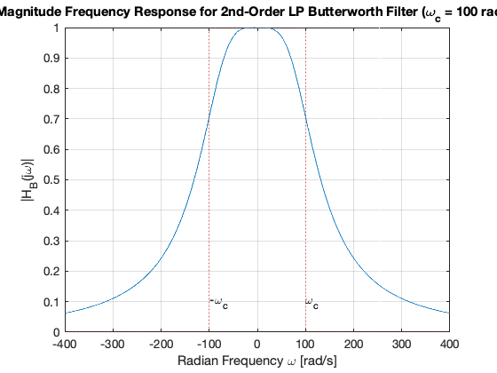
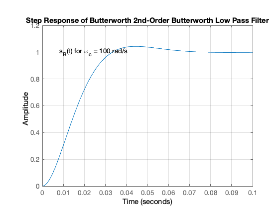
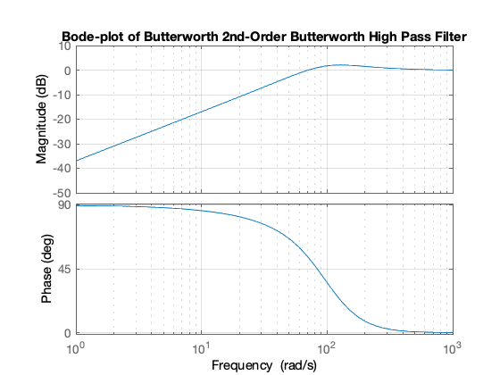

---
redirect_from:
  - "/fourier-transform/4/ft4"
interact_link: content/fourier_transform/4/ft4.ipynb
title: 'Introduction to Filters'
prev_page:
  url: /fourier_transform/3/ft3
  title: 'Fourier Transforms for Circuit and LTI Systems Analysis'
next_page:
  url: /dt_systems/index
  title: 'Sampled Data Systems'
comment: "***PROGRAMMATICALLY GENERATED, DO NOT EDIT. SEE ORIGINAL FILES IN /content***"
---

# Introduction to Filters

## Scope and Background Reading

This section is Based on the section **Filtering** from Chapter 5 of [Benoit Boulet, Fundamentals of Signals and Systems](https://ebookcentral.proquest.com/lib/swansea-ebooks/reader.action?ppg=221&docID=3135971&tm=1518715953782) from the **Recommended Reading List**.

This material is an introduction to analogue filters. You will find much more in-depth coverage on [Pages 11-1&mdash;11-48 of Karris](https://ebookcentral.proquest.com/lib/swansea-ebooks/reader.action?ppg=429&docID=3384197&tm=1518716026573).

## Agenda

* Frequency Selective Filters

* Ideal low-pass filter

* Butterworth low-pass filter


* High-pass filter

* Bandpass filter

## Introduction

* Filter design is an important application of the Fourier transform
* Filtering is a rich topic often taught in graduate courses so we give only an introduction.
* Our introduction *will* illustrate the usefulness of the frequency domain viewpoint.
* We will explore how filters can shape the spectrum of a signal.

Other applications of the Fourier transform are sampling theory (introduced next week) and modulation.

## Frequency Selective Filters

An ideal frequency-selective filter is a system that let's the frequency components of a signal through undistorted while frequency components at other components are completely cut off.

* The range of frequencies which are let through belong to the **pass Band**
* The range of frequencies which are cut-off by the filter are called the **stopband**
* A typical scenario where filtering is needed is when noise $n(t)$ is added to a signal $x(t)$ but that signal has most of its energy outside the bandwidth of a signal.

### Typical filtering problem


### Signal


### Out-of Bandwidth Noise


### Signal plus Noise


### Filtering


### Motivating example

See the notes in the [OneNote Class Room notebook](https://swanseauniversity-my.sharepoint.com/personal/c_p_jobling_swansea_ac_uk/_layouts/15/WopiFrame.aspx?sourcedoc={540d6da0-390f-4f0a-914e-b6445f76b02a}&action=edit&wd=target%28%2F%2F_Content%20Library%2FClasses%2FWeek%207.one%7C6a452d2f-ba94-4714-b276-8eb1269b0b5b%2FBefore%20Class%7Ce5ad343a-e348-0141-8096-60e0ca201e57%2F%29) or on Blackboard.

## Ideal Low-Pass Filter

An ideal low pass filter cuts-off frequencies higher than its *cutoff frequency*, $\omega_c$.

$$H_{\rm{lp}}(\omega ) = \left\{ {\begin{array}{*{20}{c}}
{1,}&{|\omega |{\kern 1pt} \, < {\omega _c}}\\
{0,}&{|\omega |{\kern 1pt} \, \ge {\omega _c}}
\end{array}} \right.$$

### Frequency response


### Impulse response

$$h_{\rm{lp}}(t) = \frac{\omega _c}{\pi }{\mathop{\rm sinc}\nolimits} \left( \frac{\omega _c}{\pi }t \right)$$


### Filtering is Convolution

The output of an LTI system with impulse response 

$$h(t) \Leftrightarrow H(\omega)$$

subject to an input signal

$$x(t) \Leftrightarrow X(\omega)$$

is given by 

$$y(t) = h(t)*x(t) \Leftrightarrow Y(\omega) = H(\omega)X(\omega)$$

### Issues with the "ideal" filter

This is the step response:


(reproduced from Boulet Fig. 5.23 p. 205)

Ripples in the impulse resonse would be undesireable, and because the impulse response is non-causal it cannot actually be implemented.


## Butterworth low-pass filter

N-th Order Butterworth Filter

$$\left| H_B(\omega ) \right| = \frac{1}{\left(1 + \left(\frac{\omega }{\omega _c}\right)^{2N}\right)^{\frac{1}{2}}}$$

**Remarks**

* DC gain is $|H_B(j0)|=1$
* Attenuation at the cut-off frequency is $|H_B(j\omega_c)|=1/\sqrt{2}$ for any $N$

More about the Butterworth filter: [Wikipedia Article](http://en.wikipedia.org/wiki/Butterworth_filter)

### Example 5: Second-order BW Filter

The second-order butterworth Filter is defined by is Characteristic Equation (CE):

$$p(s) = s^2 + \omega_c\sqrt{2}s+\omega_c^2 = 0^*$$

Calculate the roots of $p(s)$ (the poles of the filter transfer function) in both Cartesian and polar form.

**Note**: This has the same characteristic as a control system with damping ratio $\zeta = 1/\sqrt{2}$ and $\omega_n = \omega_c$!

#### Solution

<pre style="border: 2px solid blue">


</pre>

### Example 6

Derive the differential equation relating the input $x(t)$ to output $y(t)$ of the 2nd-Order Butterworth Low-Pass Filter with cutoff frequency $\omega_c$.

#### Solution

<pre style="border: 2px solid blue">


</pre>

### Example 7

Determine the frequency response $H_B(\omega)=Y(\omega)/X(\omega)$

### Solution

<pre style="border: 2px solid blue">


</pre>

### Magnitude of frequency response of a 2nd-order Butterworth Filter


{:.input_area}
```matlab
wc = 100;
```


Transfer function


{:.input_area}
```matlab
H = tf(wc^2,[1, wc*sqrt(2), wc^2])
```


{:.output .output_stream}
```

H =
 
          10000
  ---------------------
  s^2 + 141.4 s + 10000
 
Continuous-time transfer function.


```

Magnitude frequency response


{:.input_area}
```matlab
w = -400:400;
mHlp = 1./(sqrt(1 + (w./wc).^4));
plot(w,mHlp)
grid
ylabel('|H_B(j\omega)|')
title('Magnitude Frequency Response for 2nd-Order LP Butterworth Filter (\omega_c = 100 rad/s)')
xlabel('Radian Frequency \omega [rad/s]')
text(100,0.1,'\omega_c')
text(-100,0.1,'-\omega_c')
hold on
plot([-400,-100,-100,100,100,400],[0,0,1,1,0,0],'r:')
hold off
```


{:.output .output_png}



Bode plot


{:.input_area}
```matlab
bode(H)
grid
title('Bode-plot of Butterworth 2nd-Order Butterworth Low Pass Filter')
```


{:.output .output_png}


### Example 8

Determine the impulse and step response of a butterworth low-pass filter.

You will find this Fourier transform pair useful:

$$e^{-at}\sin\omega_0 t\;u_0(t) \Leftrightarrow \frac{\omega_0}{(j\omega + a)^2+\omega_0^2}$$

#### Solution

<pre style="border: 2px solid blue">


</pre>

Impulse response


{:.input_area}
```matlab
impulse(H,0.1)
grid
title('Impulse Response of 2nd-Order Butterworth Low Pass Filter')
```


{:.output .output_png}


Step response


{:.input_area}
```matlab
step(H,0.1)
title('Step Response of Butterworth 2nd-Order Butterworth Low Pass Filter')
grid
text(0.008,1,'s_B(t) for \omega_c = 100 rad/s')
```


{:.output .output_png}



## High-pass filter

An ideal highpass filter cuts-off frequencies lower than its *cutoff frequency*, $\omega_c$.

$$H_{\rm{hp}}(\omega ) = \left\{ {\begin{array}{*{20}{c}}
{0,}&{|\omega |{\kern 1pt} \, \le {\omega _c}}\\
{1,}&{|\omega |{\kern 1pt} \, > {\omega _c}}
\end{array}} \right.$$

### Frequency response


### Responses

**Frequency response**

$$H_{\mathrm{hp}}(\omega)=1-H_{\mathrm{lp}}(\omega)$$

**Impulse response**

$$h_{\mathrm{hp}}(t)=\delta(t)-h_{\mathrm{lp}}(t)$$

### Example 9

Determine the frequency response of a 2nd-order butterworth highpass filter

#### Solution

<pre style="border: 2px solid blue">


</pre>

Magnitude frequency response


{:.input_area}
```matlab
w = -400:400;
plot(w,1-mHlp)
grid
ylabel('|H_B(j\omega)|')
title('Magnitude Frequency Response for 2nd-Order HP Butterworth Filter (\omega_c = 100 rad/s)')
xlabel('Radian Frequency \omega [rad/s]')
text(100,0.9,'\omega_c')
text(-100,0.9,'-\omega_c')
hold on
plot([-400,-100,-100,100,100,400],[0,0,1,1,0,0],'r:')
hold off
```


{:.output .output_png}


High-pass filter


{:.input_area}
```matlab
Hhp = 1 - H
bode(Hhp)
grid
title('Bode-plot of Butterworth 2nd-Order Butterworth High Pass Filter')
```


{:.output .output_stream}
```

Hhp =
 
      s^2 + 141.4 s
  ---------------------
  s^2 + 141.4 s + 10000
 
Continuous-time transfer function.


```


{:.output .output_png}



## Band-pass filter

An ideal bandpass filter cuts-off frequencies lower than its first *cutoff frequency* $\omega_{c1}$, and higher than its second *cutoff frequency* $\omega_{c2}$.

$$H_{\rm{bp}}(\omega ) = \left\{ {\begin{array}{*{20}{c}}
{1,}&\omega _{c1} < \,|\omega |\, < \omega _{c2}\\
{0,}&\rm{otherwise}
\end{array}} \right.$$


### Bandpass filter design

A bandpass filter can be obtained by multiplying the frequency responses of a lowpass filter by a highpass filter.

$$H_{\mathrm{bp}}(\omega) = H_{\mathrm{hp}}(\omega)H_{\mathrm{lp}}(\omega)$$

* The highpass filter should have cut-off frequency of $\omega_{c1}$

* The lowpass filter should have cut-off frequency of $\omega_{c2}$

To generate all the plots shown in this presentation, you can use [butter2_ex.m](files/matlab/butter2_ex.m)

## Summary

* Frequency-Selective Filters
* Ideal low-pass filter
* Butterworth low-pass filter
* High-pass filter
* Bandpass filter
