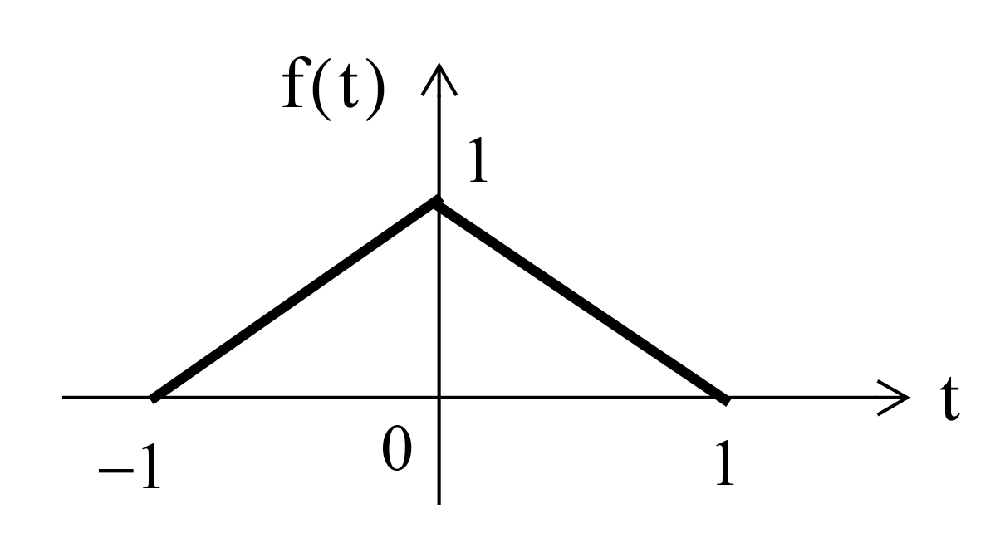

---
jupytext:
  formats: ipynb,md:myst
  text_representation:
    extension: .md
    format_name: myst
    format_version: 0.13
    jupytext_version: 1.15.2
kernelspec:
  display_name: Matlab
  language: matlab
  name: matlab
---

+++ {"slideshow": {"slide_type": "slide"}}

(unit6.2)=
# Unit 6.2: The Fast Fourier Transform

+++ {"slideshow": {"slide_type": "skip"}}

## Colophon

An annotatable worksheet for this presentation is available as [**Worksheet 19**](worksheet19).

* The source code for this page is [dft/1/dft.ipynb](https://github.com/cpjobling/eg-247-textbook/blob/master/dft/2/fft.ipynb).

* You can view the notes for this presentation as a webpage ([HTML](https://cpjobling.github.io/eg-247-textbook/dft/2/fft.html)). 

* This page is downloadable as a [PDF](https://cpjobling.github.io/eg-247-textbook/dft/2/fft.pdf) file.

+++ {"slideshow": {"slide_type": "subslide"}}

## Scope and Background Reading

This session introduces the fast fourier transform (FFT) which is one of the most widely used numerical algorithms in the world. It exploits some features of the symmetry of the computation of the DFT to reduce the complexity from something that takes order $N^2$ ($O(N^2)$) complex operations to something that takes order $N \log N$ ($O(N \log N)$) operations.

+++ {"slideshow": {"slide_type": "notes"}}

The FFT is to be found in all manner of signal and image processing algorithms, and because it is more efficient than the DFT, you will find it exploited in hundreds of signal processing applications.

As one example, it turns out that the computation of the convolution of two long DT sequences is more efficient if the FFT of the two signals is taken, the product of the frequency spectra is computed, and the Inverse DFT of the result is computed.

In this presentation, we will not go through the mathematical development of the FFT, please read section 10.6 of Karris if you want the details. Here we will concentrate on the benefits to be gained by using the FFT and give some examples of its use in MATLAB.

+++ {"slideshow": {"slide_type": "subslide"}}

### Acknowledgements

The material in this presentation and notes is based on [Chapter 10](https://ebookcentral.proquest.com/lib/swansea-ebooks/reader.action?docID=44853&ppg=405) of {cite}`karris` from the **Required Reading List**. The models of the FFT signal flow graphs and Simulink block diagrams are based on the presentation given in Section 12.5 of {cite}`phillips`.

+++ {"slideshow": {"slide_type": "slide"}}

## Agenda

+++ {"slideshow": {"slide_type": "fragment"}}

* The inefficiency of the DFT

+++ {"slideshow": {"slide_type": "fragment"}}

* The FFT - a sketch of its development

+++ {"slideshow": {"slide_type": "fragment"}}

* An illustration of part of the FFT algorithm

+++ {"slideshow": {"slide_type": "fragment"}}

* FFT v DFT

+++ {"slideshow": {"slide_type": "fragment"}}

* Two examples

+++ {"slideshow": {"slide_type": "fragment"}}

* Frequency and Amplitude Scaling

+++ {"slideshow": {"slide_type": "slide"}}

## The inefficiency of the DFT

Consider a signal whose highest frequency is 18 kHz, the sampling frequency is 50 kHz, and 1024 samples are taken, i.e., $N=1024$.

+++ {"slideshow": {"slide_type": "fragment"}}

The time required to compute the entire DFT would be:

$$t = \frac{1024\,\mathrm{samples}}{50\times 10^3\,\mathrm{samples\ per\ second}} = 20.48\,\mathrm{ms}$$

+++ {"slideshow": {"slide_type": "subslide"}}

To compute the number of operations required to complete this task, let us expand the N-point DFT defined as:

$$X[m] = \sum_{n=0}^{N-1} x[n] W_N^{mn}$$

+++ {"slideshow": {"slide_type": "subslide"}}

Then

$$\begin{eqnarray*}
  X[0] &=& x[0]W_N^0 + x[1]W_N^0 + x[1]W_N^0 +  \cdots  + x[N - 1]W_N^0 \hfill \\
  X[1] &=& x[0]W_N^0 + x[1]W_N^1 + x[1]W_N^2 +  \cdots  + x[N - 1]W_N^{N - 1} \hfill \\
  X[2] &=& x[0]W_N^0 + x[1]W_N^2 + x[1]W_N^4 +  \cdots  + x[N - 1]W_N^{2(N - 1)} \hfill \\
  \hfil &\cdots&  \hfill \\
  X[N - 1] &=& x[0]W_N^0 + x[1]W_N^{N - 1} + x[1]W_N^{2(N - 1)} +  \cdots  + x[N - 1]W_N^{(N - 1)^2} \hfill \\ 
\end{eqnarray*}$$

+++ {"slideshow": {"slide_type": "subslide"}}

* It is worth remembering that 

$$W_N^0 = \exp\left(-j\frac{2\pi}{N}(0)\right) = 1.$$

+++ {"slideshow": {"slide_type": "fragment"}}

* Since $W_N^i$ is a complex number, the computation of any frequency component $X[k]$ requires $N$ complex multiplications and $N$ complex additions

+++ {"slideshow": {"slide_type": "fragment"}}

* $2N$ complex arithmetic operations are required to compute any frequency component of $X[k].$<sup>1</sup>

+++ {"slideshow": {"slide_type": "fragment"}}

* If we assume that $x[n]$ is real, then only $N/2$ of the $X[m]$ components are unique.

+++ {"slideshow": {"slide_type": "fragment"}}

* Therefore we would require $2N\times N/2 = N^2$ complex operations to compute the entire frequency spectrum.<sup>2</sup>

+++ {"slideshow": {"slide_type": "subslide"}}

* For our example, the $N=1024$-point DFT, would require $1024^2 = 1,048,576$ complex operations

+++ {"slideshow": {"slide_type": "fragment"}}

* These would have to be completed in 20.48 ms.

+++ {"slideshow": {"slide_type": "fragment"}}

* This may be possible with modern computing hardware, perhaps even in a mobile phone, but it seems impractical.

+++ {"slideshow": {"slide_type": "subslide"}}

* Fortunately, many of the $W_N$ terms in the computation are unity ($=\pm 1$).

+++ {"slideshow": {"slide_type": "fragment"}}

* Moreover, because the $W_N^i$ points are equally spaced points on the unit circle;

+++ {"slideshow": {"slide_type": "fragment"}}

* And because $N$ is a power of 2, the points on the upper-half plane (range $0 < \theta < \pi$ are the mirror image of the points on the lower-half plane range $\pi < \theta < 2\pi$;

+++ {"slideshow": {"slide_type": "fragment"}}

* Thus, there is a great deal of symmetry in the computation that can be exploited to simplify the computation and reduce the number of operations considerably to a much more manageable $N\log_2 N$ operations<sup>3</sup>.

+++ {"slideshow": {"slide_type": "fragment"}}

This is possible with the algorithm called the [FTT](https://en.wikipedia.org/wiki/Fast_Fourier_transform) (fast Fourier transform) that was originally developed by [James Cooley](https://en.wikipedia.org/wiki/James_Cooley) and [John Tukey](https://en.wikipedia.org/wiki/John_Tukey) and has been considerably refined since.

+++ {"slideshow": {"slide_type": "slide"}}

## The Fast Fourier Transform (FFT)

The FFT is very well documented, including in Karris, so we will only sketch its development and present its main result. However, we will illustrate part of the algorithm to make concrete an idea of the efficiency advantage that the FFT has over the DFT that we have already seen.

+++ {"slideshow": {"slide_type": "fragment"}}

Much of the development follows from the properties of the rotating vector.<sup>4</sup>

+++ {"slideshow": {"slide_type": "subslide"}}

$$W_N=\exp\left(-\frac{j2\pi}{N}\right)$$

which results in some simplifications and mathematical short-cuts when $N$ is a power of 2.

+++ {"slideshow": {"slide_type": "subslide"}}

The most useful properties are:

$$\begin{eqnarray*}
  W_N^N &=& \exp\left(-j\frac{2\pi}{N}N\right) = \exp\left(-j2\pi\right) = 1.\\
  W_N^{N/2} &=&  \exp\left(-j\frac{2\pi}{N}\frac{N}{2}\right) = \exp\left(-j\pi\right) = -1.\\
  W_N^{N/4} &=&  \exp\left(-j\frac{2\pi}{N}\frac{N}{4}\right) = \exp\left(-j\pi/2\right) = -j.\\
  W_N^{3N/4} &=&  \exp\left(-j\frac{2\pi}{N}\frac{3N}{4}\right) = \exp\left(-j3\pi/2\right) = j.\end{eqnarray*}$$

+++ {"slideshow": {"slide_type": "subslide"}}

$$\begin{eqnarray*}
  W_N^{kN} &=&  \exp\left(-j\frac{2\pi}{N}kN\right) = \exp\left(-j2\pi\right) = 1,\,k=0,1,2,\ldots\\
  W_N^{kN+r} &=&  \exp\left(-j\frac{2\pi}{N}kN\right)\exp\left(-j\frac{2\pi}{N}r\right) = 1.W_N^r=W_N^r.\\
  W_{2N}^{k} &=&  \exp\left(-j\frac{2\pi}{2N}k\right) = \exp\left(-j\frac{2\pi}{N}\frac{k}{2}\right) = W_N^{k/2}.
\end{eqnarray*}$$

+++ {"slideshow": {"slide_type": "subslide"}}

Representing

$$\begin{eqnarray*}
  X[0] &=& x[0]W_N^0 + x[1]W_N^0 + x[2]W_N^0 +  \cdots  + x[N - 1]W_N^0 \hfill \\
  X[1] &=& x[0]W_N^0 + x[1]W_N^1 + x[2]W_N^2 +  \cdots  + x[N - 1]W_N^{N - 1} \hfill \\
  X[2] &=& x[0]W_N^0 + x[1]W_N^2 + x[2]W_N^4 +  \cdots  + x[N - 1]W_N^{2(N - 1)} \hfill \\
  \hfil &\cdots&  \hfill \\
  X[N - 1] &=& x[0]W_N^0 + x[1]W_N^{N - 1} + x[2]W_N^{2(N - 1)} +  \cdots  + x[N - 1]W_N^{(N - 1)^2} \hfill \\ 
\end{eqnarray*}$$

+++ {"slideshow": {"slide_type": "subslide"}}

in matrix form:

$$
\left[ {\begin{array}{*{20}{c}}
{X[0]}\\
{X[1]}\\
{X[2]}\\
 \vdots \\
{X[N - 1]}\end{array}} \right] = \left[ {\begin{array}{*{20}{c}}
{W_N^0}&{W_N^0}&{W_N^0}&\cdots&{W_N^0}\\
{W_N^0}&{W_N^1}&{W_N^2}&\cdots&{W_N^{N - 1}}\\
{W_N^0}&{W_N^2}&{W_N^4}&\cdots&{W_N^{2(N - 1)}}\\
\cdots&\cdots&\cdots&\cdots&\cdots\\
{W_N^0}&{W_N^{N - 1}}&{W_N^{2(N - 1)}}&\cdots&W_N^{(N - 1)^2}\\
\end{array}} \right]\left[ {\begin{array}{*{20}{c}}
{x[0]}\\
{x[1]}\\
{x[2]}\\
 \vdots \\
{x[N - 1]}
\end{array}} \right].
$$

+++ {"slideshow": {"slide_type": "subslide"}}

This is a complex [Vandemonde matrix](https://en.wikipedia.org/wiki/Vandermonde_matrix) and it is more compactly expressed as:

$$\mathbf{X}[m] = \mathbf{W_N} \mathbf{x}[n]$$

+++ {"slideshow": {"slide_type": "subslide"}}

The algorithm developed by Cooley and Tukey is based on *matrix decomposition* methods, where the matrix $\mathbf{W_N}$ is factored into $L$ smaller matrices, that is:

$$\mathbf{W_N} = \mathbf{W_1} \mathbf{W_2} \mathbf{W_3} \cdots \mathbf{W_L}$$

where $L$ is chosen as $L = \log_2N$ or $N=2^L$.

+++ {"slideshow": {"slide_type": "subslide"}}

Each row of the matrices on the right side of the decomposition, contains only two, non-zero terms, unity and $W_N^k$. 

And the DFT sequence is:

$$\mathbf{X}[m] = \mathbf{W_1} \mathbf{W_2} \mathbf{W_3} \cdots \mathbf{W_L} \mathbf{x}[n].$$

+++ {"slideshow": {"slide_type": "notes"}}

The FFT computation starts with matrix $\mathbf{W}_L$. It operates on $\mathbf{x}[n]$ producing a row vector, and each component of the row vector is obtained by one multiplication and one addition. This is because there are only two non-zero elements on a given row, and one of those elements is unity. Since there are $N$ components of $\mathbf{x}[n]$, there will be $N$ complex multiplications and $N$ complex additions.

+++ {"slideshow": {"slide_type": "subslide"}}

This new vector is then operated on by the $\mathbf{W}_{L-1}$ matrix, then on $\mathbf{W}_{L-2}$ and so on, until the entire operation is completed.

+++ {"slideshow": {"slide_type": "subslide"}}

It appears that the entire operation would require $NL= N\log_2N$ complex additions and also $N\log_2N$ complex additions.

+++ {"slideshow": {"slide_type": "fragment"}}

However, since $W_N^0 = 1$, $W_N^{N/2}=-1$, and other simplifications, it is estimated that only about half of these, that is, $N\log_2 N$ total complex arithmetic operations are required by the FFT versus the $N^2$ required by the DFT<sup>5</sup>.

+++ {"slideshow": {"slide_type": "subslide"}}

### Decomposition-in-Time FFT Algorithm

+++ {"slideshow": {"slide_type": "fragment"}}

This development follows (Philips, *et al.*, 2015). It is called the *decomposition-in-time (DIT), radix-2, FFT*.

+++ {"slideshow": {"slide_type": "fragment"}}

It allows us to visualize the FFT as a block diagram (for simulation) or a signal flow graph (for ease of drawing).

+++ {"slideshow": {"slide_type": "fragment"}}

We start from a 2-point FFT ($N=2$), and work up to an 8-point FFT ($N=8$) before generalizing the result.

+++ {"slideshow": {"slide_type": "notes"}}

We have implemented each algorithm in Simulink so we are able illustrate these structures with executable examples as we go.

+++ {"slideshow": {"slide_type": "subslide"}}

#### 2-Point DFT

$$X[k] = \sum_{n=0}^1 x[n]W^{nk}_2 = x[0]W_2^{0k} + X[1]W_2^{1k},\,k=0,1.$$

+++ {"slideshow": {"slide_type": "fragment"}}

Because $W_2^{0k}=\exp\left(j0\right)=1$ and $W_2^{1k}=\exp\left(-j\pi k\right)=(-1)^k$, we write

$$\begin{eqnarray*}
X[0] &=& x[0]+x[1];\\
X[1] &=& x[0]-x[1].
\end{eqnarray*}$$

+++ {"slideshow": {"slide_type": "subslide"}}

In general for the 2-point DFT, we have

$$X[k]=x[0]+(-1)^kx[1].$$

+++ {"slideshow": {"slide_type": "subslide"}}


+++ {"slideshow": {"slide_type": "notes"}}

An equivalent Simulink model in block diagram form is:


+++ {"slideshow": {"slide_type": "subslide"}}

#### Let's See it in MATLAB

[two_point_dft.slx](https://cpjobling.github.io/eg-247-textbook/dft/2/matlab/two_point_dft.slx)

```{code-cell}
---
slideshow:
  slide_type: fragment
---
cd matlab
clear all
format compact
```

```{code-cell}
---
slideshow:
  slide_type: fragment
---
open two_point_dft
```

+++ {"slideshow": {"slide_type": "slide"}}

#### 4-point DFT

The 4-point DFT is given by

$$X[k] = \sum_{n=0}^3 x[n]W_4^{nk}= x[0]W_4^{0k} + x[1]W_4^{1k} + x[2]W_4^{2k} + x[3]W_4^{3k}.$$

+++ {"slideshow": {"slide_type": "subslide"}}

As a result of the periodicity of the weighting factor, we can simplify this expression:

$$\begin{eqnarray*}
W_N^{nk} &=& \exp\left(-j(2\pi/N)nk\right);\\
W_4^{0k} &=& 1;\\
W_4^{1k} &=& \exp\left(-j(\pi/2)k\right) = (-j)^k;\\
W_4^{2k} &=& \exp\left(-j\pi k\right) = (-1)^k;\\
W_4^{3k} &=& W_4^{2k}W_4^{1k}=(-1)^k W_4^{1k}.
\end{eqnarray*}$$

+++ {"slideshow": {"slide_type": "subslide"}}

Using these results, we write

$$\begin{eqnarray*}
X[k] &=&  x[0] + x[1]W_4^{1k} + x[2](-1)^k + x[3](-1)^kW_4^{1k},\\
X[k] &=&  \left[x[0] + x[2](-1)^k\right] \left[x[1] +  x[3](-1)^k\right]W_4^{1k}.
\end{eqnarray*}$$

+++ {"slideshow": {"slide_type": "subslide"}}

To clarify the next step, we define two new variables

$$\begin{eqnarray*}
x_e[n]&=&x[2n],\,n=0,1;\\
x_o[n]&=&x[2n+1],\,n=0,1.
\end{eqnarray*}$$

+++ {"slideshow": {"slide_type": "subslide"}}

Then,

$$X[k] =  \left[x_e[0] + x_e[1](-1)^k\right] + \left[x_o[0] + x_o[1](-1)^k\right]W_4^{1k}.$$

+++ {"slideshow": {"slide_type": "fragment"}}

The factors in brackets in this equation can be recognized as 2-point DFTs:

$$\begin{eqnarray*}
X_e[m] &=& x_e[0] + x_e[1](-1)^m,\;m=0,1;\\
X_o[m] &=& x_o[0] + x_o[1](-1)^m,\;m=0,1.
\end{eqnarray*}$$

+++ {"slideshow": {"slide_type": "subslide"}}

Note that $X_e[k]$ and $X_o[k]$ are periodic; for example,

$$X_e[2]= x_e[0]+ x_e[1](-1)^2 = X_e[0]$$

and

$$X_o[3]= x_o[0]+ x_o[1](-1)^3 = X_o[1]$$

+++ {"slideshow": {"slide_type": "subslide"}}

The 4-point DFT then is

$$\begin{eqnarray*}
X[0] &=& X_e[0] + X_o[0]W_4^{1(0)} = X_e[0] + X_o[0];\\
X[1] &=& X_e[1] + X_o[1]W_4^{1(1)} = X_e[1] + X_o[1]W_4^1;\\
X[2] &=& X_e[0] - X_o[0]W_4^{1(2)} = X_e[0] - X_o[0];\\
X[3] &=& X_e[1] - X_o[1]W_4^{1(3)} = X_e[1] + X_o[1]W_4^1.
\end{eqnarray*}$$

+++ {"slideshow": {"slide_type": "notes"}}

We see that the 4-point DFT can be computed by the generation of two 2-point DFTs, followed by a *recomposition* of terms as shown in the signal flow graph below:

+++ {"slideshow": {"slide_type": "subslide"}}


+++ {"slideshow": {"slide_type": "notes"}}

In other words,

[4-point DFT of $x[n]$] = [2-point DFT of $x_e[n]$] + $W_4^{1k}$[2-point DFT of $x_o[n]$].

+++ {"slideshow": {"slide_type": "subslide"}}

#### SIMULINK Model of 4-Point DFT

[four_point_dft.slx](https://cpjobling.github.io/eg-247-textbook/dft/2/matlab/four_point_dft.slx)

```{code-cell}
---
slideshow:
  slide_type: fragment
---
open four_point_dft
```

+++ {"slideshow": {"slide_type": "subslide"}}

### In Class Example 1

Use four-point DIT FFT to confirm that the DFT of the sequence 

$$x[n] = [1, 2, 3, 4]$$

is 

$$X[m] = [10, -2+j2, -4, -2-j2].$$

+++ {"slideshow": {"slide_type": "notes"}}

<pre style="border: 2px solid blue">


</pre>

+++ {"slideshow": {"slide_type": "slide"}}

#### 8-point DFT

$$X[k] = \sum_{n=0}^{7}x[n]W_8^{nk}.$$

+++ {"slideshow": {"slide_type": "subslide"}}

After some manipulation, not reproduced here, it can be shown that the 8-point DFT is the recombination of two, 4-point DFTs that operate on the even and odd numbered values in the sequence $x[n]$ respectively.

+++ {"slideshow": {"slide_type": "subslide"}}

#### Signal flow graph of 8-point DFT


+++ {"slideshow": {"slide_type": "subslide"}}

#### SIMULINK Model of 8-Point DFT

[eight_point_dft.slx](https://cpjobling.github.io/eg-247-textbook/dft/2/matlab/eight_point_dft.slx)

```{code-cell}
---
slideshow:
  slide_type: fragment
---
open eight_point_dft
```

+++ {"slideshow": {"slide_type": "slide"}}

#### N-Point, radix-2 DIT FFT

In general, the $N$-point, radix-2 DIT FFT is computed as the recomposition of two $(N/2)$-point FFTs) as shown in the buterfly diagram below


+++ {"slideshow": {"slide_type": "slide"}}

### Decomposition-in-Frequency FFT

Another approach to forming the FFT is the so-called decomposition in frequency (DIF) FFT. 

We will not cover it's development in detail (see Karris and Phillips *et al.*) if you want to follow it through.

We instead illustrate the final result for the four-point DIF FFT.

+++ {"slideshow": {"slide_type": "subslide"}}

#### Signal flow graph for 4-point DIF FFT


+++ {"slideshow": {"slide_type": "notes"}}

Note that the structure is a 4-point decompostion followed by two 2-point FFTs.

Also note that it is frequency $X_n[k]$ that is the input to the DFT stage.

+++ {"slideshow": {"slide_type": "slide"}}

### In Class Example 2

Use four two-point DIF FFT to confirm that the DFT of the sequence 

$$x[n] = [1, 2, 3, 4]$$

is 

$$X[m] = [10, -2+j2, -4, -2-j2].$$

+++ {"slideshow": {"slide_type": "notes"}}

<pre style="border: 2px solid blue">


</pre>

+++ {"slideshow": {"slide_type": "subslide"}}

#### SIMULINK Model of 4-Point DIF FFT

[four_point_dif.slx](https://cpjobling.github.io/eg-247-textbook/dft/2/matlab/four_point_dif.slx)

```{code-cell}
---
slideshow:
  slide_type: fragment
---
open four_point_dif
```

+++ {"slideshow": {"slide_type": "notes"}}

### 8-Point DIF FFT

I have created a Simulink model of the 8-point DIF FFT. I will create a signal flow graph to go with it at some point in the future.

#### SIMULINK Model of 4-Point DIF FFT

[eight_point_dif.slx](https://cpjobling.github.io/eg-247-textbook/dft/2/matlab/eight_point_dif.slx)

+++ {"slideshow": {"slide_type": "slide"}}

## Efficiency of the FFT

Wether we implement it as a Decomposition-in-Time (DIT) or a Decomposition-in-Frequency (DIF), the FFT ends up having approximately $(N/2)\log_2(N)$ multiplications and a similar number of complex additions or subtractions. 

In other words, $(N)\log_2(N)$ complex arithmetic operations.

As complex arithmetic, particularly multiplication, is very expensive, this is a great saving over the DFT which has of order $N^2$ operations.

+++ {"slideshow": {"slide_type": "subslide"}}

### DFT and FFT Comparisons

Under the assumptions about the relative efficiency of the DFT and FFT we can create a table like that shown below:


| &nbsp; |  &nbsp;      | DFT         | FFT       | FFT/DFT   |
|--------|--------------|-------------|-----------|-----------|
| N      | $\log_2 N$ | $N^2$   | $N\log_2 N$ |         % | 
| 8      | 3            | 64        | 24          | 37.5      |
| 16     | 4            | 256       | 64          | 25        |
| 32     | 5            | 1,024     | 160         | 15.6      |
| 64     | 6            | 4,096     | 384         | 9.4       |
| 128    | 7            | 16,384    | 896         | 5.5       |
| 256    | 8            | 65,536    | 2,048       | 3.1       |
| 512    | 9            | 261,144   | 4,608       | 1.8       |
| 1024   | 10           | 1,048,576 | 10,240      | 1         |
| 2048   | 11           | 4,194,304 | 22,528      | 0.5       |

+++ {"slideshow": {"slide_type": "notes"}}

As you can see, the efficiency of the FFT actual gets better as the number of samples go up! 

However, there are other costs, such as the data storage needed for intermediate steps, that need to be taken into account as well. For example, an 8-point FFT requires only a 3 stage decomposition, with each stage needing storage for 8 complex numbers. That is 24 in all. Whereas a 2048 sequence will require 11 stages, storing 2048 values each. That is a total of 22,528 complex values<sup>6</sup>.

+++ {"slideshow": {"slide_type": "slide"}}

## In Class Demonstrations

+++ {"slideshow": {"slide_type": "fragment"}}

### FFT in MATLAB

The FFT algorithm is implemented, in MATLAB, as the function `fft`. We will conclude the class by working through Exercises 6 and 7 from section 10.8 of Karris.

+++ {"slideshow": {"slide_type": "subslide"}}

### Example 3

Plot the Fourier transform of the rectangular pulse shown below, using the MATLAB `fft` func-tion. Then, use the `ifft` function to verify that the inverse transformation produces the rectangular pulse.


+++ {"slideshow": {"slide_type": "subslide"}}

#### FFT for Example 3

The rectangular pulse can be produced like so

```{code-cell}
---
slideshow:
  slide_type: fragment
---
x = [linspace(-2,-1,50) linspace(-1,1,100) linspace(1,2,50)];
y = [linspace(0,0,50) linspace(1,1,100) linspace(0,0,50)];
stem(x,y)
```

+++ {"slideshow": {"slide_type": "subslide"}}

and the FFT is produced as

```{code-cell}
---
slideshow:
  slide_type: fragment
---
stem(x, abs(fft(y)))
```

+++ {"slideshow": {"slide_type": "subslide"}}

unwind

```{code-cell}
---
slideshow:
  slide_type: fragment
---
stem(x, abs(fftshift(fft(y))))
```

+++ {"slideshow": {"slide_type": "subslide"}}

The inverse FFT is obtained with

```{code-cell}
---
slideshow:
  slide_type: fragment
---
stem(x, ifft(fft(y)))
```

+++ {"slideshow": {"slide_type": "subslide"}}

### Example 4



+++ {"slideshow": {"slide_type": "subslide"}}

#### FFT Example 4

The triangular pulse is obtained with

```{code-cell}
---
slideshow:
  slide_type: fragment
---
x = linspace(-1,1,100);
y = [linspace(0,1,50) linspace(1,0,50)];
stem(x,y)
```

+++ {"slideshow": {"slide_type": "subslide"}}

and the FFT is obtained with

```{code-cell}
---
slideshow:
  slide_type: subslide
---
stem(x, abs(fftshift(fft(y))))
```

+++ {"slideshow": {"slide_type": "subslide"}}

The inverse FFT is obtained with

```{code-cell}
---
slideshow:
  slide_type: fragment
---
stem(x, ifft(fft(y)))
```

+++ {"slideshow": {"slide_type": "slide"}}

(fas)=
## Frequency and Amplitude Scaling

Let's assume that you have a DT sequence $x[n]$ sampled from a CT signal $x(t)$ at some period $T_s = 1/f_s$. When you apply the `fft` function to $x[n]$, the absolute values of the frequency terms $X[K]$ will have the distribution shown in {numref}`fig:fft:1` starting at $K=0$ on the left and going up to $K=N-1$ at the right.

+++ {"slideshow": {"slide_type": "subslide"}}

:::{figure-md} fig:fft:1


Distribution of the terms $X[K]$ in the fft of DT signal $x[n]$. From video {cite}`douglasdft` [9 minutes 20 seconds] (c) The MathWorks 2023.
:::

+++ {"slideshow": {"slide_type": "subslide"}}

DC is at $K = 0$, and the frequency terms for $K = 1 \to N/2$ on the left of the plot represent the positive frequencies. That is the frequencies computed on the unit circle from $\theta = 0 \to -\pi$ radians.

+++ {"slideshow": {"slide_type": "fragment"}}

The component that corresponds to the Nyquist frequency $f_n = f_s/2$ is at the centre of the plot at $\theta = -\pi$ radians or $K = N/2$[^fft:footnote1]

+++ {"slideshow": {"slide_type": "notes"}}

[^fft:footnote1]: The Nyquist frequency will only appear on the frequency plot if there are an even number of samples. If that is the case, we construct the positive frquencies from $K = 1$ to ceil $N/2$

+++ {"slideshow": {"slide_type": "fragment"}}

The FFT terms plotted on the right of the plot, from $K = N/2 + 1 \to N - 1$, correspond to the negative frequencies and, for real signals, will be the complex conjugates of their positive frequency terms. Thus the frequency plot will always be symmetric around the Nyquist frequency.

+++ {"slideshow": {"slide_type": "subslide"}}

As demonstrated above, we normally expect the frequency response to be symmetric around $f = 0$ and the `fftshift` function achieves that for us by shifting $X[0]$ to $K = N/2$, reversing the sequence of negative frequencies, and plotting them between $K = 0$ and $N/2 -1$.

+++ {"slideshow": {"slide_type": "subslide"}}

* However, even when shifted in this way, the $x$-axis of the FFT plot only represents the sequence number $K$ not frequency. 
* Furthermore, the amplitude of the frequency terms is related to the FFT algorithm rather than the physical size of the frequency components in the original signal. 
* Also, we often only care about the postive frequencies and so usually present the FFT data as a single-sided plot.

+++ {"slideshow": {"slide_type": "subslide"}}

To achieve a single sided FFT plot against frequency, with realistic amplitudes, and valid values of power and power spectral density for power plots, we need to make some adjustments to the FFT data. This is called *frequency and amplitude scaling*.

+++ {"slideshow": {"slide_type": "notes"}}

What follows is extracted from the two MATLAB Tech Talks {cite}`douglasdft` and {cite}`douglaspsd`.

We have already shown you {cite}`douglasdft` in {ref}`unit6`. You may which to watch {cite}`douglaspsd` now.

<iframe width="560" height="315" src="https://www.youtube.com/embed/pfjiwxhqd1M?si=BA_C6_GrOA54ayEj" title="YouTube video player" frameborder="0" allow="accelerometer; autoplay; clipboard-write; encrypted-media; gyroscope; picture-in-picture; web-share" referrerpolicy="strict-origin-when-cross-origin" allowfullscreen></iframe>

+++ {"slideshow": {"slide_type": "subslide"}}

### Frequency scaling

How does $K$ relate to the frequency?

+++ {"slideshow": {"slide_type": "fragment"}}

When $K=0$, the equivalent frequency is 0 Hz or DC.

+++ {"slideshow": {"slide_type": "fragment"}}

When $K=1$ the frequency is equal to the length of the time sequence.

+++ {"slideshow": {"slide_type": "fragment"}}

When $K = 2$ there are two complete cycles of a sinusoid in the length of the time signal, ... and so on up to the Nyquist frequency at $K = N/2 + 1$ for a signal with an even number of samples.

+++ {"slideshow": {"slide_type": "fragment"}}

Frequency corresponding to a particular $K$ is therefore given by frequency = $K$/(length of the time signal) or

$$f = \frac{K\times f_s}{N} $$

+++ {"slideshow": {"slide_type": "notes"}}

### Bin width

The bin width is the distance (in frequency) between samples in the FFT. It is given by

$$f_s/N$$

To reduce the bin width, and increase the frequency resolution of the FFT, we take more samples, or equivalently reduce the sampling period.

+++ {"slideshow": {"slide_type": "subslide"}}

### Example 5

Use MATLAB to find the one-sided FFT of a sinusoidal signal with frequency 3 Hz, sampled at $f_s = 40$ Hz. Present the frequency response in Hz.

+++ {"slideshow": {"slide_type": "subslide"}}

#### Solution

##### Create time-domain signal

```{code-cell}
---
slideshow:
  slide_type: '-'
---
fs = 40;              % Sampling frequency
T = 1/fs;             % Sampling period
N = 40;               % Length of signal
t = (0:N-1)*T';        % Time vector

xn = sin(2*pi*3*t);   % 3 Hz signal
```

+++ {"slideshow": {"slide_type": "subslide"}}

##### Plot the signal

```{code-cell}
---
slideshow:
  slide_type: fragment
---
plot(t, xn, '.-', 'MarkerSize', 20')
title('Signal')
xlabel('t')
ylabel('xn(t)')
```

+++ {"slideshow": {"slide_type": "subslide"}}

##### FFT

```{code-cell}
---
slideshow:
  slide_type: fragment
---
Xn = fft(xn);

figure
plot(Xn)
```

+++ {"slideshow": {"slide_type": "notes"}}

This plot doesn't make sense as Xn is complex.

+++ {"slideshow": {"slide_type": "subslide"}}

##### Plot absolute value

```{code-cell}
Xn = fft(xn);

figure
stem(abs(Xn));
title('Absolute Value of the FFT of xn');
```

+++ {"slideshow": {"slide_type": "notes"}}

Now we see the peaks in the postive and negative frequency. But they are plotted at bin number $K$ not frequency.

+++ {"slideshow": {"slide_type": "subslide"}}

##### One-sided FFT plotted against frequency
Just plot half of the frequency by plotting absolute values only for $K = 0 \to N/2$<sup>7</sup>.

```{code-cell}
---
slideshow:
  slide_type: fragment
---
Xn = fft(xn);

figure
stem(abs(Xn(1:(N/2)+1)));
title('One-Sided Absolute Value of the FFT of xn');
```

+++ {"slideshow": {"slide_type": "subslide"}}

##### Plot against real frequency

```{code-cell}
---
slideshow:
  slide_type: fragment
---
Xn = fft(xn);
```

```{code-cell}
---
slideshow:
  slide_type: fragment
---
K = 0:N/2;       % K starts at 0 so the length here is N/2 + 1
freq = K*fs/N;   % Cycles per length of the signal in seconds
```

```{code-cell}
---
slideshow:
  slide_type: fragment
---
figure
stem(freq, abs(Xn(1:(N/2)+1)));
title('One-Sided Absolute Value of the FFT of xn');
xlabel('Frequencty (Hz)')
```

+++ {"slideshow": {"slide_type": "notes"}}

Now we can clearly see the peak at 3 Hz, but the amplitude is 20, which has no real physical value. 

we will see how to scale the amplitude of the FFT in the next section.

The actual Live Script can be obtained from [aerojunkie/control-tools/FFT MATLAB App](https://github.com/aerojunkie/control-tools/tree/master/FFT%20MATLAB%20App)

+++ {"slideshow": {"slide_type": "subslide"}}

#### Amplitude Scaling

If you only need to know that a peak occurs at a particular frequency then you only need to scale the frequency. If you need to know the *amplitude* or *power* of the sinusoidal frequencies that are present in the FFT, then we also need to scale the magnitudes.

The detail of how this is done is covered in {cite}`douglaspsd` (see video in the notes) and we will only summarize it here and give an example. 

The example is available on [GitHub](https://github.com/aerojunkie/control-tools/tree/master/PSD) and can be loaded into MATLAB online (we will do this in class).

+++ {"slideshow": {"slide_type": "subslide"}}

##### Amplitude scaling

For a double-sided FFT, the amplitudes are scaled by the number of samples, that is:

$$X'[m] = \frac{\left|X[m]\right|}{N}$$ 

For a single sided FFT, we use double this value and ignore the DC and Nyquist frequency.

$$X'[m]_{m \gt 0; m \ne 0; m \ne N/2} = \frac{2\left|X[m]\right|}{N}$$ 

+++ {"slideshow": {"slide_type": "subslide"}}

##### Power

By analysis of the terms. it can be shown that the power in each term pf the single-sided FFT is

$$P = 2\frac{\left|X[m]\right|^2}{N^2}$$

We can thus compute the power using a similar method to that used for the amplitude.

The power is often expressed in dB so we can use the `pow2db` function to get power in dB.

There is also a function [`periodigram`](https://uk.mathworks.com/help/signal/ref/periodogram.html) that will compute the power spectrum in dB from the sampled data:

```matlab
periodogram(xn, rectwin(length(xn)), length(xn), fs, 'power')
````

+++

##### Power Spectral Density

A full explanation of this is beyond the scope of this presentation (and will not be formally assessed). View the video for details. We will demonstrate this in class.

The function [`periodigram`](https://uk.mathworks.com/help/signal/ref/periodogram.html) also computes the power spectral density in dB from the sampled data:

```matlab
periodogram(xn, rectwin(length(xn)), length(xn), fs, 'psd')
````

+++ {"slideshow": {"slide_type": "subslide"}}

#### Exercise

Redo Examples 3 and 4 as single-sided FFT plots using amplitude and frequency scaling.

Compute the power spectrum and power-spectral desity.

+++ {"slideshow": {"slide_type": "slide"}}

## Summary

* The inefficiency of the DFT
* The FFT - a sketch of its development
* An illustration of part of the FFT algorithm
* FFT v DFT
* Two examples
* Frequency and Amplitude Scaling

+++ {"slideshow": {"slide_type": "slide"}}

## Homework

Read the rest of Chapter 10 of Karris from page 10.9 and make your own notes on the implementation of the FFT.

+++ {"slideshow": {"slide_type": "slide"}}

## Coming next

* **Filter Design** (including the use of MATLAB for this) from Chapter 11 of Karris and other resources.

+++ {"slideshow": {"slide_type": "notes"}}

## References

See [Bibliography](/zbib).

+++ {"slideshow": {"slide_type": "notes"}}

### Footnotes

1. *Note*: addition of two complex numbers $(a + jb) + (c + jd) = (a+b) + j(b + d)$ so requires 2 floating-point additions; multiplication $(a + jb)(c + jd) = (ac - bd)+j(ad + bc)$ requires four floating-point multiplications and two additions. 

    In MATLAB, complex numbers are represented internally as two 64 bit floating point operations so each complex operation is expensive both in terms of computing time and working memory space. And the result of an N-point DFT will require twice the memory of the original sequence, assuming that it is stored as floating point real numbers, considerably 16 times the storage is needed if the original sequence is the result of sampling by, say, an 8 bit ADC.

    Of course, modern 64 bit mirocprocessers have hardware support for floating point operations and so these operations take a minumum number of machine cycles. Digital Signal Processors and Graphic Processing Units, probably have hardware support for complex arithmetic too. Nonethess, complex arithmetic is an expensive operation, so any simplifications we can make will be valuable.

2. Even if we do not have a real sequence, we only need to compute the first $N/2$ values of the spectrum because the sequence for $X[k]$ from $N/2 + 1 < k \le N-1$ are complex conjugates, in the reverse order, of the sequence of $X[k]$ for $0 \le k < N/2$. This is easy to prove by looking at the geometry of the unit circle in the z-plane.

3. If $N=1024$, $N\log_2 N = 1024\times 10 = 10,240$ complex operations.

4. The Inverse FFT (IFFT) follows by noting that the rotation vector used in its computation is the complex conjugate
$$W_N^{-1}.$$

5. Karris goes further in showing how the decomposition used to implement the FFT can be further be understood by considering even and odd decompositions. This is also the approach taken by Phillips *et al.* reproduced here.
You'll also find that most text books on Digital Signal Processing will cover the FFT and give more or less understandable presentations of the way the algorithm works.

6. A complex number in MATLAB is 2 floating point doubles or 128 bits. So a 2048 "bin" FFT needs storage in RAM for approximately $22,528\times 128 = 2.9$ Mbit ($260$ kByte) of data.

7. In MATLAB arrays start at 1 so we actually use 1 - N/2 + 1 as our range of values for K.

+++ {"slideshow": {"slide_type": "notes"}}

## Solutions

+++ {"slideshow": {"slide_type": "notes"}}

### Example 1

From the mathematical development and signal flow graph shown earlier:

$$\begin{eqnarray*}
X_e[0] &=& x[0] + x[2] = 1 + 3 = 4;\\
X_e[1] &=& x[0] - x[2] = 1 - 3 = -2;\\
X_o[0] &=& x[1] + x[3] = 2 + 4 = 6;\\
X_o[1] &=& x[1] - x[3] = 2 - 4 = -2.
\end{eqnarray*}$$

Thus,

$$\begin{eqnarray*}
X[0] &=& X_e[0] + X_o[0] = 4 + 6 = 10,\\
X[1] &=& X_e[1] + W_4^1 X_o[1] = -2 + (-j)(-2) = -2 - j2,\\
X[2] &=& X_e[0] - X_o[0] = 4 - 6 = -2,\\
X[3] &=& X_e[1] - W_4^1 X_o[1] = -2 - (-j)(-2) = -2 + j2.
\end{eqnarray*}$$

Q.E.D.

+++ {"slideshow": {"slide_type": "notes"}}

### Example 2

After decomposition we have:

$$\begin{eqnarray*}
X_1[0] &=& x[0] + x[2] = 1 + 3 = 4;\\
X_1[1] &=& W_4^0\left[x[1] - x[3]\right] = 2 + 4 = 6;\\
X_2[0] &=& x[0] - x[2] = 1 - 3 = -2;\\
X_2[1] &=& W_4^1\left[x[1] - x[3]\right] = -j[2 - 4] = -j2.
\end{eqnarray*}$$

Hence, after 2-point FFT:

$$\begin{eqnarray*}
X[0] &=& X_1[0] + X_1[1] = 4 + 6 = 10,\\
X[1] &=& X_2[0] + X_2[1] = -2 - j2,\\
X[2] &=& X_1[0] - X_1[1] = 4 - 6 = -2,\\
X[3] &=& X_2[0] - X_2[1] = -2 + j2.
\end{eqnarray*}$$

Q.E.D.

+++ {"slideshow": {"slide_type": "notes"}}

### Example 3

See script [fft_ex1.m](https://cpjobling.github.io/eg-247-textbook/dft/2/matlab/fft_ex1.m).

### Example 4

See script [fft_ex2.m](https://cpjobling.github.io/eg-247-textbook/dft/2/matlab/fft_ex2.m).
