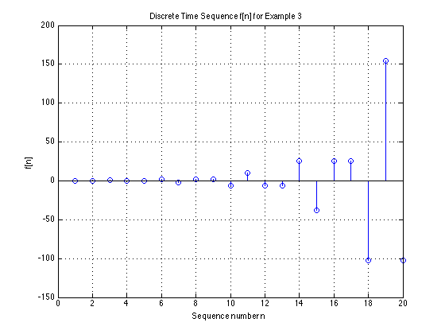

---
jupytext:
  formats: ipynb,md:myst
  text_representation:
    extension: .md
    format_name: myst
    format_version: 0.13
    jupytext_version: 1.11.5
kernelspec:
  display_name: MATLAB
  language: matlab
  name: imatlab
---

+++ {"slideshow": {"slide_type": "slide"}}

# The Inverse Z-Transform

+++ {"slideshow": {"slide_type": "notes"}}

## Colophon

An annotatable worksheet for this presentation is available as [**Worksheet 16**](worksheet16).

* The source code for this page is [dt_systems/3/i_z_transform.ipynb](https://github.com/cpjobling/eg-247-textbook/blob/master/dt_systems/3/i_z_transform.ipynb).

* You can view the notes for this presentation as a webpage ([HTML](https://cpjobling.github.io/eg-247-textbook/dt_systems/3/i_z_transform.html)). 

* This page is downloadable as a [PDF](https://cpjobling.github.io/eg-247-textbook/dt_systems/3/i_z_transform.pdf) file.

+++ {"slideshow": {"slide_type": "slide"}}

## Scope and Background Reading

This session we will talk about the Inverse Z-Transform and illustrate its use through an examples class.

The material in this presentation and notes is based on Chapter 9 (Starting at [Section 9.6](https://ebookcentral.proquest.com/lib/swansea-ebooks/reader.action?docID=3384197&ppg=351)) of {cite}`karris`.

+++ {"slideshow": {"slide_type": "slide"}}

## Agenda

+++ {"slideshow": {"slide_type": "fragment"}}

* Inverse Z-Transform

+++ {"slideshow": {"slide_type": "fragment"}}

* Examples using PFE

+++ {"slideshow": {"slide_type": "fragment"}}

* Examples using Long Division

+++ {"slideshow": {"slide_type": "fragment"}}

* Analysis in MATLAB

+++ {"slideshow": {"slide_type": "slide"}}

## Performing the Inverse Z-Transform

The inverse Z-Transform enables us to extract a sequence $f[n]$ from $F(z)$. It can be found by any of the following methods:

* Partial fraction expansion
* The inversion integral
* Long division of polynomials

+++ {"slideshow": {"slide_type": "subslide"}}

### Partial fraction expansion

We expand $F(z)$ into a summation of terms whose inverse is known. These terms have the form:

$$k,\;\frac{r_1 z}{z - p_1},\;\frac{r_1 z}{(z - p_1)^2},\;\frac{r_3 z}{z - p_2},\ldots$$

where $k$ is a constant, and $r_i$ and $p_i$ represent the residues and poles respectively, and can be real or complex<sup>1</sup>.

+++ {"slideshow": {"slide_type": "notes"}}

**Notes**

1. If complex, the poles and residues will be in complex conjugate pairs 

$$\frac{r_{i} z}{z - p_i} + \frac{r_{i}^* z}{z - p_i^*}$$

+++ {"slideshow": {"slide_type": "subslide"}}

### Step 1: Make Fractions Proper

* Before we expand $F(z)$ into partial fraction expansions, we must first express it as a *proper* rational function.
* This is done by expanding $F(z)/z$ instead of $F(z)$
* That is we expand

$$\frac{F(z)}{z} = \frac{k}{z} + \frac{r_1}{z-p_1} + \frac{r_2}{z-p_2} + \cdots$$

+++ {"slideshow": {"slide_type": "subslide"}}

### Step 2: Find residues

* Find residues from

$$r_k = \lim_{z\to p_k}(z - p_k)\frac{F(z)}{z} = (z - p_k)\left.\frac{F(z)}{z}\right|_{z=p_k}$$

+++ {"slideshow": {"slide_type": "subslide"}}

### Step 3: Map back to transform tables form

* Rewrite $F(z)/z$:

$$z\frac{F(z)}{z} = F(z) = k + \frac{r_1z}{s-p_1} + \frac{r_2z}{s-p_2} + \cdots$$

+++ {"slideshow": {"slide_type": "subslide"}}

We will work through an example in class.

[Skip next slide in Pre-Lecture]

+++ {"slideshow": {"slide_type": "subslide"}}

### Example 1

Karris Example 9.4: use the partial fraction expansion to compute the inverse z-transform of

$$F(z) = \frac{1}{(1 - 0.5z^{-1})(1 - 0.75z^{-1})(1 - z^{-1})}$$

+++ {"slideshow": {"slide_type": "notes"}}

<pre style="border: 2px solid blue">


</pre>

+++ {"slideshow": {"slide_type": "subslide"}}

### MATLAB solution for example 1

See [example1.mlx](https://cpjobling.github.io/eg-247-textbook/dt_systems/3/matlab/example1.mlx). (Also available as  [example1.m](https://cpjobling.github.io/eg-247-textbook/dt_systems/3/matlab/example1.m).)

Uses MATLAB functions: 

* `collect` &ndash; expands a polynomial
* `sym2poly` &ndash; converts a polynomial into a numeric polymial (vector of coefficients in descending order of exponents)
* `residue` &ndash; calculates poles and zeros of a polynomial
* `ztrans` &ndash; symbolic z-transform
* `iztrans` &ndash; symbolic inverse ze-transform
* `stem` &ndash; plots sequence as a "lollipop" diagram

```{code-cell} matlab
---
slideshow:
  slide_type: fragment
---
clear all
imatlab_export_fig('print-svg')  % Static svg figures.
cd matlab
format compact
```

```{code-cell} matlab
---
slideshow:
  slide_type: fragment
---
syms z n
```

+++ {"slideshow": {"slide_type": "subslide"}}

The denoninator of $F(z)$

```{code-cell} matlab
---
slideshow:
  slide_type: fragment
---
Dz = (z - 0.5)*(z - 0.75)*(z - 1);
```

+++ {"slideshow": {"slide_type": "subslide"}}

Multiply the three factors of Dz to obtain a polynomial

```{code-cell} matlab
---
slideshow:
  slide_type: fragment
---
Dz_poly = collect(Dz)
```

+++ {"slideshow": {"slide_type": "subslide"}}

### Make into a rational polynomial

+++ {"slideshow": {"slide_type": "fragment"}}

$z^2$

```{code-cell} matlab
---
slideshow:
  slide_type: fragment
---
num = [0, 1, 0, 0];
```

+++ {"slideshow": {"slide_type": "fragment"}}

$z^3 - 9/4 z^2 - 13/8 z - 3/8$

```{code-cell} matlab
---
slideshow:
  slide_type: fragment
---
den = sym2poly(Dz_poly)
```

+++ {"slideshow": {"slide_type": "subslide"}}

### Compute residues and poles

```{code-cell} matlab
---
slideshow:
  slide_type: fragment
---
[r,p,k] = residue(num,den);
```

+++ {"slideshow": {"slide_type": "subslide"}}

### Print results 

- `fprintf` works like the c-language function

```{code-cell} matlab
---
slideshow:
  slide_type: fragment
---
fprintf('\n')
fprintf('r1 = %4.2f\t', r(1)); fprintf('p1 = %4.2f\n', p(1));...
fprintf('r2 = %4.2f\t', r(2)); fprintf('p2 = %4.2f\n', p(2));...
fprintf('r3 = %4.2f\t', r(3)); fprintf('p3 = %4.2f\n', p(3));
```

+++ {"slideshow": {"slide_type": "subslide"}}

### Symbolic proof

$$f[n] = 2\left(\frac{1}{2}\right)^n - 9\left(\frac{3}{4}\right)^n + 8$$

```{code-cell} matlab
---
slideshow:
  slide_type: fragment
---
% z-transform
fn = 2*(1/2)^n-9*(3/4)^n + 8;
Fz = ztrans(fn)
```

```{code-cell} matlab
---
slideshow:
  slide_type: fragment
---
% inverse z-transform
iztrans(Fz)
```

+++ {"slideshow": {"slide_type": "subslide"}}

### Sequence

```{code-cell} matlab
---
slideshow:
  slide_type: fragment
---
n = 1:15;
sequence = subs(fn,n);
stem(n,sequence)
title('Discrete Time Sequence f[n] = 2*(1/2)^n-9*(3/4)^n + 8');
ylabel('f[n]')
xlabel('Sequence number n')
```

+++ {"slideshow": {"slide_type": "subslide"}}

### Example 2

Karris example 9.5: use the partial fraction expansion method to to compute the inverse z-transform of

$$F(z) = \frac{12z}{(z+1)(z - 1)^2}$$

+++ {"slideshow": {"slide_type": "notes"}}

<pre style="border: 2px solid blue">


</pre>

+++ {"slideshow": {"slide_type": "subslide"}}

### MATLAB solution for example 2

See [example2.mlx](https://cpjobling.github.io/eg-247-textbook/dt_systems/3/matlab/example2.mlx). (Also available as  [example2.m](https://cpjobling.github.io/eg-247-textbook/dt_systems/3/matlab/example2.m).)

+++ {"slideshow": {"slide_type": "notes"}}

Uses additional MATLAB functions: 

* `dimpulse` &ndash; computes and plots a sequence $f[n]$ for any range of values of $n$

```{code-cell} matlab
---
slideshow:
  slide_type: fragment
---
open example2
```

+++ {"slideshow": {"slide_type": "notes"}}

### Results for example 2

#### 'Lollipop' Plot


#### 'Staircase' Plot

Simulates output of Zero-Order-Hold (ZOH) or Digital Analogue Converter (DAC)


+++ {"slideshow": {"slide_type": "subslide"}}

### Example 3

Karris example 9.6: use the partial fraction expansion method to to compute the inverse z-transform of

$$F(z) = \frac{z + 1}{(z-1)(z^2 + 2z + 2)}$$

+++ {"slideshow": {"slide_type": "notes"}}

<pre style="border: 2px solid blue">


</pre>

+++ {"slideshow": {"slide_type": "subslide"}}

### MATLAB solution for example 3

See [example3.mlx](https://cpjobling.github.io/eg-247-textbook/dt_systems/3/matlab/example3.mlx). (Also available as [example3.m](https://cpjobling.github.io/eg-247-textbook/dt_systems/3/matlab/example3.m).)

```{code-cell} matlab
---
slideshow:
  slide_type: fragment
---
open example3
```

+++ {"slideshow": {"slide_type": "notes"}}

### Results for example 3

#### Lollipop Plot



#### Staircase Plot


+++ {"slideshow": {"slide_type": "slide"}}

### Inverse Z-Transform by the Inversion Integral

The inversion integral states that:

$$f[n] = \frac{1}{j2\pi}\oint_C {F(z){z^{n - 1}}\,dz} $$

where $C$ is a closed curve that encloses all poles of the integrant.

This can (*apparently*) be solved by Cauchy's residue theorem!!

Fortunately (:-), this is beyond the scope of this module!

+++ {"slideshow": {"slide_type": "notes"}}

See Karris Section 9.6.2 (pp 9-29&mdash;9-33) if you want to find out more.

+++ {"slideshow": {"slide_type": "slide"}}

### Inverse Z-Transform by the Long Division

To apply this method, $F(z)$ must be a rational polynomial function, and the numerator and denominator must be polynomials arranged in descending powers of $z$.

+++ {"slideshow": {"slide_type": "subslide"}}

We will work through an example in class.

[Skip next slide in Pre-Lecture]

+++ {"slideshow": {"slide_type": "subslide"}}

### Example 4

Karris example 9.9: use the long division method to determine $f[n]$ for $n = 0,\,1,\,\mathrm{and}\,2$, given that

$$F(z) = \frac{1 + z^{-1} + 2z^{-2} + 3z^{-3}}{(1 - 0.25z^{-1})(1 - 0.5z^{-1})(1 - 0.75z^{-1})}$$

+++ {"slideshow": {"slide_type": "notes"}}

<pre style="border: 2px solid blue">


</pre>

+++ {"slideshow": {"slide_type": "subslide"}}

### MATLAB solution for example 4

See [example4.mlx](https://cpjobling.github.io/eg-247-textbook/dt_systems/3/matlab/example4.mlx). (also available as [example4.m](https://cpjobling.github.io/eg-247-textbook/dt_systems/3/matlab/example4.m).)

```{code-cell} matlab
---
slideshow:
  slide_type: fragment
---
open example4
```

+++ {"slideshow": {"slide_type": "notes"}}

### Results for example 4

````
sym_den =
 
z^3 - (3*z^2)/2 + (11*z)/16 - 3/32
 

fn =

    1.0000
    2.5000
    5.0625
    ....
````

#### Combined Staircase/Lollipop Plot


+++ {"slideshow": {"slide_type": "slide"}}

## Methods of Evaluation of the Inverse Z-Transform

+++ {"slideshow": {"slide_type": "subslide"}}

### Partial Fraction Expansion

*Advantages*

* Most familiar.
* Can use MATLAB `residue` function.

*Disadvantages*

* Requires that $F(z)$ is a proper rational function.

+++ {"slideshow": {"slide_type": "subslide"}}

### Invsersion Integral

*Advantage*

* Can be used whether $F(z)$ is rational or not

*Disadvantages*

* Requires familiarity with the *Residues theorem* of complex variable analaysis.</li></ul>

+++ {"slideshow": {"slide_type": "subslide"}}

### Long Division

*Advantages*

* Practical when only a small sequence of numbers is desired.
* Useful when z-transform has no closed-form solution.

+++ {"slideshow": {"slide_type": "subslide"}}

*Disadvantages*

* Can use MATLAB `dimpulse` function to compute a large sequence of numbers.
* Requires that $F(z)$ is a proper rational function.
* Division may be endless.

+++ {"slideshow": {"slide_type": "slide"}}

## Summary

* Inverse Z-Transform
* Examples using PFE
* Examples using Long Division
* Analysis in MATLAB

*Coming Next*

* DT transfer functions, continuous system equivalents, and modelling DT systems in Matlab and Simulink.

+++

## Reference

See [Bibliography](/zbib).

+++ {"slideshow": {"slide_type": "notes"}}

## Answers to Examples

+++ {"slideshow": {"slide_type": "notes"}}

### Answer to Example 1

$$f[n] = 2\left(\frac{1}{2}\right)^n - 9\left(\frac{3}{4}\right)^n + 8$$

+++ {"slideshow": {"slide_type": "notes"}}

### Answer to Example 2

$$f[n] = 3(-1)^n + 6n - 3$$

+++ {"slideshow": {"slide_type": "notes"}}

### Answer to Example 3

$$f[n] = -0.5\delta[n] + 0.4 + \frac{(\sqrt{2})^n}{10}\cos \frac{3n\pi}{4} - \frac{3(\sqrt{2})^n}{10}\sin \frac{3n\pi}{4}$$

+++ {"slideshow": {"slide_type": "notes"}}

### Answer to Example 4

$f[0] = 1$, $f[1] = 5/2$, $f[2] = 81/16$, ....
