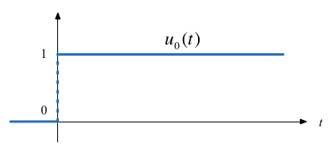
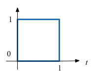
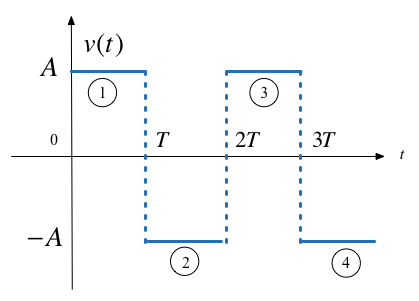
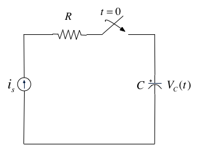
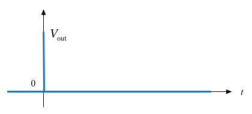

---
jupytext:
  formats: ipynb,md:myst
  text_representation:
    extension: .md
    format_name: myst
    format_version: 0.12
    jupytext_version: 1.9.1
kernelspec:
  display_name: MATLAB
  language: matlab
  name: imatlab
---

+++ {"slideshow": {"slide_type": "skip"}}

Lecturer: Set up MATLAB

```{code-cell} matlab
---
slideshow:
  slide_type: skip
---
clear all
format compact
imatlab_export_fig('print-svg')  % Static svg figures.
```

+++ {"slideshow": {"slide_type": "slide"}}

# Worksheet 3

## To accompany Chapter 2 Elementary Signals

+++ {"slideshow": {"slide_type": "notes"}}

## Colophon

This worksheet can be downloaded as a [PDF file](https://cpjobling.github.io/eg-247-textbook/worksheets/worksheet3.pdf).

A printout of this worksheet will be distributed before the first class meeting in the **Week 1: Classroom Activities** section of the Canvas site. I will also distribute a copy to your personal **Worksheets** section of the **OneNote Class Notebook** so that you can add your own notes using OneNote. 

You are expected to have at least watched the video presentation of [Chapter 2](https://cpjobling.github.io/eg-247-textbook/elementary_signals/index) of the [notes](https://cpjobling.github.io/eg-247-textbook) before coming to the first class. If you haven't watch it afterwards!

After class, the lecture recording and the annotated version of this worksheet will be made available to you via OneNote and through Canvas.

+++ {"slideshow": {"slide_type": "slide"}}

## Elementary Signals

Consider the network shown in below where the switch is closed at time $t=T$ and all components are ideal. 


Express the output voltage $V_{\mathrm{out}}$ as a function of the unit step function, and sketch the appropriate waveform.

+++ {"slideshow": {"slide_type": "subslide"}}

Q1: What happens **before** $t=T$?

1. $v_{\mathrm{out}} = \mathrm{undefined}$
2. $v_{\mathrm{out}} = 0$
3. $v_{\mathrm{out}} = V_s$
4. $v_{\mathrm{out}} = V_s/2$
5. $v_{\mathrm{out}} = \infty$

+++ {"slideshow": {"slide_type": "fragment"}}

**-> Open Poll: 1.2.1**

+++ {"slideshow": {"slide_type": "subslide"}}

Q2: What happens **after** $t=T$?

1. $v_{\mathrm{out}} = \mathrm{undefined}$
2. $v_{\mathrm{out}} = 0$
3. $v_{\mathrm{out}} = V_s$
4. $v_{\mathrm{out}} = V_s/2$
5. $v_{\mathrm{out}} = \infty$

+++ {"slideshow": {"slide_type": "fragment"}}

**-> Open Poll: 1.2.2**

+++ {"slideshow": {"slide_type": "subslide"}}

Q3: What happens **at** $t=T$?

1. $v_{\mathrm{out}} = \mathrm{undefined}$
2. $v_{\mathrm{out}} = 0$
3. $v_{\mathrm{out}} = V_s$
4. $v_{\mathrm{out}} = V_s/2$
5. $v_{\mathrm{out}} = \infty$

+++ {"slideshow": {"slide_type": "fragment"}}

**-> Open Poll: 1.2.3**

+++ {"slideshow": {"slide_type": "subslide"}}

Q4: What does the response of $V_{\mathrm{out}}$ look like? 

Circle the picture you think is correct on your handout.

<table>
    <tr><td>A</td><td></td><td>B</td><td></td></tr>
    <tr><td>C</td><td></td><td>D</td><td></td></tr>
</table>

+++ {"slideshow": {"slide_type": "fragment"}}

**-> Open Poll: 1.2.4**

+++ {"slideshow": {"slide_type": "slide"}}

## The Unit Step Function

$${u_0}(t) = \left\{ {\begin{array}{*{20}{c}}
{0\quad t < 0}\\
{1\quad t > 0}
\end{array}} \right.$$



+++ {"slideshow": {"slide_type": "subslide"}}

### In Matlab

In Matlab, we use the `heaviside` function (Named after [Oliver Heaviside](https://en.wikipedia.org/wiki/Oliver_Heaviside)).

```{code-cell} matlab
---
slideshow:
  slide_type: fragment
tags: [remove-outlook]
---
syms t
ezplot(heaviside(t),[-1,1])
heaviside(0)
```

+++ {"slideshow": {"slide_type": "notes"}}

See: [show_heaviside.m](https://cpjobling.github.io/eg-247-textbook/elementary_signals/show_heaviside.m).

Note that, so it can be plotted, Matlab defines the *heaviside function* slightly differently from the mathematically ideal unit step:

$$\mathrm{heaviside}(t) = \left\{ {\begin{array}{*{20}{c}}
{0\quad t < 0}\\
{1/2\quad t = 0}\\
{1\quad t > 0}
\end{array}} \right.$$

+++ {"slideshow": {"slide_type": "subslide"}}

### Circuit Revisited

Consider the network shown below, where the switch is closed at time $t=T$. 


Express the output voltage $v_{\mathrm{out}}$ as a function of the unit step function, and sketch the appropriate waveform.

+++ {"slideshow": {"slide_type": "notes"}}

<pre style="border: 2px solid blue">


</pre>

+++ {"slideshow": {"slide_type": "slide"}}

## Simple Signal Operations

+++ {"slideshow": {"slide_type": "subslide"}}

### Amplitude Scaling

Sketch $Au_0(t)$ and $-Au_0(t)$

+++ {"slideshow": {"slide_type": "notes"}}

<pre style="border: 2px solid blue">


</pre>

+++ {"slideshow": {"slide_type": "subslide"}}

### Time Reversal

Sketch $u_0(-t)$

+++ {"slideshow": {"slide_type": "notes"}}

<pre style="border: 2px solid blue">


</pre>

+++ {"slideshow": {"slide_type": "subslide"}}

### Time Delay and Advance

Sketch $u_0(t-T)$ and $u_0(t+T)$

+++ {"slideshow": {"slide_type": "notes"}}

<pre style="border: 2px solid blue">


</pre>

+++ {"slideshow": {"slide_type": "slide"}}

### Examples

+++ {"slideshow": {"slide_type": "subslide"}}

#### Example 1

Which of these signals represents $-Au_0(t+T)$?


+++ {"slideshow": {"slide_type": "fragment"}}

**-> Open Poll: 1.2.5**

+++ {"slideshow": {"slide_type": "subslide"}}

#### Example 2

What is represented by


+++ {"slideshow": {"slide_type": "notes"}}

1. $-Au_0(t + T)$ 
2. $-Au_0(-t + T)$
3. $-Au_0(-t - T)$
4. $-Au_0(t-T)$

+++ {"slideshow": {"slide_type": "fragment"}}

**-> Open Poll: 1.2.6**

+++ {"slideshow": {"slide_type": "slide"}}

## Synthesis of Signals from Unit Step

Unit step functions can be used to represent other time-varying functions such as rectangular pulses, square waves and triangular pulses.

+++ {"slideshow": {"slide_type": "subslide"}}

### Synthesize Rectangular Pulse



+++ {"slideshow": {"slide_type": "notes"}}

<pre style="border: 2px solid blue">


</pre>

+++ {"slideshow": {"slide_type": "subslide"}}

### Synthesize Square Wave



+++ {"slideshow": {"slide_type": "notes"}}

<pre style="border: 2px solid blue">


</pre>

+++ {"slideshow": {"slide_type": "subslide"}}

### Synthesize Symmetric Rectangular Pulse


+++ {"slideshow": {"slide_type": "notes"}}

<pre style="border: 2px solid blue">


</pre>

+++ {"slideshow": {"slide_type": "subslide"}}

### Synthesize Symmetric Triangular Pulse


+++ {"slideshow": {"slide_type": "notes"}}

<pre style="border: 2px solid blue">


</pre>

+++ {"slideshow": {"slide_type": "slide"}}

## The Ramp Function



In the circuit shown above $i_s$ is a constant current source and the switch is closed at time $t=0$.

+++ {"slideshow": {"slide_type": "subslide"}}

Show that the voltage across the capacitor can be represented as

$$v_C(t)=\frac{i_s}{C}t u_0(t)$$ 

and sketch the wave form.

+++ {"slideshow": {"slide_type": "notes"}}

<pre style="border: 2px solid blue">


</pre>

+++ {"slideshow": {"slide_type": "subslide"}}

The unit ramp function is defined as

$$u_1(t) = \int_{-\infty}^{t}u_0(\tau)d\tau$$

so

$${u_1}(t) = \left\{ {\begin{array}{*{20}{c}}
{0\quad t < 0}\\
{t\quad t \ge 0}
\end{array}} \right.$$

and 

$$u_0(t) = \frac{d }{dt}u_1(t)$$

+++ {"slideshow": {"slide_type": "notes"}}

**Note**

Higher order functions of $t$ can be generated by the repeated integration of the unit step function. 

For future reference, you should determine $u_2(t)$, $u_3(t)$ and $u_n(t)$ for yourself and make a note of the general rule:

$$u_{n-1} = \frac{1}{n}\frac{d}{dt}u_n(t)$$

Details are given in equations 1.26&mdash;1.29 in the textbook.

+++ {"slideshow": {"slide_type": "slide"}}

## The Dirac Delta Function


In the circuit shown above, the switch is closed at time $t=0$ and $i_L(t)=0$ for $t<0$. Express the inductor current $i_L(t)$ in terms of the unit step function and hence derive an expression for $v_L(t)$.

+++ {"slideshow": {"slide_type": "notes"}}

<pre style="border: 2px solid blue">


</pre>

+++ {"slideshow": {"slide_type": "notes"}}

**Notes**

To solve this problem we need to invent a function that represents the derivative of the unit step function. This function is called $\delta(t)$ or the *dirac delta* function (named after [Paul Dirac](https://en.wikipedia.org/wiki/Paul_Dirac)).

+++ {"slideshow": {"slide_type": "subslide"}}

### The delta function

The unit impulse or the delta function, denoted as $\delta(t)$, is the derivative of the unit step.

This function is tricky because $u_0(t)$ is discontinuous at $t=0$ but it must have the properties

$$\int_{-\infty}^{t}\delta(\tau)d\tau = u_0(t)$$

and

$\delta(t) = 0$ for all $t\ne 0$.

+++ {"slideshow": {"slide_type": "subslide"}}

### Sketch of the delta function



+++ {"slideshow": {"slide_type": "slide"}}

## Important properties of the delta function

See the accompanying [notes](index).

+++ {"slideshow": {"slide_type": "slide"}}

### Examples

+++ {"slideshow": {"slide_type": "subslide"}}

#### Example 3

Evaluate the following expressions

+++ {"slideshow": {"slide_type": "fragment"}}

$$3t^4\delta(t-1) $$

+++ {"slideshow": {"slide_type": "notes"}}

<pre style="border: 2px solid blue">


</pre>

+++ {"slideshow": {"slide_type": "fragment"}}

$$\int_{-\infty}^{\infty}t\delta(t-2)dt$$

+++ {"slideshow": {"slide_type": "notes"}}

<pre style="border: 2px solid blue">


</pre>

+++ {"slideshow": {"slide_type": "fragment"}}

$$t^2\delta'(t-3)$$

+++ {"slideshow": {"slide_type": "notes"}}

<pre style="border: 2px solid blue">


</pre>

+++ {"slideshow": {"slide_type": "subslide"}}

#### Example 4


+++ {"slideshow": {"slide_type": "subslide"}}

(1) Express the voltage waveform $v(t)$ shown above as a sum of unit step functions for the time interval $-1 < t < 7$ s

+++ {"slideshow": {"slide_type": "notes"}}

<pre style="border: 2px solid blue">


</pre>

+++ {"slideshow": {"slide_type": "subslide"}}

Using the result of part (1), compute the derivative of $v(t)$ and sketch its waveform.

+++ {"slideshow": {"slide_type": "notes"}}

<pre style="border: 2px solid blue">


</pre>

+++ {"slideshow": {"slide_type": "slide"}}

## Lab Work

In the first lab, next Tuesday, we will solve further elemetary signals problems using MATLAB and Simulink
following the procedure given between pages 1-17 and 1-22 of the Karris. We will also explore the
`heaviside` and `dirac` functions.

+++ {"slideshow": {"slide_type": "notes"}}

## Answers to in-class questions

Mathematically

Q1. $v_{\mathrm{out}} = 0$ when $-\infty < t < 0$ (answer 2)

Q2. $v_{\mathrm{out}} = V_s$ when $0 < t < \infty$ (answer 3)

Q3. $v_{\mathrm{out}} = \mathrm{undefined}$ when $t=0$ (answer 1)

$V_{\mathrm{out}}$ jumps from $0$ to $V_s$ instantanously when the switch is closed. We call this a discontinuous signal!

Q4: The correct image is:


Example 1: Answer 3.

Example 2: Answer 2.
