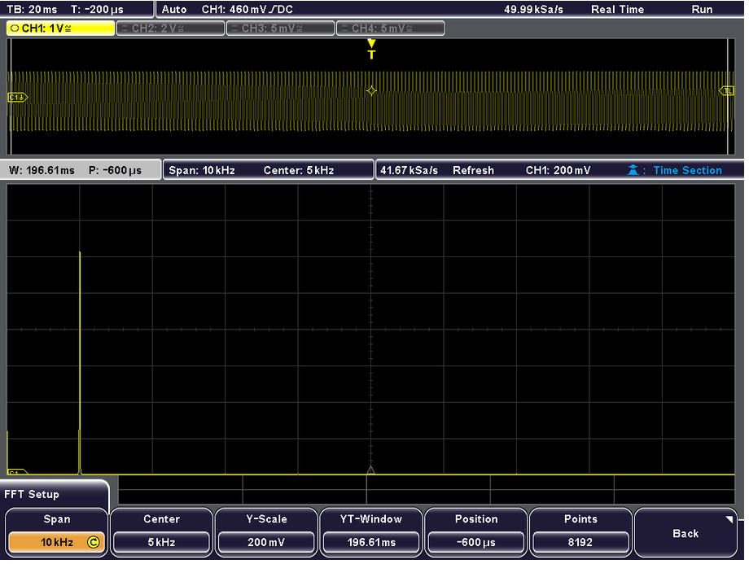
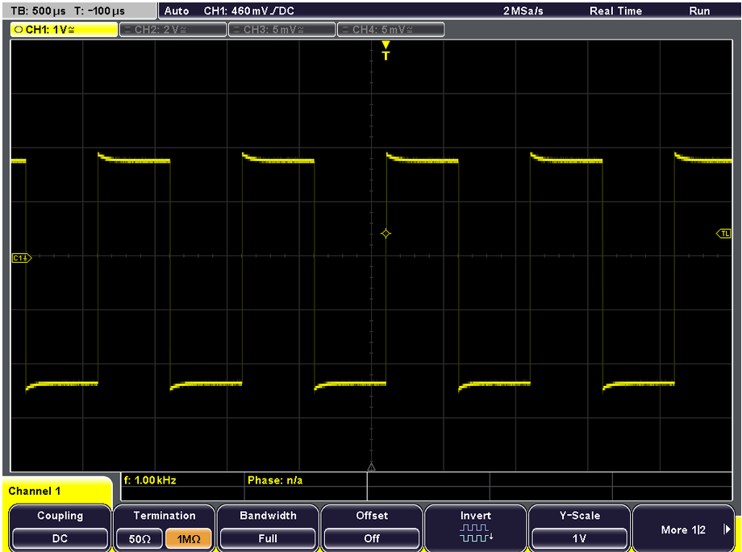
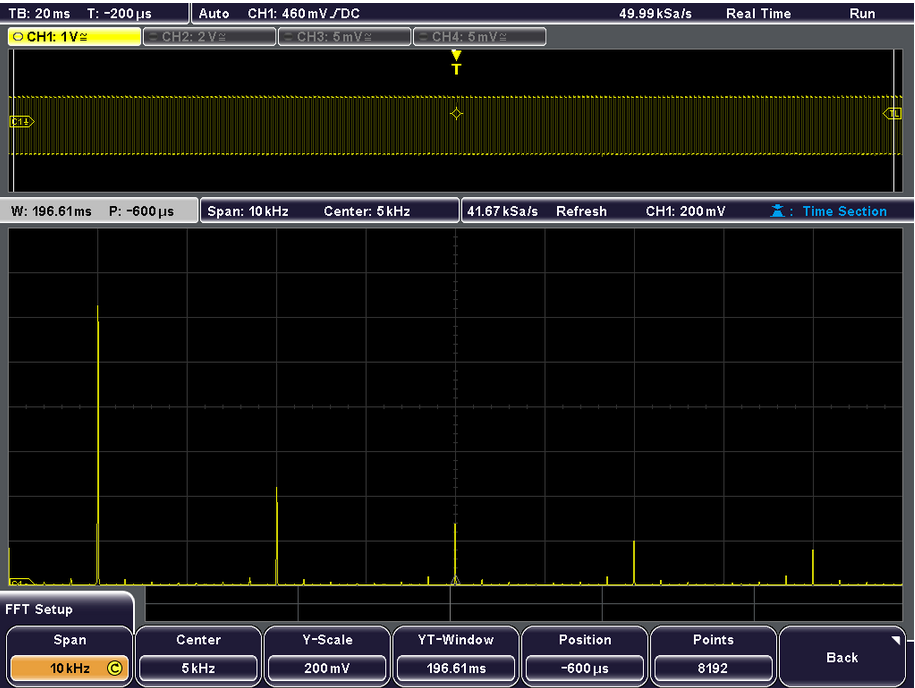
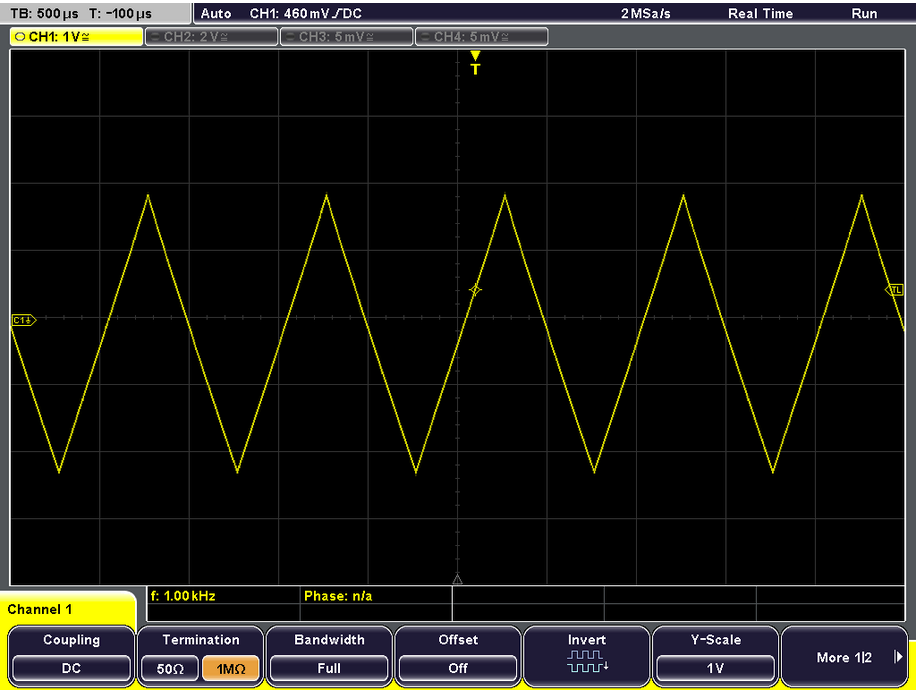
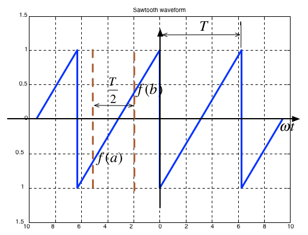
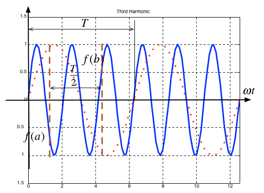

---
jupytext:
  formats: ipynb,md:myst
  text_representation:
    extension: .md
    format_name: myst
    format_version: 0.13
    jupytext_version: 1.15.2
kernelspec:
  display_name: Matlab
  language: matlab
  name: matlab
---

+++ {"slideshow": {"slide_type": "slide"}}

(ws2)=
# Worksheet 2

## To accompany Unit 3.1 Trigonometric Fourier Series

+++ {"slideshow": {"slide_type": "notes"}}

## Colophon

This worksheet can be downloaded as a [PDF file](https://cpjobling.github.io/eg-247-textbook/worksheets/worksheet2.pdf). We will step through this worksheet in class. 

An annotatable copy of the notes for this presentation will be distributed before the second class meeting as **Worksheet 2** in the **Week 3: Classroom Activities** section of the Canvas site. I will also distribute a copy to your personal **Worksheets** section of the **OneNote Class Notebook** so that you can add your own notes using OneNote. 

You are expected to have at least watched the video presentation of {ref}`trig_fseries` of the [notes](https://cpjobling.github.io/eg-247-textbook/) before coming to class. If you haven't watch it afterwards!

After class, the lecture recording and the annotated version of the worksheets will be made available through Canvas.

+++ {"slideshow": {"slide_type": "notes"}}

## Motivating Examples

This [Fourier Series demo](http://dspfirst.gatech.edu/matlab/#fseriesdemo), developed by Members of the Center for Signal and Image Processing (CSIP) at the [School of Electrical and Computer Engineering](https://www.ece.gatech.edu/) at the [Georgia Institute of Technology](https://www.gatech.edu/), shows how periodic signals can be synthesised by a sum of sinusoidal signals.

It is here used as a motivational example in our introduction to [Fourier Series](https://en.wikipedia.org/wiki/Fourier_series). (See also [Fourier Series](https://mathworld.wolfram.com/FourierSeries.html) from Wolfram MathWorld referenced in the **Quick Reference** on Blackboard.)

To install this example, download the [zip file](http://dspfirst.gatech.edu/matlab/ZipFiles/fseriesdemo-v144.zip) and unpack it somewhere on your MATLAB path.

+++ {"slideshow": {"slide_type": "slide"}}

## The Trigonometric Fourier Series

Any periodic waveform $f(t)$ can be represented as

$$\begin{eqnarray*}
  f(t) &=& \frac{1}{2}{a_0} + {a_1}\cos \Omega_0 t + {a_2}\cos 2\Omega_0 t + {a_3}\cos 3\Omega_0 t +  \cdots  + {a_n}\cos n\Omega_0 t +  \cdots  \\ 
   &+& {b_1}\sin \Omega_0 t + {b_2}\sin 2\Omega_0 t + {b_3}\sin 3\Omega_0 t +  \cdots  + {b_n}\sin n\Omega_0 t +  \cdots  \\ 
\end{eqnarray*} $$

or equivalently (if more confusingly)

$$f(t) = \frac{1}{2}{a_0} + \sum\limits_{n = 1}^\infty  {({a_n}\cos n\Omega_0 t + {b_n}\sin n\Omega_0 t)} $$

where $\Omega_0$ rad/s is the *fundamental frequency*.

+++ {"slideshow": {"slide_type": "subslide"}}

### Evaluation of the Fourier series coefficients

The coefficients are obtained from the following expressions (valid for any periodic waveform with fundamental frequency $\Omega_0$ so long as we integrate over one period $0\to T_0$ where $T_0 = 2\pi/\Omega_0$), and $\theta = \Omega_0 t$:

$$\frac{1}{2}a_0 = \frac{1}{T_0}\int_{0}^{T_0}f(t)d t = \frac{1}{2\pi}\int_{0}^{2\pi}f(\theta )d \theta$$

$$a_n = \frac{2}{T_0}\int_{0}^{T_0}f(t)\cos n\Omega_0 t\,dt = \frac{1}{\pi}\int_{0}^{2\pi}f(\theta)\cos n\theta\,d\theta$$

$$b_n = \frac{2}{T_0}\int_{0}^{T_0}f(t)\sin n\Omega_0 t\,dt = \frac{1}{\pi}\int_{0}^{2\pi}f(\theta)\cos n\theta \,d\theta$$

+++ {"slideshow": {"slide_type": "subslide"}}

### Demo 1

Building up wave forms from sinusoids.

```{code-cell}
---
slideshow:
  slide_type: fragment
---
% Setup working directory
clear vars
cd ../matlab
format compact
% Add install directory to path
path('/Users/eechris/MATLAB-Drive/EG-247-Examples/fseriesdemo',path)
% Run demo
fseriesdemo
```

+++ {"slideshow": {"slide_type": "subslide"}}

### Demo 2

Actual measurements

Taken by Dr Tim Davies with a Rhode&Schwarz Oscilloscope.

+++ {"slideshow": {"slide_type": "notes"}}

Note all spectra shown in these slides are generated numerically from the input signals by sampling and the application of the Fast Fourier Transform (FFT).

+++ {"slideshow": {"slide_type": "subslide"}}

#### 1 kHz Sinewave


+++ {"slideshow": {"slide_type": "subslide"}}

#### Spectrum of 1kHz sinewave



+++ {"slideshow": {"slide_type": "subslide"}}

#### 1 kHz Squarewave



+++ {"slideshow": {"slide_type": "subslide"}}

#### Spectrum of 1kHz square wave



+++ {"slideshow": {"slide_type": "notes"}}

Clearly showing peaks at fundamental, 1/3, 1/5, 1/7 and 1/9 at 3rd, 5th and 7th harmonic frequencies. Note for sawtooth, harmonics decline in amplitude as the reciprocal of the of harmonic number $n$.

+++ {"slideshow": {"slide_type": "subslide"}}

#### 1 kHz triangle waveform



+++ {"slideshow": {"slide_type": "subslide"}}

#### Spectrum of 1kHz triangle waveform


+++ {"slideshow": {"slide_type": "notes"}}

Clearly showing peaks at fundamental, 1/9, 1/25, 1/7 and 1/49 at 3rd, 5th and 7th harmonic frequencies. Note for triangle, harmonics decline in amplitude as the reciprocal of the square of $n$.

+++ {"slideshow": {"slide_type": "slide"}}

## Odd, Even and Half-wave Symmetry

+++ {"slideshow": {"slide_type": "fragment"}}

### Odd- and even symmetry

* An *odd* function is one for which $f(t) = -f(-t)$. The function $\sin t$ is an *odd* function.
* An *even* function is one for which $f(t) = f(-t)$. The function $\cos t$ is an *even* function.

+++ {"slideshow": {"slide_type": "fragment"}}

### Half-wave symmetry

* A periodic function with period $T$ is a function for which $f(t) = f(t + T)$
* A periodic function with period $T$, has *half-wave symmetry* if $f(t) = -f(t + T/2)$

+++ {"slideshow": {"slide_type": "subslide"}}

## Symmetry in Trigonometric Fourier Series

There are simplifications we can make if the original periodic properties has certain properties:

+++ {"slideshow": {"slide_type": "fragment"}}

* If $f(t)$ is odd, $a_0=0$ and there will be no cosine terms so ${a_n} = 0\; \forall n > 0$

+++ {"slideshow": {"slide_type": "fragment"}}

* If $f(t)$ is even, there will be no sine terms and ${b_n} = 0\; \forall n > 0$. The DC term ($a_0$) may or may not be zero.

+++ {"slideshow": {"slide_type": "fragment"}}

* If $f(t)$ has *half-wave symmetry* only the odd harmonics will be present. That is $a_n$ and $b_n$ is zero for all even values of $n$ (0, 2, 4, ...)

+++ {"slideshow": {"slide_type": "subslide"}}

### Symmetry in Common Waveforms

To reproduce the following waveforms (without annotation) publish the script [waves.m](https://cpjobling.github.io/eg-247-textbook/fourier_series/matlab/waves.m).

+++ {"slideshow": {"slide_type": "subslide"}}

#### Squarewave


* Average value over period $T$ is ...?
* It is an **odd**/**even** function?
* It **has/has not** half-wave symmetry $f(t)=-f(t+T/2)$?

+++ {"slideshow": {"slide_type": "subslide"}}

#### Shifted Squarewave


* Average value over period $T$ is 
* It is an **odd**/**even** function?
* It **has/has not** half-wave symmetry $f(t)=-f(t+T/2)$?

+++ {"slideshow": {"slide_type": "subslide"}}

#### Sawtooth



* Average value over period $T$ is 
* It is an **odd**/**even** function?
* It **has/has not** half-wave symmetry $f(t)=-f(t+T/2)$?

+++ {"slideshow": {"slide_type": "subslide"}}

#### Triangle


* Average value over period $T$ is 
* It is an **odd**/**even** function?
* It **has/has not** half-wave symmetry $f(t)=-f(t+T/2)$?

+++ {"slideshow": {"slide_type": "slide"}}

### Symmetry in fundamental, Second and Third Harmonics

In the following, $T/2$ is taken to be the half-period of the fundamental sinewave.

+++ {"slideshow": {"slide_type": "subslide"}}

#### Fundamental


* Average value over period $T$ is 
* It is an **odd**/**even** function?
* It **has/has not** half-wave symmetry $f(t)=-f(t+T/2)$?

+++ {"slideshow": {"slide_type": "subslide"}}

#### Second Harmonic


* Average value over period $T$ is 
* It is an **odd**/**even** function?
* It **has/has not** half-wave symmetry $f(t)=-f(t+T/2)$?

+++ {"slideshow": {"slide_type": "subslide"}}

#### Third Harmonic



* Average value over period $T$ is 
* It is an **odd**/**even** function?
* It **has/has not** half-wave symmetry $f(t)=-f(t+T/2)$?

+++ {"slideshow": {"slide_type": "subslide"}}

### Some simplifications that result from symmetry

* The limits of the integrals used to compute the coefficents $a_n$ and $b_n$ of the Fourier series are given as $0\to 2\pi$ which is one period $T$
* We could also choose to integrate from $-\pi \to \pi$
* If the function is *odd*, or *even* or has *half-wave symmetry* we can compute $a_n$ and $b_n$ by integrating from $0\to \pi$ and multiplying by 2.
* If we have *half-wave symmetry* we can compute $a_n$ and $b_n$ by integrating from $0\to \pi/2$ and multiplying by 4.

(For more details see page 7-10 of the textbook)

+++ {"slideshow": {"slide_type": "subslide"}}

## Computing coefficients of Trig. Fourier Series in Matlab 

As an example let's take a square wave with amplitude $\pm A$ and period $T$.


+++ {"slideshow": {"slide_type": "subslide"}}

### Solution

Solution: See [square_ftrig.mlx](https://cpjobling.github.io/eg-247-textbook/fourier_series/matlab/square_ftrig.mlx). Script confirms that:

* $a_0 = 0$
* $a_i = 0$: function is odd
* $b_i = 0$: for $i$ even - half-wave symmetry

```
ft =
 
(4*A*sin(t))/pi + (4*A*sin(3*t))/(3*pi) + (4*A*sin(5*t))/(5*pi) + (4*A*sin(7*t))/(7*pi) + (4*A*sin(9*t))/(9*pi) + (4*A*sin(11*t))/(11*pi)
```

```{code-cell}
---
slideshow:
  slide_type: fragment
---
open square_ftrig
```

+++ {"slideshow": {"slide_type": "notes"}}

Note that the coefficients match those given in the textbook (Section 7.4.1).

$$f(t) = \frac{4A}{\pi}\left(\sin \Omega_0 t + \frac{1}{3}\sin 3\Omega_0 t + \frac{1}{5}\sin 5\Omega_0 t + \cdots\right) = \frac{4A}{\pi}\sum_{n=\mathrm{odd}}\frac{1}{n}\sin n\Omega_0 t$$

+++ {"slideshow": {"slide_type": "subslide"}}

### Using symmetry - computing the Fourier series coefficients of the shifted square wave


+++ {"slideshow": {"slide_type": "subslide"}}

* As before $a_0=0$
* We observe that this function is even, so all $b_k$ coefficents will be zero
* The waveform has half-wave symmetry, so only odd indexed coeeficents will be present.
* Further more, because it has half-wave symmetry we can just integrate from $0 \to \pi/2$ and multiply the result by 4.

See [shifted_sq_ftrig.mlx](https://cpjobling.github.io/eg-247-textbook/fourier_series/matlab/shifted_sq_ftrig.mlx).

```
ft =
 
(4*A*cos(t))/pi - (4*A*cos(3*t))/(3*pi) + (4*A*cos(5*t))/(5*pi) - (4*A*cos(7*t))/(7*pi) + (4*A*cos(9*t))/(9*pi) - (4*A*cos(11*t))/(11*pi)
```

```{code-cell}
---
slideshow:
  slide_type: fragment
---
open shifted_sq_ftrig
```

+++ {"slideshow": {"slide_type": "notes"}}

Note that the coefficients match those given in the textbook (Section 7.4.2).

$$f(t) = \frac{4A}{\pi}\left(\cos \Omega_0 t - \frac{1}{3}\cos 3\Omega_0 t + \frac{1}{5}\cos 5\Omega_0 t - \cdots\right) = \frac{4A}{\pi}\sum_{n=\mathrm{odd}}(-1)^{\frac{n-1}{2}} \frac{1}{n}\cos n\Omega_0 t$$
