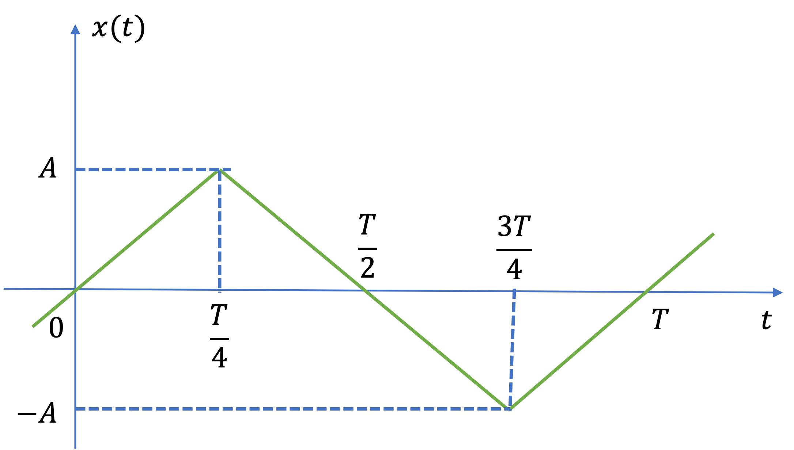
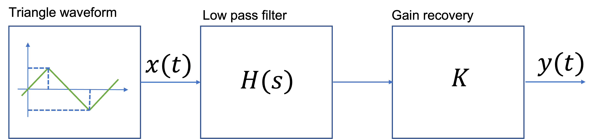

---
jupytext:
  formats: ipynb,md:myst
  text_representation:
    extension: .md
    format_name: myst
    format_version: 0.13
    jupytext_version: 1.15.2
kernelspec:
  display_name: Matlab
  language: matlab
  name: matlab
---

+++ {"slideshow": {"slide_type": "slide"}}

(unit3.4)=
# Unit 3.4: Applications of Line Spectra

The preparatory reading for this section is [Chapter 7.10](https://ebookcentral.proquest.com/lib/swansea-ebooks/reader.action?docID=3384197&ppg=247) of  {cite}`karris`.

+++ {"slideshow": {"slide_type": "notes"}}

This section concludes our introduction to Fourier Series.

In {ref}`exp_fs2` we saw that we could represent continuous-time periodic waveforms as line spectra in the frequency domain.

In this section we discuss how we can use these line spectra for the calculation of power for signals with harmonics, computation of total harmanic distortion and we conclude with an introduction to filters.

+++

## Colophon

An annotatable worksheet for this presentation is available as {ref}`ws5`.

* The source code for this page is [fourier_series/4/exp_fs3.md](https://github.com/cpjobling/eg-247-textbook/blob/master/fourier_series/4/exp_fs3.md).

* You can view the notes for this presentation as a webpage ({ref}`unit3.4`). 

* This page is downloadable as a [PDF](https://cpjobling.github.io/eg-247-textbook/fourier_series/4/exp_fs3.pdf) file.

+++ {"slideshow": {"slide_type": "notes"}}

## Agenda

* {ref}`fse4:power`
* {ref}`fse4:power_spectrum`
* {ref}`fse4:thd`
* {ref}`fse4:ss_resp`
* {ref}`examples19`

+++ {"slideshow": {"slide_type": "slide"}}

(fse4:power)=
## Power in Periodic Signals

+++ {"slideshow": {"slide_type": "fragment"}}

In [Unit 2.2 of EG-150 Signals and Systems](https://cpjobling.github.io/eg-150-textbook/signals_and_systems/signals/pep_signals.html) we defined *Signal Energy*, *Average Signal Power* and *Root Mean Square Power* which for periodic signals will be defined as shown below:

+++ {"slideshow": {"slide_type": "subslide"}}

$$E = \int_0^T |x(t)|^2 dt$$ (eq:fs3:1)

+++ {"slideshow": {"slide_type": "fragment"}}

$$P_{\mathrm{av}} = \frac{1}{T}\int_0^T |x(t)|^2 dt$$ (eq:fs3:2)

+++ {"slideshow": {"slide_type": "fragment"}}

$$P_{\mathrm{RMS}} = \sqrt{\frac{1}{T}\int_0^T |x(t)|^2 dt}$$ (eq:fs3:3)

+++ {"slideshow": {"slide_type": "subslide"}}

### Parseval's Theorem

[Parseval's Theorem](https://en.wikipedia.org/wiki/Parseval's_theorem) states that the total average power of a periodic signal $f(t)$ is equal to the sum of the average powers of all its harmonic components.

+++ {"slideshow": {"slide_type": "subslide"}}

The power in the $k$th harmonic $C_ke^{jk\Omega_0 t}$ is given by

$$P_k = \frac{1}{T}\int_0^T\left|C_ke^{jk\Omega_0 t}\right|^2\,dt = \frac{1}{T}\int_0^T\left|C_k\right|^2\,dt=\left|C_k\right|^2$$ (eq:fs3:4)

+++ {"slideshow": {"slide_type": "subslide"}}

Since $P_k = P_{-k}$, the total power of the $k$th harmomic is $2P_k$.

+++ {"slideshow": {"slide_type": "notes"}}

You should note that $|C_k| = \sqrt{C_k C_k^*}$ so $|C_k|^2 = C_k C_k^*$.

+++ {"slideshow": {"slide_type": "subslide"}}

Parseval's theorem states that

$$P = \frac{1}{T}\int_0^T \left|x(t)\right|^2\,dt = \sum_{k=-\infty}^{\infty}\left|C_k\right|^2.$$ (eq:fs3:5)

+++ {"slideshow": {"slide_type": "subslide"}}

### RMS Power

By a similar argument:

$$P_{\mathrm{RMS}} = \sqrt{\frac{1}{T}\int_0^T \left|f(t)\right|^2\,dt} = \sqrt{\sum_{k=-\infty}^{\infty}\left|C_k\right|^2}.$$ (eq:fs3:6)

+++ {"slideshow": {"slide_type": "slide"}}

(fse4:power_spectrum)=
## Power Spectrum

The *power spectrum* of signal is the sequence of average powers in each complex harmonic: 

$$|C_k|^2.$$ 

For real periodic signals the power spectrum is a real even sequence as 

$$|C_{-k}|^2 = |C_k^*|^2 = |C_k|^2.$$

+++ {"slideshow": {"slide_type": "slide"}}

(fse4:thd)=
## Total Harmonic Distortion

Suppose that a signal that is supposed to be a pure sine wave of amplitude A is distorted as shown in {numref}`fse:thd1` below

:::{figure-md} fse:thd1


A sinusoid with harmomic distortion
:::

+++ {"slideshow": {"slide_type": "notes"}}

This can occur in the line voltages of an industrial plant that makes heavy use of nonlineear loads such as electric arc furnaces, solid state relays, motor drives, etc (E.g. Tata Steel!)

+++ {"slideshow": {"slide_type": "subslide"}}

### THD Defined

Clearly, some of the harmonics for $k\ne \pm 1$ are nonzero. One way to characterize the distortion is to compute the ratio of average power in all the harmonics that "should not be present", that is for $k > 1$, to the total average power of the distorted sine wave. The square-root of this ratio is called the *total harmonic distortion* (THD) of the signal.

+++ {"slideshow": {"slide_type": "subslide"}}

If the signal is real and based on a sine wave (that is *odd*), then $C_0=0$ and

$$x_{\mathrm{RMS}}=\sqrt{\sum_{k=1}^{\infty}2|C_k|^2}$$ (eq:fs3:7)

+++ {"slideshow": {"slide_type": "subslide"}}

and we can define the THD as the ratio of the RMS value for all the harmonics for $K>1$ (the distortion) to the RMS of the fundamental which is 

$$\sqrt{2\left|C_1\right|^2}$$ (eq:fs3:8)

$${\rm{THD}} = 100\sqrt {\frac{\sum\limits_{k = 2}^\infty  {\left| C_k \right|^2}} {\left| C_1 \right|^2}} \% $$ (fse4:thd)

+++ {"slideshow": {"slide_type": "subslide"}}

### Computation of THD

:::{figure-md} fse4:compute_thd


Computation of THD from the signal power spectrum
:::

+++ {"slideshow": {"slide_type": "slide"}}

(fse4:ss_resp)=
## Steady-State Response of a Continuous-Time LTI System to a Periodic Signal

As shown in {ref}`eigenfunctions_of_continuous_time_LTI_systems`, the response of a continuous-time LTI system with impulse response $h(t)$ to a complex exponential signal $e^{st}$ is the same complex exponential multiplied by a complex gain: $y(t) = H(s)e^{st}$, where:

$$H(s)=\int_{-\infty}^{\infty}h(\tau)e^{-s\tau}\,d\tau.$$ (fse4:h_s)

+++ {"slideshow": {"slide_type": "subslide"}}

In particular, for $s = j\omega$, the output is simply $y(t)=H(j\omega)e^{j\omega t}$.

+++ {"slideshow": {"slide_type": "fragment"}}

The complex functions $H(s)$ and $H(j\omega)$ are called the system's *transfer function* and *frequency response*, respectively.

+++ {"slideshow": {"slide_type": "subslide"}}

### By superposition

The output of a continuous-time LTI system to a periodic function with period $T$ represented by a Fourier series is given by:

$$y(t)=\sum_{k=-\infty}^{\infty} C_kH(jk\Omega_0)e^{jk\Omega_0 t}$$ (fs4:y_t)

where $\Omega_0 = 2\pi/T$ is the fundamental frequency.

+++ {"slideshow": {"slide_type": "subslide"}}

Thus $y(t)$ is a Fourier series itself with coefficients $D_k$:

$$D_k = C_kH(jk\Omega_0)$$ (fs4:d_k)

+++ {"slideshow": {"slide_type": "subslide"}}

### Illustration

This picture below shows the effect of an LTI system on a periodic input in the frequency domain.


+++ {"slideshow": {"slide_type": "subslide"}}

### Application to signal processing

A consequence of the previous result is that we can design a system that has a desirable frequency spectrum $H(jk\Omega_0)$ that retains certain frequencies and cuts off others.

+++ {"slideshow": {"slide_type": "notes"}}

### Filter attenuation

The effect of an LTI system on a periodic input signal is to modify its Fourier series through a multiplication by its frequency response evaluated at the harmonic frequencies.

So what does $H(jk\Omega_0)$ looks like.

[change this to an RC circuit filter]

As an example, consider the simple first-order Butterworth low-pass (LP) filter with cut-off frequency $\omega_c$:

$$H(s) = \frac{\omega_c}{s + \omega_c}$$

For this filter

$$H(j\omega) = \frac{\omega_c}{j\omega + \omega_c}.$$

Let us say that we wish to compute the attenuation and phase of this filter at $\omega = \Omega_0$.

To compute the *magnitude*:

$$\begin{eqnarray*}
\left|H(j\Omega_0)\right| &=& \left|\frac{\omega_c}{j\Omega_0 + \omega_c}\right| \\
& = & \frac{\omega_c}{\sqrt{\Omega_0^2 + \omega_c^2}}
\end{eqnarray*}$$

We note that is $\left|H(j\Omega_0\right| \lt 1$ so the filter will *attenuate* the incoming harmonic frequency. This will be true for all harmonics, so in general, for a LP filter:

$$D_k = C_k\left|H(jk\Omega_0)\right|   < C_k.$$

The phase will be given by 

$$\phi = \angle H(j\omega) = \tan^{-1}\left(\frac{\Im \left( H(j\omega)\right)}{\Re \left(H(j(\omega)\right)}\right)$$

where

$$\begin{eqnarray*}
H(jk\Omega_0) &=& \frac{\omega_c^2}{(k\Omega_0)^2 + \omega_c^2} - j\frac{k\Omega_0\omega_c}{(k\Omega_0)^2 + \omega_c^2}\\
\phi_k &=& \tan^{-1}\left(-\frac{K\Omega_0\omega_c}{\omega_c^2}\right) \\
&=& \tan^{-1}\left(-\frac{k\Omega_0}{\omega_c}\right) 
\end{eqnarray*}
$$

Phases are additive so

$$\angle D_k = \angle C_k + \phi_k.$$

By doing such analysis, we can examine the effect of a filter on a periodic signal, just by considering how the coefficients of the harmonic terms are changed (attenuated in magnitude and shifted in phase) by the filter.

+++

(examples19)=
## Examples

The recurrent rectangular pulse is used extensively in digital communication systems. To determine how faithfully such pulses will be transmitted, it is necessary to know the power in the frequency components.

+++ {"slideshow": {"slide_type": "slide"}}

(ex:19.1)=
### Example 6: Average Power

Compute the average power of a pulse train for which the pulse width is $T/2$ (duty cycle 50%). Use the result: 

$$C_k = \frac{A}{w}.\frac{\sin(k\pi/w)}{k\pi/w}$$

as your starting point.

+++ {"slideshow": {"slide_type": "notes"}}

<pre style="border: 2px solid blue">


</pre>

+++ {"slideshow": {"slide_type": "slide"}}

(ex19.2)=
### Example 7: Power Spectrum

Compute and display the power spectrum for the signal of {ref}`ex:19.1`.

```{code-cell}
---
slideshow:
  slide_type: subslide
---
clear all
cd ../matlab
format compact
```

```{code-cell}
---
slideshow:
  slide_type: subslide
---
A = 1; w = 8; [f,omega] = pulse_fs(A,w,15);
```

+++ {"slideshow": {"slide_type": "subslide"}}

#### Power spectrum

```{code-cell}
---
slideshow:
  slide_type: subslide
---
ps = abs(f).^2;
fprintf('Omega (rad/s)\tPower (W)\n')
for i = 1:length(ps)
    fprintf('%d\t\t%f\n',omega(i),ps(i))
end
```

+++ {"slideshow": {"slide_type": "subslide"}}

#### Plot

```{code-cell}
---
slideshow:
  slide_type: subslide
---
stem(omega,abs(f).^2)
title('Power Spectrum for pulse width T/8')
ylabel('|C_k|^2')
xlabel('\Omega_0 [rad/s]')
```

+++ {"slideshow": {"slide_type": "notes"}}

Note that most of the power is concentrated at DC and in the first seven harmonic components. That is in the frequency range $[-14\pi/T,+14\pi/T]$ rad/s.

+++ {"slideshow": {"slide_type": "slide"}}

(ex19.3)=
### Example 8: THD in a square-wave
Given that the exponential fourier series coefficients for a square wave are 

$$C_0 = 0$$

$$C_k = 0\quad k\,\mathrm{even}$$

$$C_k = \frac{2A}{jk\pi}\quad k\,\mathrm{odd}$$

compute the total harmonic distortion represented by the first 7 harmonics of the square-wave.

+++ {"slideshow": {"slide_type": "slide"}}

(ex19.4)=
### Example 9: THD in a triangle wave
Given that the exponential fourier series coefficients for a triangle wave with even symmetry is

$$C_0 = 0$$

$$C_k = 0\quad k\,\mathrm{even}$$

$$C_k = -\frac{4A}{jk^2\pi^2}\quad k\,\mathrm{odd}$$

compute the total harmonic distortion represented by the first 7 harmonics of the triangle-wave.

+++ {"slideshow": {"slide_type": "notes"}}

(ex19.5)=
### Example 10: Low-pass filter
This example represents the low-pass filter used in the signal generator project for **EG-152: Analogue Design**.

:::{note}
Use MATLAB to complete this example.
:::


a) A triangle waveform $x(t)$ with frequency $\Omega_0 = 2\pi/T$ is shown in {numref}`fig_ex19.1a`. 

:::{figure-md} fig_ex19.1a


A triangle waveform
:::

Determine the exponential Fourier series coefficients $C_k$ for this waveform and use this result to show that the trigonomentric Fourier series for a triangle waveform is

+++ {"slideshow": {"slide_type": "notes"}}

$$x(t) = \frac{8A}{\pi^2}\left(\sum_{k\ \mathrm{odd}}(-1)^{\left(\frac{k-1}{2}\right)}\frac{1}{k^2}\sin k \Omega_0 t \right)$$ (fse4:ws:fs4tri)

+++ {"slideshow": {"slide_type": "notes"}}

which, for the first seven harmonic frequencies, is given as

+++ {"slideshow": {"slide_type": "notes"}}

$$x(t) \approx \frac{8A}{\pi^2}\left(\sin \Omega_0 t - \frac{1}{9} \sin 3\Omega_0 t + \frac{1}{25} \sin 5\Omega_0 t - \frac{1}{49} \sin 7\Omega_0 t \cdots \right) $$

+++ {"slideshow": {"slide_type": "notes"}}

b) In the signal generator, the block diagram for which is given in {numref}`fig19_5a_bd`, a triangle wavefom with $A = 10$ and frequency $f = 1/T = 2.5$ kHz, is filtered by the low-pass filter with transfer function

$$H(s) = \frac{a^2}{s^2 + 3as + a^2}$$

where $a = 1/(RC)$ and $RC$ is the time constant of an RC circuit with $R = 8.2$ k&Omega; and $C  = 10$ nF.

:::{figure-md} fig19_5a_bd


A signal generator
:::


i) Determine the frequency response $H(j\omega)$ of the filter.

ii) Compute the cut-off frequency $\omega_c$ of the filter. Note the value of the cut-off frequency this is the frequency for which the filter transmits half-the power or 

$$|H(j\omega_c)| = \frac{1}{\sqrt{2}}$$

iii) Use equation {eq}`fs4:d_k` and the result of a) to determine the attenuation in the first 7 harmonics of the triangle waveform.

iv) The filter is intended to generate a sinewave from the triangle wave. Determine the value of the recovery gain $K$ to ensure that the attenuation is 0 dB at 2.5 kHz. Recompute the harmonic attenuation given the presence of $K$.

v) Use these results to determine the THD (in dB) of the filtered waveform.

vi) Use the attached Simulink model ([ex19_5.slx](../matlab/ex19_5.slx)) of the the filter to validate the results. Comment on the quality of the design.

```{code-cell}
---
slideshow:
  slide_type: notes
---
cd ../matlab
% For Simulink model
R = 8.2e3; % 8.2 kOhm
C = 10e-9; % 10 nF
a = (1/(R*C)); % filter coefficient
K = 1 % replace wthis value with the value computed in Exercise 10(b)(iv)
Hs = tf(a^2,[1 3*a a^2])
bode(Hs),grid
ex19_5
```

+++ {"slideshow": {"slide_type": "notes"}}

## Summary

We concluded our study of Fourier series by reviewing the following topics

* {ref}`fse4:power`
* {ref}`fse4:power_spectrum`
* {ref}`fse4:thd`
* {ref}`fse4:ss_resp`
* {ref}`examples19`


(unit5.4:takeaways)=
### Unit 3.4 Takeaways

* Parseval's theorem allows us to compute the average power of of periodic signal $x(t) = x(t + nT)$ from its eponential Fourier series coefficients. The average Paower in a signale $x(t)$ is given by Eq. {eq}`eq:fs3:4` and RMS power is given by Eq. {eq}`eq:fs3:6`.
* The *power spectrum* of signal is the sequence of average powers in each complex harmonic: $|C_k|^2.$ which for real periodic signals is a *real even* sequence. 
* Total harmonic distortion is a measure of how much a periodic signal is different from a sine wave. It is defined in Eq. {eq}`fse4:thd`.
* The steady-state frequency response of a continuous-time LTI system with impulse response $h(t)$ to a periodic signal $x(t) = xTt + nT)$ with exponential Fourier series components $C_k$ is a Fourier series $y(t)$ with coefficients $D_k = C_k H(jk\Omega_0)$. (Where $H(s)$ is the Laplace transform of $h(t)$). This
result can be used to determine the filtering affect of any continuous-time LTI system on any periodic signal. As an example of this you should review the theory for the *harmonic filter* studied in Session 4 of **EG-152 Analogue Design** and which is reviewed in {ref}`ex19.5`.


### Coming next

We will continue our study of signals and system by introducing the Fourier Transform, discrete-time signals and systems, discrete Fourier transform and filter design.

+++ {"slideshow": {"slide_type": "notes"}}

(solutions19)=
## Answers to selected examples

+++ {"slideshow": {"slide_type": "notes"}}

(sol:ex:19.1)=
### Solution to Example 1

$w = 2$ so:

$$C_n = \frac{A}{2}.\frac{\sin(k\pi/2)}{k\pi/2}$$

Write down an expression for $P$ using Parseval's Theorem

+++ {"slideshow": {"slide_type": "notes"}}

### P

$$P = \sum\limits_{k =  - \infty }^\infty  \left| C_k \right|^2  = \sum\limits_{k =  - \infty }^\infty  \left| \frac{A}{2}{\mathop{\rm sinc}\nolimits} \frac{k\pi }{2} \right|^2  = {A^2}\left( \frac{1}{4} + 2\sum\limits_{k = 1}^\infty  \left| \frac{1}{4}\mathop{\rm sinc}\nolimits \frac{k\pi }{2} \right|^2  \right)$$

sinc$(k\pi/2) = 0$ for $k$ even ($k=0,2,4,6,\ldots$) so...?

+++ {"slideshow": {"slide_type": "notes"}}

### P for k odd

$$P = A^2\left( \frac{1}{4} + \frac{1}{2}\sum\limits_{k = 1,3,5, \ldots }^\infty  \left| \rm{sinc}\frac{k\pi }{2} \right| ^2 \right) = A^2\left( \frac{1}{4} + \frac{1}{2}\sum\limits_{k = 1,3,5, \ldots }^\infty  \left| \frac{\sin \left( \frac{k\pi }{2} \right)}{\frac{k\pi }{2}} \right|^2  \right)$$

$\sin(k\pi/2) = 1$ for $k$ odd ($k=1,3,5,7,\ldots$) so...?

+++ {"slideshow": {"slide_type": "notes"}}

### P after eliminating sine

$$P = {A^2}\left( \frac{1}{4} + \frac{2}{\pi ^2}\left[ 1 + \frac{1}{9} + \frac{1}{25} +  \ldots  \right]  \right) = {A^2}\left( \frac{1}{4} + \frac{2}{\pi ^2}\left[ \frac{\pi ^2}{8} \right] \right)$$

$$P = \frac{A^2}{2}$$

+++

### Check P from x(t)

$$P = \frac{1}{2\pi}\int_{-\pi/2}^{\pi/2}|x(t)|^2\,d\theta = \frac{1}{2\pi}\int_{-\pi/2}^{\pi/2}|A|^2\,d\theta = \frac{A^2}{2\pi}\left(\frac{\pi}{2}+\frac{\pi}{2}\right) = \frac{A^2}{2}.$$
