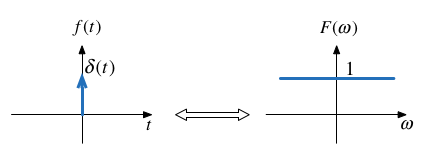
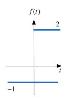
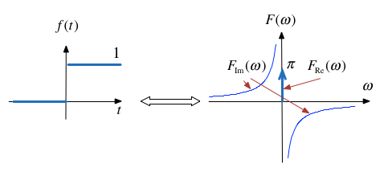

---
jupytext:
  formats: ipynb,md:myst
  text_representation:
    extension: .md
    format_name: myst
    format_version: 0.13
    jupytext_version: 1.11.5
kernelspec:
  display_name: MATLAB
  language: matlab
  name: imatlab
---

+++ {"slideshow": {"slide_type": "slide"}}

# Fourier transforms of commonly occurring signals

+++ {"slideshow": {"slide_type": "notes"}}

## Colophon

An annotatable worksheet for this presentation is available as [**Worksheet 13**](https://cpjobling.github.io/eg-247-textbook/fourier_transform/2/worksheet13.html).

* The source code for this page is [fourier_transform/2/ft2.ipynb](https://github.com/cpjobling/eg-247-textbook/blob/master/fourier_transform/2/ft2.ipynb).

* You can view the notes for this presentation as a webpage ([HTML](https://cpjobling.github.io/eg-247-textbook/fourier_transform/2/ft2.html)). 

* This page is downloadable as a [PDF](https://cpjobling.github.io/eg-247-textbook/fourier_transform/2/ft2.pdf) file.

+++ {"slideshow": {"slide_type": "notes"}}

## Note on Notation

If you have been reading both Karris and Boulet you may have noticed a difference in the notation used in the definition of Fourier Transform:

* Karris uses $F(\omega)$
* Boulet uses $F(j\omega)$

I checked other sources and [Hsu (Schaum's Signals and Systems)](https://www.dawsonera.com/?li=true&dest=https%3a%2f%2fwww.dawsonera.com%2fabstract%2f9780071634731){cite}`schaum` and Morrell (The [Fourier Analysis Video Series on YouTube](https://www.youtube.com/watch?v=bqYxhYGA2qU&list=PL51707156C4956932)) both use the $F(\omega)$ notation.

According to Wikipedia [Fourier Transform: Other Notations](https://en.wikipedia.org/wiki/Fourier_transform#Other_notations) both are used only by electronic engineers anyway and either would be acceptible.

There is some advantage in using Boulet's notation $F(j\omega)$ in that it helps to reinforce the idea that Fourier Transform is a special case of the Laplace Transform and it was the notation that I used in the [last section](../1/ft1).

In these notes, I've used the other convention on the basis that its the more likely to be seen in your support materials. 

However, I am happy to change back if you find the addition of $j$ useful.

You should be aware that Fourier Transforms are in general complex so whatever the notation used to *represent* the transform, we are still dealing with real and imaginary parts or magnitudes and phases when we use the *actual transforms* in analysis.

+++ {"slideshow": {"slide_type": "slide"}}

## Agenda

* Tables of Transform Pairs
* Examples of Selected Transforms
* Relationship between Laplace and Fourier
* Fourier Transforms of Common Signals

+++ {"slideshow": {"slide_type": "slide"}}

## Reminder of the Definitions

Last time we derived the Fourier Transform by evaluating what would happen when a periodic signal was made periodic. Let us restate the definitions.

+++ {"slideshow": {"slide_type": "subslide"}}

### The Fourier Transform

In the signals and systems context, the Fourier Transform is used to convert a function of time $f(t)$ to a function of radian frequency $F(\omega)$:

$$\mathcal{F}\left\{f(t)\right\} = \int_{-\infty}^{\infty} f(t)e^{-j\omega t}\,dt = F(\omega).$$

+++ {"slideshow": {"slide_type": "subslide"}}

### The Inverse Fourier Transform

In the signals and systems context, the *Inverse Fourier Transform* is used to convert a function of frequency $F(\omega)$ to a function of time $f(t)$:

$$\mathcal{F}^{-1}\left\{F(\omega)\right\} = \frac{1}{2\pi}\int_{-\infty}^{\infty} F(\omega)e^{j\omega t}\,d\omega = f(t) .$$

+++ {"slideshow": {"slide_type": "notes"}}

Note, the factor $2\pi$ is introduced because we are changing units from radians/second to seconds.

+++ {"slideshow": {"slide_type": "subslide"}}

### Duality of the transform

Note the similarity of the Fourier and its Inverse. 

This has important consequences in filter design and later when we consider sampled data systems.

+++ {"slideshow": {"slide_type": "slide"}}

## Table of Common Fourier Transform Pairs

This table is adapted from Table 8.9 of Karris. See also: [Wikibooks: Engineering Tables/Fourier Transform Table](https://en.wikibooks.org/wiki/Engineering_Tables/Fourier_Transform_Table) and [Fourier Transform&mdash;WolframMathworld](https://mathworld.wolfram.com/FourierTransform.html) for more complete references.

+++ {"slideshow": {"slide_type": "subslide"}}

|     | **Name**                         | $f(t)$                            | $F(\omega)$ | **Remarks**                           |
|-----| ---------------------------------|-----------------------------------|-------------|---------------------------------------|
| 1.  | Dirac delta                      | $\delta(t)$                       | $1$         | Constant energy at *all* frequencies. |
| 2.  | Time sample                      | $\delta(t-t_0)$                   |  $e^{-j\omega t_0}$ |  
| 3.  | Phase shift                      | $e^{j\omega_0 t}$                 |  $2\pi\delta(\omega - \omega_0)$ |  
| 4.  | *Signum*                         | $\operatorname{sgn} t$          |  $\displaystyle{\frac{2}{j\omega}}$ |  also known as sign function
| 5.  |  Unit step                       | $u_0(t)$                          |  $\displaystyle{\frac{1}{j\omega}+\pi\delta(\omega)}$ |  
| 6.  |  Cosine                          | $\cos \omega_0 t$                 |  $\pi\left[\delta(\omega-\omega_0)+\delta(\omega+\omega_0)\right]$ |  
| 7.  |  Sine                            | $\sin \omega_0 t$                 |  $-j\pi\left[\delta(\omega-\omega_0)-\delta(\omega+\omega_0)\right]$ |  
| 8.  |  Single pole                     | $e^{-at}u_0(t)$                   |  $\displaystyle{\frac{1}{j\omega + a}}$ |  $a \gt 0$ |
| 9.  |  Double pole                     | $te^{-at}u_0(t)$                  |  $\displaystyle{\frac{1}{(j\omega + a)^2}}$ |  $a \gt 0$ |
| 10. |  Complex pole (cosine component) | $e^{-at}\cos \omega_0 t\;u_0(t)$  |  $\displaystyle{\frac{j\omega + a}{(j\omega + a)^2+\omega_0^2}}$ |  $a\gt 0$
| 11. |  Complex pole (sine component)   | $e^{-a t}\sin \omega_0 t\;u_0(t)$ |  $\displaystyle{\frac{\omega_0}{(j\omega + a)^2+\omega_0^2}}$ |  $a\gt 0$ |

+++ {"slideshow": {"slide_type": "slide"}}

## Some Selected Fourier Transforms

+++ {"slideshow": {"slide_type": "notes"}}

### Relationship between $f(t)$ and $F(\omega)$

In most of the work we will do in this course, and in practice, the *signals* that we use with the Fourier transform will be a real continuous aperiodic functions of time that are zero when $t = 0$.

The Fourier transforms of such signals will be complex continous functions of frequency which have real and imaginary parts and will exist at both positive and negative values of $\omega$.

It is often most convenient to deal with the transformed "spectrum" by considering the magnitude and phase and we will therefore often plot $F(\omega)$ on two separate graphs as *magnitude* $|F(\omega)|$ and *phase* $\angle F(\omega)$ (where phase is measured in radians) plotted against frequency $\omega \in [-\infty,\infty]$ (in radians/second).

We most often represent the *system* by its so-called *frequency response* and we will be interested on what effect the system has on the signal $f(t)$. 

As for the Laplace transform, this is more conveniently determined by exploiting the *time convolution property*. That is by performing a Fourier transform of the signal, multiplying it by the system's frequency response and then inverse Fourier transforming the result.

Have these ideas in mind as we go through the examples in the rest of this section.

+++ {"slideshow": {"slide_type": "subslide"}}

### The Dirac Delta

$$\delta(t) \Leftrightarrow 1$$



*Proof*: uses sampling and sifting properties of $\delta(t)$.

+++ {"slideshow": {"slide_type": "subslide"}}

*Matlab*:

```{code-cell} matlab
---
slideshow:
  slide_type: subslide
---
imatlab_export_fig('print-svg')  % Static svg figures.
```

```{code-cell} matlab
---
slideshow:
  slide_type: subslide
---
syms t;
fourier(dirac(t))
```

+++ {"slideshow": {"slide_type": "subslide"}}

Related:

$$\delta(t-t_0) \Leftrightarrow e^{-j\omega t_0}$$

+++ {"slideshow": {"slide_type": "subslide"}}

### DC

$$1 \Leftrightarrow 2\pi\delta(\omega)$$


+++ {"slideshow": {"slide_type": "subslide"}}

*Matlab*:

```{code-cell} matlab
---
slideshow:
  slide_type: subslide
---
syms t omega;
A = sym(1);
fourier(A,omega)
```

+++ {"slideshow": {"slide_type": "subslide"}}

Related by frequency shifting property:

$$e^{j\omega_0 t} \Leftrightarrow 2\pi\delta(\omega-\omega_0)$$

+++ {"slideshow": {"slide_type": "subslide"}}

### Cosine (Sinewave with even symmetry)

$$\cos(t) = \frac{1}{2}\left(e^{j\omega_0 t}+e^{-j\omega_0 t}\right) \Leftrightarrow \pi\delta(\omega - \omega_0) + \pi\delta(\omega + \omega_0)$$


Note: $f(t)$ is real and even. $F(\omega)$ is also real and even.

+++ {"slideshow": {"slide_type": "subslide"}}

### Sinewave

$$\sin(t) = \frac{1}{j2}\left(e^{j\omega_0 t}-e^{-j\omega_0 t}\right) \Leftrightarrow -j\pi\delta(\omega - \omega_0) + j\pi\delta(\omega + \omega_0)$$


Note: $f(t)$ is real and odd. $F(\omega)$ is imaginary and odd.

+++ {"slideshow": {"slide_type": "subslide"}}

### Signum (Sign)

The signum function is a function whose value is equal to

$$\operatorname{sgn} t = \left\{ {\begin{array}{*{20}{c}}
  { - 1\;t < 0} \\ 
  {0\;x = 0} \\ 
  { + 1\;t > 0} 
\end{array}} \right.$$

+++ {"slideshow": {"slide_type": "subslide"}}

The transform is:

$$\operatorname{sgn} t = u_0(t) - u_0(-t) = \frac{2}{j\omega}$$


This function is often used to model a *voltage comparitor* in circuits.

+++ {"slideshow": {"slide_type": "subslide"}}

### Example 4: Unit Step

Use the signum function to show that

$$
\mathcal{F}\left\{u_0(t))\right\} = \pi\delta(\omega)+\frac{1}{j\omega}
$$

+++ {"slideshow": {"slide_type": "subslide"}}

#### Clue

Define

$$\operatorname{sgn} t = 2 u_0(t) - 1$$



*Does that help?*

+++ {"slideshow": {"slide_type": "notes"}}

#### Proof

$$\operatorname{sgn} t = 2u_0(t) - 1$$

so

$$u_0(t) = \frac{1}{2} + \frac{\operatorname{sgn} t}{2}$$

From previous results $1\Leftrightarrow 2\pi\delta(\omega)$ and $\operatorname{sgn} x = 2/(j\omega)$ so by linearity

$$u_0(t) \Leftrightarrow \pi\delta(\omega)+\frac{1}{j\omega}$$

*QED*

+++ {"slideshow": {"slide_type": "subslide"}}

#### Graph of unit step

$$u_0(t) \Leftrightarrow \pi\delta(\omega)+\frac{1}{j\omega}$$



+++ {"slideshow": {"slide_type": "notes"}}

The unit step is neither even nor odd so the Fourier transform is complex with real part $F_\mathrm{Re}(\omega) = \pi\delta(\omega)$ and imaginary part $F_\mathrm{Im}(\omega) = 1/(j\omega)$. The real part is even, and the imaginary part is odd.

+++ {"slideshow": {"slide_type": "subslide"}}

### Example 5

Use the results derived so far to show that 

$$e^{j\omega_0 t}u_0(t)\Leftrightarrow \pi\delta(\omega - \omega_0) + \frac{1}{j(\omega-\omega_0)}$$

Hint: linearity plus frequency shift property.

+++ {"slideshow": {"slide_type": "subslide"}}

### Example 6

Use the results derived so far to show that 

$$\sin \omega_0 t\; u_0(t)\Leftrightarrow \frac{\pi}{j2}\left[\delta(\omega-\omega_0)-\delta(\omega+\omega_0)\right] + \frac{\omega_0}{\omega_0^2 - \omega^2}$$

Hint: Euler's formula plus solution to example 2.

+++ {"slideshow": {"slide_type": "notes"}}

**Important note**: the equivalent example in Karris (Section 8.4.9 Eq. 8.75 pp 8-23&mdash;8-24) is wrong! 

See [worked solution](https://cpjobling.github.io/eg-247-textbook/fourier_transform/solutions/ft2-ex3.pdf) for the corrected proof.

+++ {"slideshow": {"slide_type": "subslide"}}

### Example 7

Use the result of Example 6 to determine the Fourier transform of $\cos\omega_0 t\; u_0(t)$.

+++ {"slideshow": {"slide_type": "subslide"}}

#### Solution to example 7

$$\cos\omega_0 t\; u_0(t)\Leftrightarrow \frac{\pi}{2}\left[\delta(\omega-\omega_0)+\delta(\omega+\omega_0)\right] + \frac{j\omega}{\omega_0^2 - \omega^2}$$

+++ {"slideshow": {"slide_type": "slide"}}

## Derivation of the Fourier Transform from the Laplace Transform

If a signal is a function of time $f(t)$ which is zero for $t\le 0$, we can obtain the Fourier transform from the Laplace transform by substituting $s$ by $j\omega$.

+++ {"slideshow": {"slide_type": "subslide"}}

### Example 8: Single Pole Filter

Given that 

$$\mathcal{L}\left\{e^{-at}u_0(t)\right\} = \frac{1}{s + a}$$

Compute 

$$\mathcal{F}\left\{e^{-at}u_0(t)\right\}$$

+++ {"slideshow": {"slide_type": "subslide"}}

#### Solution to example 8

$$\frac{1}{j\omega+1}$$

+++ {"slideshow": {"slide_type": "notes"}}

Boulet gives the graph of this function.

+++ {"slideshow": {"slide_type": "subslide"}}

### Example 9: Complex Pole Pair  cos term

Given that 

$$\mathcal{L}\left\{e^{-at}\cos\omega_0 t\;u_0(t)\right\} = \frac{s+a}{(s + a)^2+\omega_0^2}$$

Compute 

$$\mathcal{F}\left\{e^{-at}\cos\omega_0 t\;u_0(t)\right\}$$

+++ {"slideshow": {"slide_type": "subslide"}}

#### Solution to example 9

$$\frac{j\omega + a}{(j\omega+a)^2 + \omega_0^2}$$

+++ {"slideshow": {"slide_type": "notes"}}

Boulet gives the graph of this function.

+++ {"slideshow": {"slide_type": "subslide"}}

## Fourier Transforms of Common Signals

We shall conclude this session by computing as many of the the Fourier transform of some common signals as we have time for.

* rectangular pulse
* triangular pulse
* periodic time function
* unit impulse train (model of regular sampling)

+++ {"slideshow": {"slide_type": "notes"}}

I will not provide notes for these, but you will find more details in Chapter 8 of Karris and Chapter 5 of Boulet and 

I have created some worked examples (see Blackboard and the OneNote notebook) to help with revision.

+++ {"slideshow": {"slide_type": "slide"}}

## Suggestions for Further Reading

Boulet has several interesting amplifications of the material presented by {cite}`karris`. You would be well advised to read these. Particular highlights which we will not have time to cover:

* Time multiplication and its relation to amplitude modulation (pp 182&mdash;183).
* Fourier transform of the complex exponential signal $e^{(\alpha +j\beta)t}$ with graphs (pp 184&mdash;187).
* Use of inverse Fourier series to determine $f(t)$ from a given $F(j\omega)$ and the "ideal" low-pass filter (pp 188&mdash;191).
* The Duality of the Fourier transform (pp 191&mdash;192).

+++ {"slideshow": {"slide_type": "slide"}}

## Summary

* Tables of Transform Pairs
* Examples of Selected Transforms
* Relationship between Laplace and Fourier
* Fourier Transforms of Common Signals

+++ {"slideshow": {"slide_type": "notes"}}

## References

See [Bibliography](/zbib).

+++ {"slideshow": {"slide_type": "subslide"}}

*Next Section*

* [The Fourier Transform for Systems and Circuit Analysis](../3/ft3)
