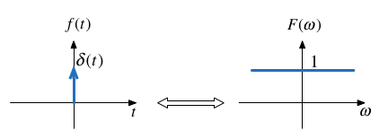
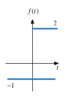

---
jupytext:
  formats: ipynb,md:myst
  text_representation:
    extension: .md
    format_name: myst
    format_version: 0.13
    jupytext_version: 1.15.2
kernelspec:
  display_name: Matlab
  language: matlab
  name: matlab
---

+++ {"slideshow": {"slide_type": "slide"}}

(ws7)=
# Worksheet 7

## To accompany Chapter 4.2 Fourier transforms of commonly occurring signals

+++ {"slideshow": {"slide_type": "notes"}}

This worksheet can be downloaded as a [PDF file](https://cpjobling.github.io/eg-247-textbook/worksheets/worksheet7.pdf). We will step through this worksheet in class. 

An annotatable copy of the notes for this presentation will be distributed before the second class meeting as **Worksheet 7** in the **Week 5: Classroom Activities** section of the Canvas site. I will also distribute a copy to your personal **Worksheets** section of the **OneNote Class Notebook** so that you can add your own notes using OneNote. 

You are expected to have at least watched the video presentation of {ref}`ft2` of the [notes](https://cpjobling.github.io/eg-247-textbook) before coming to class. If you haven't watch it afterwards!

After class, the lecture recording and the annotated version of the worksheets will be made available through Canvas.

+++ {"slideshow": {"slide_type": "slide"}}

## Reminder of the Definitions

Last time we derived the Fourier Transform by evaluating what would happen when a periodic signal was made periodic. Let us restate the definitions.

+++ {"slideshow": {"slide_type": "subslide"}}

### The Fourier Transform

Used to convert a function of time $f(t)$ to a function of radian frequency $F(\omega)$:

$$\mathcal{F}\left\{f(t)\right\} = \int_{-\infty}^{\infty} f(t)e^{-j\omega t}\,dt = F(\omega).$$

+++ {"slideshow": {"slide_type": "subslide"}}

### The Inverse Fourier Transform

Used to convert a function of frequency $F(\omega)$ to a function of time $f(t)$:

$$\mathcal{F}^{-1}\left\{F(\omega)\right\} = \frac{1}{2\pi}\int_{-\infty}^{\infty} F(\omega)e^{j\omega t}\,d\omega = f(t) .$$

+++ {"slideshow": {"slide_type": "notes"}}

Note, the factor $2\pi$ is introduced because we are changing units from radians/second to seconds.

+++ {"slideshow": {"slide_type": "subslide"}}

### Duality of the transform

Note the similarity of the Fourier and its Inverse. 

This has important consequences in filter design and later when we consider sampled data systems.

+++ {"slideshow": {"slide_type": "slide"}}

## Table of Common Fourier Transform Pairs

This table is adapted from Table 8.9 of Karris. See also: [Wikibooks: Engineering Tables/Fourier Transform Table](https://en.wikibooks.org/wiki/Engineering_Tables/Fourier_Transform_Table) and [Fourier Transform&mdash;WolframMathworld](https://mathworld.wolfram.com/FourierTransform.html) for more complete references.

+++ {"slideshow": {"slide_type": "subslide"}}

|     | **Name**                         | $f(t)$                            | $F(\omega)$ | **Remarks**                           |
|-----| ---------------------------------|-----------------------------------|-------------|---------------------------------------|
| 1.  | Dirac delta                      | $\delta(t)$                       | $1$         | Constant energy at *all* frequencies. |
| 2.  | Time sample                      | $\delta(t-t_0)$                   |  $e^{-j\omega t_0}$ |  
| 3.  | Phase shift                      | $e^{j\omega_0 t}$                 |  $2\pi\delta(\omega - \omega_0)$ |  
| 4.  | *Signum*                         | $\operatorname{sgn} t$          |  $\displaystyle{\frac{2}{j\omega}}$ |  also known as sign function
| 5.  |  Unit step                       | $u_0(t)$                          |  $\displaystyle{\frac{1}{j\omega}+\pi\delta(\omega)}$ |  
| 6.  |  Cosine                          | $\cos \omega_0 t$                 |  $\pi\left[\delta(\omega-\omega_0)+\delta(\omega+\omega_0)\right]$ |  
| 7.  |  Sine                            | $\sin \omega_0 t$                 |  $-j\pi\left[\delta(\omega-\omega_0)-\delta(\omega+\omega_0)\right]$ |  
| 8.  |  Single pole                     | $e^{-at}u_0(t)$                   |  $\displaystyle{\frac{1}{j\omega + a}}$ |  $a \gt 0$ |
| 9.  |  Double pole                     | $te^{-at}u_0(t)$                  |  $\displaystyle{\frac{1}{(j\omega + a)^2}}$ |  $a \gt 0$ |
| 10. |  Complex pole (cosine component) | $e^{-at}\cos \omega_0 t\;u_0(t)$  |  $\displaystyle{\frac{j\omega + a}{(j\omega + a)^2+\omega_0^2}}$ |  $a\gt 0$
| 11. |  Complex pole (sine component)   | $e^{-a t}\sin \omega_0 t\;u_0(t)$ |  $\displaystyle{\frac{\omega_0}{(j\omega + a)^2+\omega_0^2}}$ |  $a\gt 0$ |

+++ {"slideshow": {"slide_type": "slide"}}

## Some Selected Fourier Transforms

+++ {"slideshow": {"slide_type": "subslide"}}

### The Dirac Delta

$$\delta(t) \Leftrightarrow 1$$




*Proof*: uses sampling and sifting properties of $\delta(t)$.

+++ {"slideshow": {"slide_type": "subslide"}}

*MATLAB*:

```{code-cell}
---
slideshow:
  slide_type: fragment
---
syms t omega omega_0 t0;
u0(t) = heaviside(t); % useful utility function
fourier(dirac(t))
```

+++ {"slideshow": {"slide_type": "subslide"}}

Related:

$$\delta(t-t_0) \Leftrightarrow e^{-j\omega t_0}$$

```{code-cell}
---
slideshow:
  slide_type: fragment
---
fourier(dirac(t - t0),omega)
```

+++ {"slideshow": {"slide_type": "subslide"}}

### DC

$$1 \Leftrightarrow 2\pi\delta(\omega)$$


+++ {"slideshow": {"slide_type": "subslide"}}

*MATLAB*:

```{code-cell}
---
slideshow:
  slide_type: fragment
---
A = sym(1); % take one to be a symbol
fourier(A,omega)
```

+++ {"slideshow": {"slide_type": "subslide"}}

Related by frequency shifting property:

$$e^{j\omega_0 t} \Leftrightarrow 2\pi\delta(\omega-\omega_0)$$

+++ {"slideshow": {"slide_type": "subslide"}}

### Cosine (Sinewave with even symmetry)

$$\cos(t) = \frac{1}{2}\left(e^{j\omega_0 t}+e^{-j\omega_0 t}\right) \Leftrightarrow \pi\delta(\omega - \omega_0) + \pi\delta(\omega + \omega_0)$$


Note: $f(t)$ is real and even. $F(\omega)$ is also real and even.

+++ {"slideshow": {"slide_type": "subslide"}}

*MATLAB*:

```{code-cell}
---
slideshow:
  slide_type: fragment
---
fourier(cos(omega_0*t),omega)
```

+++ {"slideshow": {"slide_type": "subslide"}}

### Sinewave

$$\sin(t) = \frac{1}{j2}\left(e^{j\omega_0 t}-e^{-j\omega_0 t}\right) \Leftrightarrow -j\pi\delta(\omega - \omega_0) + j\pi\delta(\omega + \omega_0)$$


Note: $f(t)$ is real and odd. $F(\omega)$ is imaginary and odd.

+++ {"slideshow": {"slide_type": "subslide"}}

*MATLAB*:

```{code-cell}
---
slideshow:
  slide_type: fragment
---
fourier(sin(omega_0*t),omega)
```

+++ {"slideshow": {"slide_type": "subslide"}}

### Signum (Sign)

The signum function is a function whose value is equal to

$$\operatorname{sgn} t = \left\{ {\begin{array}{*{20}{c}}
  { - 1\;t < 0} \\ 
  {0\;x = 0} \\ 
  { + 1\;t > 0} 
\end{array}} \right.$$

+++ {"slideshow": {"slide_type": "subslide"}}

*MATLAB*:

```{code-cell}
---
slideshow:
  slide_type: fragment
---
fourier(sign(t),omega)
```

+++ {"slideshow": {"slide_type": "subslide"}}

The transform is:

$$\operatorname{sgn} t = u_0(t) - u_0(-t) = \frac{2}{j\omega}$$


This function is often used to model a *voltage comparitor* in circuits.

+++ {"slideshow": {"slide_type": "subslide"}}

### Example 4: Unit Step

Use the signum function to show that

$$
\mathcal{F}\left\{u_0(t))\right\} = \pi\delta(\omega)+\frac{1}{j\omega}
$$

+++ {"slideshow": {"slide_type": "subslide"}}

#### Clue

Define

$$\operatorname{sgn} t = 2 u_0(t) - 1$$




*Does that help?*

+++ {"slideshow": {"slide_type": "notes"}}

<pre style="border: 2px solid blue">


</pre>

+++ {"slideshow": {"slide_type": "subslide"}}

*MATLAB*:

```{code-cell}
---
slideshow:
  slide_type: fragment
---
fourier(u0(t),omega)
```

+++ {"slideshow": {"slide_type": "subslide"}}

### Example 5

Use the results derived so far to show that 

$$e^{j\omega_0 t}u_0(t)\Leftrightarrow \pi\delta(\omega - \omega_0) + \frac{1}{j(\omega-\omega_0)}$$

Hint: linearity plus frequency shift property.

+++ {"slideshow": {"slide_type": "notes"}}

<pre style="border: 2px solid blue">


</pre>

+++ {"slideshow": {"slide_type": "subslide"}}

### Example 6

Use the results derived so far to show that 

$$\sin \omega_0 t\; u_0(t)\Leftrightarrow \frac{\pi}{j2}\left[\delta(\omega-\omega_0)-\delta(\omega+\omega_0)\right] + \frac{\omega_0}{\omega_0^2 - \omega^2}$$

Hint: Euler's formula plus solution to example 5.

+++ {"slideshow": {"slide_type": "notes"}}

**Important note**: the equivalent example in Karris (Section 8.4.9 Eq. 8.75 pp 8-23&mdash;8-24) is wrong! 

See worked solution in OneNote for corrected proof.

+++ {"slideshow": {"slide_type": "notes"}}

<pre style="border: 2px solid blue">


</pre>

+++ {"slideshow": {"slide_type": "subslide"}}

### Example 7

Use the result of Example 3 to determine the Fourier transform of $\cos\omega_0 t\; u_0(t)$.

+++ {"slideshow": {"slide_type": "notes"}}

<pre style="border: 2px solid blue">


</pre>

+++ {"slideshow": {"slide_type": "subslide"}}

#### Answer

$$\cos\omega_0 t\; u_0(t)\Leftrightarrow \frac{\pi}{2}\left[\delta(\omega-\omega_0)+\delta(\omega+\omega_0)\right] + \frac{j\omega}{\omega_0^2 - \omega^2}$$

+++ {"slideshow": {"slide_type": "slide"}}

## Derivation of the Fourier Transform from the Laplace Transform

If a signal is a function of time $f(t)$ which is zero for $t\le 0$, we can obtain the Fourier transform from the Laplace transform by substituting $s$ by $j\omega$.

+++ {"slideshow": {"slide_type": "subslide"}}

### Example 8: Single Pole Filter

Given that 

$$\mathcal{L}\left\{e^{-at}u_0(t)\right\} = \frac{1}{s + a}$$

Compute 

$$\mathcal{F}\left\{e^{-at}u_0(t)\right\}$$

+++ {"slideshow": {"slide_type": "notes"}}

<pre style="border: 2px solid blue">


</pre>

+++ {"slideshow": {"slide_type": "subslide"}}

### Example 9: Complex Pole Pair  cos term

Given that 

$$\mathcal{L}\left\{e^{-at}\cos\omega_0 t\;u_0(t)\right\} = \frac{s+a}{(s + a)^2+\omega_0^2}$$

Compute 

$$\mathcal{F}\left\{e^{-at}\cos\omega_0 t\;u_0(t)\right\}$$

+++ {"slideshow": {"slide_type": "notes"}}

<pre style="border: 2px solid blue">


</pre>

+++ {"slideshow": {"slide_type": "subslide"}}

## Fourier Transforms of Common Signals

We shall conclude this session by computing as many of the the Fourier transform of some common signals as we have time for.

* rectangular pulse
* triangular pulse
* periodic time function
* unit impulse train (model of regular sampling)
