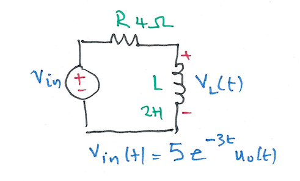
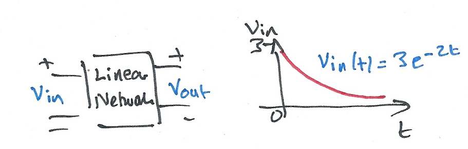
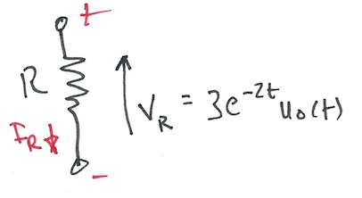

---
jupytext:
  formats: ipynb,md:myst
  text_representation:
    extension: .md
    format_name: myst
    format_version: 0.12
    jupytext_version: 1.9.1
kernelspec:
  display_name: MATLAB
  language: matlab
  name: imatlab
---

+++ {"slideshow": {"slide_type": "slide"}}

# Fourier Transforms for Circuit and LTI Systems Analysis

+++

## Colophon

An annotatable worksheet for this presentation is available as [**Worksheet 14**](https://cpjobling.github.io/eg-247-textbook/fourier_transform/3/worksheet14.html).

* The source code for this page is [fourier_transform/3/ft3.ipynb](https://github.com/cpjobling/eg-247-textbook/blob/master/fourier_transform/3/ft3.ipynb).

* You can view the notes for this presentation as a webpage ([HTML](https://cpjobling.github.io/eg-247-textbook/fourier_transform/3/ft3.html)). 

* This page is downloadable as a [PDF](https://cpjobling.github.io/eg-247-textbook/fourier_transform/3/ft3.pdf) file.

+++ {"slideshow": {"slide_type": "subslide"}}

In this section we will apply what we have learned about Fourier transforms to some typical circuit problems. After a short introduction, the body of this chapter will form the basis of an examples class.

+++ {"slideshow": {"slide_type": "subslide"}}

## Agenda

+++ {"slideshow": {"slide_type": "fragment"}}

* The system function

+++ {"slideshow": {"slide_type": "fragment"}}

* Examples

+++ {"slideshow": {"slide_type": "slide"}}

## The System Function

+++ {"slideshow": {"slide_type": "subslide"}}

### System response from system impulse response

Recall that the convolution integral of a system with impulse response $h(t)$ and input $u(t)$ is

$$h(t)*u(t)=\int_{-\infty}^{\infty}h(t-\tau)u(\tau)\,d\tau.$$

+++ {"slideshow": {"slide_type": "subslide"}}

We let 

$$g(t) = h(t)*u(t)$$

+++ {"slideshow": {"slide_type": "subslide"}}

Then by the time convolution property

$$h(t)*u(t) = g(t) \Leftrightarrow G(\omega) = H(\omega).U(\omega)$$

+++ {"slideshow": {"slide_type": "subslide"}}

### The System Function

We call $H(\omega)$ the *system function*.

We note that the system function $H(\omega)$ and the impulse response $h(t)$ form the Fourier transform pair

$$h(t) \Leftrightarrow H(\omega)$$

+++ {"slideshow": {"slide_type": "subslide"}}

### Obtaining system response

If we know the impulse resonse $h(t)$, we can compute the system response $g(t)$ of any input $u(t)$ by multiplying the Fourier transforms of $H(\omega)$ and $U(\omega)$ to obtain $G(\omega)$. Then we take the inverse Fourier transform of $G(\omega)$ to obtain the response $g(t)$.

+++ {"slideshow": {"slide_type": "subslide"}}

1. Transform $h(t) \to H(\omega)$
2. Transform $u(t) \to U(\omega)$
3. Compute $G(\omega) = H(\omega).U(\omega)$
4. Find $\mathcal{F}^{-1}\left\{G(\omega)\right\} \to g(t)$

+++ {"slideshow": {"slide_type": "slide"}}

## Examples

+++ {"slideshow": {"slide_type": "subslide"}}

### Example 1

Karris example 8.8: for the linear network shown below, the impulse response is $h(t)=3e^{-2t}$. Use the Fourier transform to compute the response $y(t)$ when the input $u(t)=2[u_0(t)-u_0(t-3)]$. Verify the result with MATLAB.


+++ {"slideshow": {"slide_type": "notes"}}

#### Solution to example 1

<pre style="border: 2px solid blue">


</pre>

+++ {"slideshow": {"slide_type": "subslide"}}

#### Matlab verification of example 1

```{code-cell} matlab
imatlab_export_fig('print-svg')  % Static svg figures.
```

```{code-cell} matlab
---
slideshow:
  slide_type: subslide
---
syms t w
U1 = fourier(2*heaviside(t),t,w)
```

```{code-cell} matlab
---
slideshow:
  slide_type: subslide
---
H = fourier(3*exp(-2*t)*heaviside(t),t,w)
```

```{code-cell} matlab
---
slideshow:
  slide_type: subslide
---
Y1=simplify(H*U1)
```

```{code-cell} matlab
---
slideshow:
  slide_type: subslide
---
y1 = simplify(ifourier(Y1,w,t))
```

+++ {"slideshow": {"slide_type": "subslide"}}

Get y2

Substitute $t-3$ into $t$.

```{code-cell} matlab
---
slideshow:
  slide_type: subslide
---
y2 = subs(y1,t,t-3)
```

```{code-cell} matlab
---
slideshow:
  slide_type: subslide
---
y = y1 - y2
```

+++ {"slideshow": {"slide_type": "subslide"}}

Plot result

```{code-cell} matlab
---
slideshow:
  slide_type: subslide
---
ezplot(y)
title('Solution to Example 1')
ylabel('y(y)')
xlabel('t [s]')
grid 
```

+++ {"slideshow": {"slide_type": "notes"}}

See [ft3_ex1.m](https://cpjobling.github.io/eg-247-textbook/fourier_transform/matlab/ft3_ex1.m)

+++ {"slideshow": {"slide_type": "notes"}}

Result is equivalent to:
    
    y = 3*heaviside(t) - 3*heaviside(t - 3) + 3*heaviside(t - 3)*exp(6 - 2*t) - 3*exp(-2*t)*heaviside(t)

Which after gathering terms gives

$$y(t) = 3(1 - 3e^{-2t})u_0(t) - 3(1 - 3e^{-2(t-3)})u_0(t-3)$$

+++ {"slideshow": {"slide_type": "subslide"}}

### Example 2

Karris example 8.9: for the circuit shown below, use the Fourier transfrom method, and the system function $H(\omega)$ to compute $V_L(t)$. Assume $i_L(0^-)=0$. Verify the result with Matlab.



+++ {"slideshow": {"slide_type": "notes"}}

#### Solution of example 2

<pre style="border: 2px solid blue">


</pre>

+++ {"slideshow": {"slide_type": "subslide"}}

#### Matlab verification of example 2

```{code-cell} matlab
---
slideshow:
  slide_type: subslide
---
syms t w
H = j*w/(j*w + 2)
```

```{code-cell} matlab
---
slideshow:
  slide_type: subslide
---
Vin = fourier(5*exp(-3*t)*heaviside(t),t,w)
```

```{code-cell} matlab
---
slideshow:
  slide_type: subslide
---
Vout=simplify(H*Vin)
```

```{code-cell} matlab
---
slideshow:
  slide_type: subslide
---
vout = simplify(ifourier(Vout,w,t))
```

+++ {"slideshow": {"slide_type": "subslide"}}

Plot result

```{code-cell} matlab
---
slideshow:
  slide_type: subslide
---
ezplot(vout)
title('Solution to Example 2')
ylabel('v_{out}(t) [V]')
xlabel('t [s]')
grid 
```

+++ {"slideshow": {"slide_type": "notes"}}

See [ft3_ex2.m](https://cpjobling.github.io/eg-247-textbook/fourier_transform/matlab/ft3_ex2.m)

+++ {"slideshow": {"slide_type": "notes"}}

Result is equivalent to:
    
    vout = -5*exp(-3*t)*heaviside(t)*(2*exp(t) - 3)

Which after gathering terms gives

$$v_{\mathrm{out}} = 5\left(3e^{-3t} - 2e^{-2t}\right)u_0(t)$$

+++ {"slideshow": {"slide_type": "subslide"}}

### Example 3

Karris example 8.10: for the linear network shown below, the input-output relationship is:

$$\frac{d}{dt}v_{\mathrm{out}}+4v_{\mathrm{out}}=10v_{\mathrm{in}}$$

where $v_{\mathrm{in}}=3e^{-2t}$. Use the Fourier transform method, and the system function $H(\omega)$ to compute the output $v_{\mathrm{out}}$. Verify the result with Matlab.



+++ {"slideshow": {"slide_type": "notes"}}

#### Solution to example 3

<pre style="border: 2px solid blue">


</pre>

+++ {"slideshow": {"slide_type": "subslide"}}

#### Matlab verification of example 3

```{code-cell} matlab
---
slideshow:
  slide_type: subslide
---
syms t w
H = 10/(j*w + 4)
```

```{code-cell} matlab
---
slideshow:
  slide_type: subslide
---
Vin = fourier(3*exp(-2*t)*heaviside(t),t,w)
```

```{code-cell} matlab
---
slideshow:
  slide_type: subslide
---
Vout=simplify(H*Vin)
```

```{code-cell} matlab
---
slideshow:
  slide_type: subslide
---
vout = simplify(ifourier(Vout,w,t))
```

+++ {"slideshow": {"slide_type": "subslide"}}

Plot result

```{code-cell} matlab
---
slideshow:
  slide_type: subslide
---
ezplot(vout)
title('Solution to Example 3')
ylabel('v_{out}(t) [V]')
xlabel('t [s]')
grid 
```

+++ {"slideshow": {"slide_type": "notes"}}

See [ft3_ex3.m](https://cpjobling.github.io/eg-247-textbook/fourier_transform/matlab/ft3_ex3.m)

Result is equiavlent to:
    
    15*exp(-4*t)*heaviside(t)*(exp(2*t) - 1)

Which after gathering terms gives

$$v_{\mathrm{out}}(t) = 15\left(e^{-2t} - e^{-4t}\right)u_0(t)$$

+++ {"slideshow": {"slide_type": "subslide"}}

### Example 4

Karris example 8.11: the voltage across a 1 $\Omega$ resistor is known to be $V_{R}(t)=3e^{-2t} u_0(t)$. Compute the energy dissipated in the resistor for $0\lt t\lt\infty$, and verify the result using Parseval's theorem. Verify the result with Matlab.

Note from [tables of integrals](https://en.wikipedia.org/wiki/Lists_of_integrals) 

$$\int\frac{1}{a^2 + x^2}\,dx = \frac{1}{a}\arctan\frac{x}{a}+C.$$



+++ {"slideshow": {"slide_type": "notes"}}

#### Solution to example 4

<pre style="border: 2px solid blue">


</pre>

+++ {"slideshow": {"slide_type": "subslide"}}

#### Matlab verification of example 4

```{code-cell} matlab
---
slideshow:
  slide_type: subslide
---
syms t w
```

+++ {"slideshow": {"slide_type": "subslide"}}

Calcuate energy from time function

```{code-cell} matlab
---
slideshow:
  slide_type: subslide
---
Vr = 3*exp(-2*t)*heaviside(t);
R = 1;
Pr = Vr^2/R
Wr = int(Pr,t,0,inf)
```

+++ {"slideshow": {"slide_type": "subslide"}}

Calculate using Parseval's theorem

```{code-cell} matlab
---
slideshow:
  slide_type: subslide
---
Fw = fourier(Vr,t,w)
```

```{code-cell} matlab
---
slideshow:
  slide_type: subslide
---
Fw2 = simplify(abs(Fw)^2)
```

```{code-cell} matlab
---
slideshow:
  slide_type: subslide
---
Wr=2/(2*pi)*int(Fw2,w,0,inf)
```

+++ {"slideshow": {"slide_type": "notes"}}

See [ft3_ex4.m](https://cpjobling.github.io/eg-247-textbook/fourier_transform/matlab/ft3_ex4.m)

+++ {"slideshow": {"slide_type": "notes"}}

## Solutions

* Example 1: [ft3-ex1.pdf](https://cpjobling.github.io/eg-247-textbook/fourier_transform/solutions/ft3-ex1.pdf)

* Example 2: [ft3-ex2.pdf](https://cpjobling.github.io/eg-247-textbook/fourier_transform/solutions/ft3-ex2.pdf)

* Example 3: [ft3-ex3.pdf](https://cpjobling.github.io/eg-247-textbook/fourier_transform/solutions/ft3-ex4.pdf)

* Example 3: [ft3-ex4.pdf](https://cpjobling.github.io/eg-247-textbook/fourier_transform/solutions/ft3-ex4.pdf)
