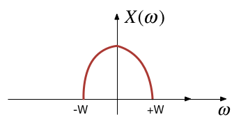
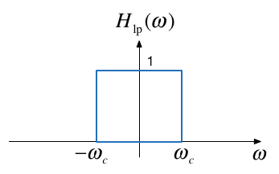
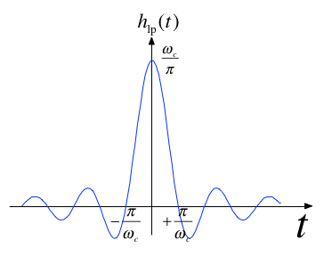
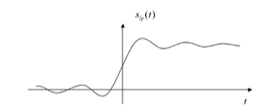
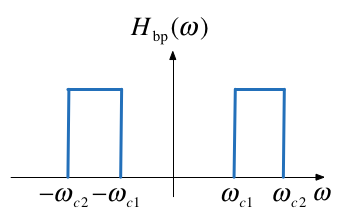

---
jupytext:
  formats: ipynb,md:myst
  text_representation:
    extension: .md
    format_name: myst
    format_version: 0.13
    jupytext_version: 1.15.2
kernelspec:
  display_name: Matlab
  language: matlab
  name: matlab
---

+++ {"slideshow": {"slide_type": "slide"}}

(ws9)=
# Worksheet 9

## To accompany Section 4.4 Introduction to Filters

+++ {"slideshow": {"slide_type": "skip"}}

This worksheet can be downloaded as a [PDF file](https://cpjobling.github.io/eg-247-textbook/worksheets/worksheet9.pdf). We will step through this worksheet in class. 

An annotatable copy of the notes for this presentation will be distributed before the second class meeting as **Worksheet 9** in the **Week 6: Classroom Activities** section of the Canvas site. I will also distribute a copy to your personal **Worksheets** section of the **OneNote Class Notebook** so that you can add your own notes using OneNote. 

You are expected to have at least watched the video presentation of {ref}`ft4` of the [notes](https://cpjobling.github.io/eg-247-textbook/) before coming to class. If you haven't watch it afterwards!

After class, the lecture recording and the annotated version of the worksheets will be made available through Canvas.We will step through this worksheet in class.

+++ {"slideshow": {"slide_type": "slide"}}

## Frequency Selective Filters

An ideal frequency-selective filter is a system that let's the frequency components of a signal through undistorted while frequency components at other frequencies are completely cut off.

+++ {"slideshow": {"slide_type": "subslide"}}

* The range of frequencies which are let through belong to the **pass Band**
* The range of frequencies which are cut-off by the filter are called the **stopband**
* A typical scenario where filtering is needed is when noise $n(t)$ is added to a signal $x(t)$ but that signal has most of its energy outside the bandwidth of a signal.

+++ {"slideshow": {"slide_type": "subslide"}}

### Typical filtering problem


+++ {"slideshow": {"slide_type": "subslide"}}

### Signal



+++ {"slideshow": {"slide_type": "subslide"}}

### Out-of Bandwidth Noise 


+++ {"slideshow": {"slide_type": "subslide"}}

### Signal plus Noise


+++ {"slideshow": {"slide_type": "subslide"}}

### Filtering


+++ {"slideshow": {"slide_type": "subslide"}}

### Motivating example

See the video and script on [*Canvas Week 7*](https://canvas.swansea.ac.uk/courses/36921/pages/motivating-example-filter-design-using-matlab?module_item_id=1964845).

+++ {"slideshow": {"slide_type": "slide"}}

## Ideal Low-Pass Filter (LPF)

An ideal low pass filter cuts-off frequencies higher than its *cutoff frequency*, $\omega_c$.

$$H_{\rm{lp}}(\omega ) = \left\{ {\begin{array}{*{20}{c}}
{1,}&{|\omega |{\kern 1pt} \, \le {\omega _c}}\\
{0,}&{|\omega |{\kern 1pt} \, \ge {\omega _c}}
\end{array}} \right.$$

+++ {"slideshow": {"slide_type": "subslide"}}

### Frequency response of an ideal LPF



+++ {"slideshow": {"slide_type": "subslide"}}

### Impulse response of an ideal LPF

$$h_{\rm{lp}}(t) = \frac{\omega _c}{\pi }{\mathop{\rm sinc}\nolimits} \left( \frac{\omega _c}{\pi }t \right)$$

+++ {"slideshow": {"slide_type": "fragment"}}



+++ {"slideshow": {"slide_type": "subslide"}}

### Filtering is Convolution

The output of an LTI system with impulse response 

$$h(t) \Leftrightarrow H(\omega)$$

subject to an input signal

$$x(t) \Leftrightarrow X(\omega)$$

is given by 

$$y(t) = h(t)*x(t) \Leftrightarrow Y(\omega) = H(\omega)X(\omega)$$

+++ {"slideshow": {"slide_type": "subslide"}}

### Issues with the "ideal" filter

This is the step response:



(reproduced from {cite}`boulet` Fig. 5.23 p. 205)

Ripples in the impulse resonse would be undesireable, and because the impulse response is non-causal it cannot actually be implemented.

+++ {"slideshow": {"slide_type": "slide"}}

## Butterworth low-pass filter

N-th Order Butterworth Filter

$$\left| H_B(\omega ) \right| = \frac{1}{\left(1 + \left(\frac{\omega }{\omega _c}\right)^{2N}\right)^{\frac{1}{2}}}$$

+++ {"slideshow": {"slide_type": "subslide"}}

**Remarks**

* DC gain is 

  $$|H_B(j0)|=1$$

* Attenuation at the cut-off frequency is 

  $$|H_B(j\omega_c)|=1/\sqrt{2}$$
  
  for any $N$

More about the Butterworth filter: [Wikipedia Article](https://en.wikipedia.org/wiki/Butterworth_filter).

+++ {"slideshow": {"slide_type": "slide"}}

### Example 5: Second-order BW Filter

The second-order butterworth Filter is defined by Characteristic Equation (CE):

$$p(s) = s^2 + \omega_c\sqrt{2}s+\omega_c^2 = 0^*$$

Calculate the roots of $p(s)$ (the poles of the filter transfer function) in both Cartesian and polar form.

+++ {"slideshow": {"slide_type": "notes"}}

**Note**: This has the same characteristic as a control system with damping ratio $\zeta = 1/\sqrt{2}$ and $\omega_n = \omega_c$!

+++ {"slideshow": {"slide_type": "notes"}}

#### Solution to example 5

<pre style="border: 2px solid blue">


</pre>

+++ {"slideshow": {"slide_type": "slide"}}

### Example 6

Derive the differential equation relating the input $x(t)$ to output $y(t)$ of the 2nd-Order Butterworth Low-Pass Filter with cutoff frequency $\omega_c$.

+++ {"slideshow": {"slide_type": "notes"}}

#### Solution to example 6

<pre style="border: 2px solid blue">


</pre>

+++ {"slideshow": {"slide_type": "slide"}}

### Example 7

Determine the frequency response $H_B(\omega)=Y(\omega)/X(\omega)$

+++ {"slideshow": {"slide_type": "notes"}}

#### Solution to example 7

<pre style="border: 2px solid blue">


</pre>

+++ {"slideshow": {"slide_type": "subslide"}}

### Magnitude of frequency response of a 2nd-order Butterworth Filter

```{code-cell}
---
slideshow:
  slide_type: subslide
---
wc = 100;
```

+++ {"slideshow": {"slide_type": "subslide"}}

Transfer function

```{code-cell}
---
slideshow:
  slide_type: subslide
---
H = tf(wc^2,[1, wc*sqrt(2), wc^2])
```

+++ {"slideshow": {"slide_type": "subslide"}}

Magnitude frequency response

```{code-cell}
---
slideshow:
  slide_type: subslide
---
w = -400:400;
mHlp = 1./(sqrt(1 + (w./wc).^4));
plot(w,mHlp)
grid
ylabel('|H_B(j\omega)|')
title('Magnitude Frequency Response for 2nd-Order LP Butterworth Filter (\omega_c = 100 rad/s)')
xlabel('Radian Frequency \omega [rad/s]')
text(100,0.1,'\omega_c')
text(-100,0.1,'-\omega_c')
hold on
plot([-400,-100,-100,100,100,400],[0,0,1,1,0,0],'r:')
hold off
```

+++ {"slideshow": {"slide_type": "subslide"}}

Bode plot

```{code-cell}
---
slideshow:
  slide_type: subslide
---
bode(H)
grid
title('Bode-plot of Butterworth 2nd-Order Butterworth Low Pass Filter')
```

+++ {"slideshow": {"slide_type": "notes"}}

Note that the attentuation of the filter is flat at 0 dB in the pass-band at frequencies below the cut-off frequency $\omega < \omega_c$; has a value of $-3$ dB at the cut-off frquency $\omega = \omega_c$; and has a "roll-off" (rate of decrease) of $N\times 20$ dB/decade in the stop-band. 

In this case, $N=2$, and $\omega_c = 100$ rad/s so the attenuation is -40 dB at $\omega = 10\omega_c = 1,000$ rad/s and $\omega = -80$ dB at $\omega = 100\omega_c = 10,000$ rad/s.

The phase is $0^\circ$ at $\omega = 0$; $N\times 90^\circ$ at $\omega = \infty$; and $N\times 45^\circ$ and $\omega = \omega_c$.

+++ {"slideshow": {"slide_type": "slide"}}

### Example 8

Determine the impulse and step response of a butterworth low-pass filter.

You will find this Fourier transform pair useful:

$$e^{-at}\sin\omega_0 t\;u_0(t) \Leftrightarrow \frac{\omega_0}{(j\omega + a)^2+\omega_0^2}$$

+++ {"slideshow": {"slide_type": "notes"}}

#### Solution to example 8

<pre style="border: 2px solid blue">


</pre>

+++ {"slideshow": {"slide_type": "subslide"}}

Impulse response

```{code-cell}
---
slideshow:
  slide_type: subslide
---
impulse(H,0.1)
grid
title('Impulse Response of 2nd-Order Butterworth Low Pass Filter')
```

+++ {"slideshow": {"slide_type": "subslide"}}

Step response

```{code-cell}
---
slideshow:
  slide_type: subslide
---
step(H,0.1)
title('Step Response of Butterworth 2nd-Order Butterworth Low Pass Filter')
grid
text(0.008,1,'s_B(t) for \omega_c = 100 rad/s')
```

+++ {"slideshow": {"slide_type": "slide"}}

## High-pass filter (HPF)

An ideal highpass filter cuts-off frequencies lower than its *cutoff frequency*, $\omega_c$.

$$H_{\rm{hp}}(\omega ) = \left\{ {\begin{array}{*{20}{c}}
{0,}&{|\omega |{\kern 1pt} \, \le {\omega _c}}\\
{1,}&{|\omega |{\kern 1pt} \, > {\omega _c}}
\end{array}} \right.$$

+++ {"slideshow": {"slide_type": "subslide"}}

### Frequency response of an ideal HPF


+++ {"slideshow": {"slide_type": "slide"}}

### Responses

**Frequency response**

$$H_{\mathrm{hp}}(\omega)=1-H_{\mathrm{lp}}(\omega)$$

**Impulse response**

$$h_{\mathrm{hp}}(t)=\delta(t)-h_{\mathrm{lp}}(t)$$

+++ {"slideshow": {"slide_type": "slide"}}

### Example 9

Determine the frequency response of a 2nd-order butterworth highpass filter

+++ {"slideshow": {"slide_type": "notes"}}

#### Solution to example 9

<pre style="border: 2px solid blue">


</pre>

+++ {"slideshow": {"slide_type": "subslide"}}

Magnitude frequency response

```{code-cell}
---
slideshow:
  slide_type: subslide
---
w = -400:400;
plot(w,1-mHlp)
grid
ylabel('|H_B(j\omega)|')
title('Magnitude Frequency Response for 2nd-Order HP Butterworth Filter (\omega_c = 100 rad/s)')
xlabel('Radian Frequency \omega [rad/s]')
text(100,0.9,'\omega_c')
text(-100,0.9,'-\omega_c')
hold on
plot([-400,-100,-100,100,100,400],[0,0,1,1,0,0],'r:')
hold off
```

+++ {"slideshow": {"slide_type": "subslide"}}

High-pass filter

```{code-cell}
---
slideshow:
  slide_type: subslide
---
Hhp = 1 - H
bode(Hhp)
grid
title('Bode-plot of Butterworth 2nd-Order Butterworth High Pass Filter')
```

+++ {"slideshow": {"slide_type": "slide"}}

## Band-pass filter (BPF)

An ideal bandpass filter cuts-off frequencies lower than its first *cutoff frequency* $\omega_{c1}$, and higher than its second *cutoff frequency* $\omega_{c2}$.

$$H_{\rm{bp}}(\omega ) = \left\{ {\begin{array}{*{20}{c}}
{1,}&\omega _{c1} < \,|\omega |\, < \omega _{c2}\\
{0,}&\rm{otherwise}
\end{array}} \right.$$

+++ {"slideshow": {"slide_type": "subslide"}}

### Frequency response of an ideal BPF



+++ {"slideshow": {"slide_type": "subslide"}}

### Bandpass filter design

A bandpass filter can be obtained by multiplying the frequency responses of a lowpass filter by a highpass filter.

+++ {"slideshow": {"slide_type": "fragment"}}

$$H_{\mathrm{bp}}(\omega) = H_{\mathrm{hp}}(\omega)H_{\mathrm{lp}}(\omega)$$

+++ {"slideshow": {"slide_type": "fragment"}}

* The highpass filter should have cut-off frequency of $\omega_{c1}$

+++ {"slideshow": {"slide_type": "fragment"}}

* The lowpass filter should have cut-off frequency of $\omega_{c2}$

+++ {"slideshow": {"slide_type": "notes"}}

## Solutions

Solutions to Examples 5-9 are captured as a PenCast which you will find attached to the Worked Solutions section of the [Week 6 Section](https://canvas.swansea.ac.uk/courses/44853/pages/worked-solutions-to-selected-week-6-problems-2?module_item_id=2484101) of the Canvas course site or here [filters2.pdf](https://cpjobling.github.io/eg-247-textbook/fourier_transform/solutions/filters2.pdf)
