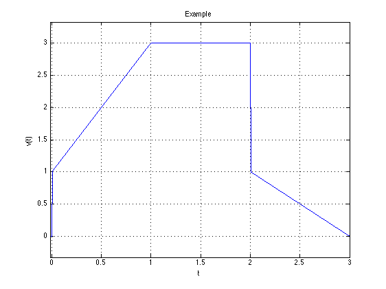
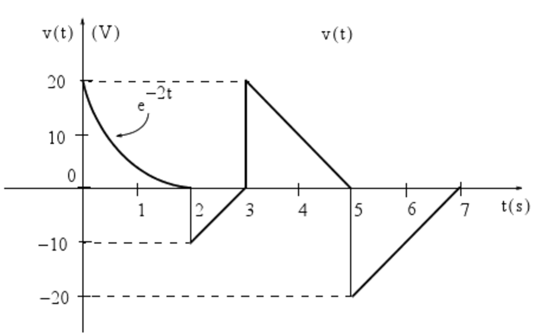

---
jupytext:
  formats: ipynb,md:myst
  text_representation:
    extension: .md
    format_name: myst
    format_version: 0.13
    jupytext_version: 1.14.1
kernelspec:
  display_name: Python 3 (ipykernel)
  language: python
  name: python3
---

+++ {"slideshow": {"slide_type": "slide"}}

# Homework 1

## Elementary signals

We will distribute this PDF to the _Homework_ section of your personal section of the **OneNote Class Notebook** then you can use the *ink feature* (if supported) to hand-write or sketch your answers.

1. Show that the waveform shown below can be represented by the function

$$
       v(t) = (2t + 1)u_0(t)-2(t-1)u_0(t-1)-tu_0(t-2)+(t-3)u_0(t-3).
$$
   
   
    
   
2. Evaluate each of the following functions:
   1. $\sin t\, \delta(t - \frac{\pi}{6})$;
   2. $\cos 2t\, \delta(t - \frac{\pi}{4})$;
   3. $\cos^2 t\, \delta(t - \frac{\pi}{2})$;
   4. $\tan 2t\, \delta(t - \frac{\pi}{8})$;
   5. $\int_{-\infty}^{+\infty} t^2\,e^{-t}\, \delta(t - 2)\, dt$;
   6. $\sin^2 t\,\delta'(t - \frac{\pi}{2}).$

   Check your answers with Matlab.

3. Consider the waveform shown below.
   1. Express the voltage waveform $v(t)$ shown below as a sum of unit step funtions for the time interval $0 < t < 7\,\mathrm{s}.$
   2. Use this result to compute the time derivative of $v(t)$, and sketch its waveform. 
   
   
