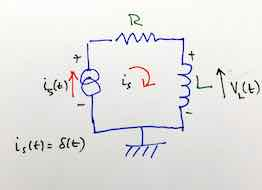
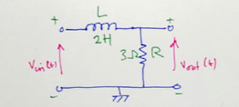
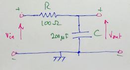

---
jupyter:
  jupytext:
    text_representation:
      extension: .md
      format_name: markdown
      format_version: '1.3'
      jupytext_version: 1.14.1
  kernelspec:
    display_name: Python 3 (ipykernel)
    language: python
    name: python3
---

<!-- #region slideshow={"slide_type": "slide"} -->
# Homework 4

## The Impulse Response and Convolution

The questions for Homework 4 are based on the examples given in [Section 6.8](https://ebookcentral.proquest.com/lib/swansea-ebooks/reader.action?docID=3384197&ppg=207) of {cite}`karris`. 

1. Confirm the result of [Example 5](https://cpjobling.github.io/eg-247-textbook/laplace_transform/5/convolution.html#Example-5) from the notes using the convolution integral 

    $$h(t) * u_0(t) = \int_{-\infty}^{\infty}\,u_0(\tau)h(t-\tau)\,d\tau$$

2. Compute the impulse response $h(t) = i_s(t)$ (where $i_s(t) = \delta(t)$) in terms of $R$ and $L$ for the circuit shown in Fig. Q2 below. Use this result to compute the voltage $v_L(t)$ across the inductor. 

   

   **Fig. Q2: An RL Circuit**

3. Redo the graphical convolution [Example 2](https://cpjobling.github.io/eg-247-textbook/laplace_transform/5/convolution.html#Example-2) from the notes by forming $h(t - \tau)$ instead of $u(t - \tau)$. That is, use the convolution integral 
   
   \begin{equation}
       \int_{-\infty}^{\infty} u(\tau)h(t-\tau)\,d\tau.
   \end{equation}
   
   Confirm the result in MATLAB.

4. Redo the graphical convolution [Example 3](https://cpjobling.github.io/eg-247-textbook/laplace_transform/5/convolution.html#Example-3) from the notes by forming $h(t-\tau)$ instead of $u(t-\tau)$. Confirm the result in MATLAB.

5. Derive the transfer function 

    \begin{equation}
        H(s) = \frac{V_L(s)}{I_s(s)}
    \end{equation}
    
    for the circuit of Fig. Q2. 

   Use this result to

    1. Confirm the impulse response of this circuit $V_L(t)$.
    
    2. Compute the step response 
    
        $$
            V_L(t) = \mathcal L^{-1}\left\{ H(s) U_0(s) \right\}.
        $$
    
    3. Validate this result in MATLAB.
    
6. For the network show in Fig. Q6 compute:

   1. The transfer function 
   
       \begin{equation}
           H(s) = \frac{V_{\mathrm{out}}(s)}{V_{\mathrm{in}}(s)};
       \end{equation}
   
   2. The response of this circuit to the input $v_{\mathrm{in}}(t) = u_0(t) - u_0(t - 1).$
      
   3. Validate this result in MATLAB.
      
      
      
      **Fig. Q6: An LR Network**
      
7. For the network shown in Fig. Q7 compute: 

   1.  The transfer function 
   
       \begin{equation}
           H(s) = \frac{V_{\mathrm{out}}(s)}{V_{\mathrm{in}}(s)};
       \end{equation}
   
   2.  Determine the step response of the network.
   
   3.  State the time constant of the network.
       
   4. Validate this result in MATLAB.
   
   
       
      **Fig. Q7: An RC Network**
    

<!-- #endregion -->

<!-- #region slideshow={"slide_type": "slide"} -->
### Answers to selected problems

* For question 2: 
  
  $$
      h(t) = i_s(t) = \left(\frac{1}{L}\right)e^{-\left(\frac{R}{L}\right)t}\,u_0(t);
  $$

  $$
      v_L(t)=-\left(\frac{R}{L}\right)e^{-\left(\frac{R}{L}\right)t}u_0(t) +\delta(t).
  $$

* For question 5 the transfer function is 
  $$
      H(s) = \frac{s}{s + R/L}
  $$
  
  and the step response is: 
  
  $$
      v_L(t) = Le^{-\left(\frac{R}{L}\right)t}u_0(t).
  $$

* For question 6 the transfer function is 

  $$
      H(s) = \frac{3/2}{s + 3/2}
  $$ 
  
  and the impulse response is: 
  
  $$
      v_L(t) = \left(1 - e^{-1.5t}\right)u_0(t) - \left(1 - e^{-1.5(t-1)}\right)u_0(t-1).
  $$

* For question 7 the transfer function is 

  $$
    H(s) = \frac{50}{s + 50};
  $$
  
  the step response is 
  
  $$
      \left(1 - e^{-50t}\right)u_0(t)
  $$ 
  
  and the time constant is: $T = RC = 1/50$ s.
<!-- #endregion -->

### Reference

See [Bibliography](/zbib).
