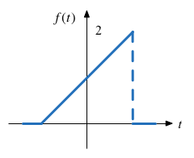
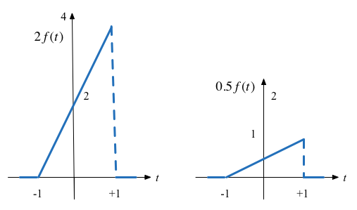
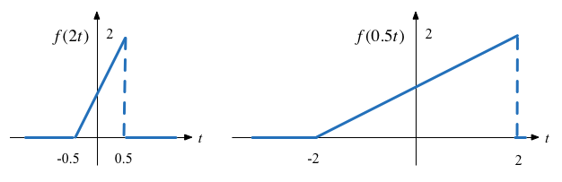
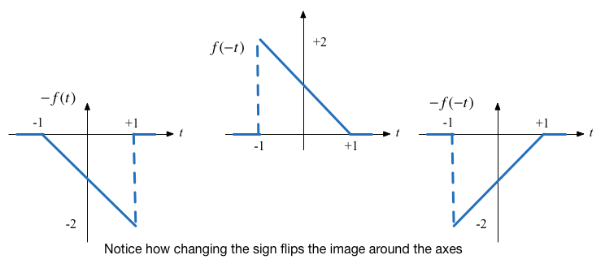
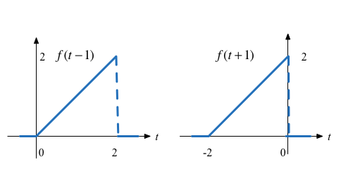

---
jupytext:
  text_representation:
    extension: .md
    format_name: myst
    format_version: '0.9'
    jupytext_version: 1.5.2
kernelspec:
  display_name: Matlab
  language: matlab
  name: matlab
---

+++ {"slideshow": {"slide_type": "slide"}}

# Answers to Worksheet 2

Consider a signal 

$$x = f(t) = \left\{ {\begin{array}{*{20}{c}}
{0\;:\;t <  - 1}\\
{t + 1\;:\; - 1 \le t \le 1}\\
{0\;:\;t > 1}
\end{array}} \right.$$

Sketch this signal

plot the effect on this signal of applying the following basic signal operations

## Amplitude scaling

## Time scaling

## Mirroring

## Time shifting - delay and advance

## Exercise

We leave the solution of $-2f(-t+2)$ as an exercise for the reader but note that it involves *amplitude scaling*, *amplitude mirroring*, *time mirroring*, and a *time shift*. Each operation can be performed in sequence in any order.
