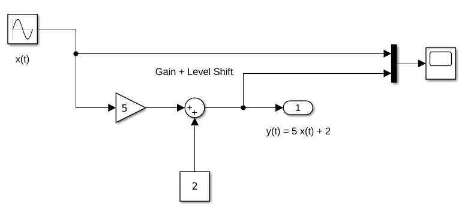

---
jupytext:
  formats: md:myst,ipynb
  text_representation:
    extension: .md
    format_name: myst
    format_version: 0.13
    jupytext_version: 1.11.5
kernelspec:
  display_name: MATLAB
  language: matlab
  name: imatlab
---

+++ {"slideshow": {"slide_type": "slide"}}

# Worksheet 1

## To accompany Chapter 1 Introduction

We will step through this worksheet in class. 

This give us an opportunity to demonstrate the electronic resources, Canvas, OneNote, Pingo, MATLAB, Simulink and Wolfram Alpha, that we will use to make our time in class more active and engaging. We will also test your background knowledge coming into the module.

+++ {"slideshow": {"slide_type": "notes"}}

## Colophon

This worksheet has been designed to be used in Microsoft's OneNote. Should you wish to use another note taking application, a version of this worksheet can be downloaded as a [PDF file](https://cpjobling.github.io/eg-247-textbook/worksheets/worksheet1.pdf).

A copy of this worksheet will be distributed before the first class meeting in the **Week 1: Classroom Activities** section of the Canvas site. I will also distribute a copy to your personal **Worksheets** section of the **OneNote Class Notebook** so that you can add your own notes using OneNote.

You are expected to have at least watched the video presentation of [Chapter 1](https://cpjobling.github.io/eg-247-textbook/introduction) of the [notes](https://cpjobling.github.io/eg-247-textbook) before coming to the first class.

After class, the lecture recording and the annotated version of this worksheet will be made available to you through Canvas.

+++ {"slideshow": {"slide_type": "slide"}}

## How this will work

There will (usually) be two worksheets per week - one per class hour.

The worksheets are based on the corresponding sections of the notes.

We will use the worksheets as class whiteboards and the Pingo audience response system to make the class as active as we can.

+++ {"slideshow": {"slide_type": "subslide"}}

### Before class

* I will have published a video of me presenting the slide-show version of the notes in advance of class.

* A copy of this worksheet will have been distributed to your **Worksheets** folder on OneNote so that you can make your own notes.

+++ {"slideshow": {"slide_type": "subslide"}}

### In class

* I will step through the worksheet in class using the Slide Show feature of Jupyter Notebooks.

* I can execute embedded examples of MATLAB code as we go (the notes contain all the results of these code examples).

* Any hand written notes that I would need to make on a White Board will be done on my copy of this worksheet. This means you have a copy of my handwritten notes as soon as the network syncs your class notebook.

+++ {"slideshow": {"slide_type": "subslide"}}

### After class¶

* I will copy my annotated version of this worksheet into the **_Content Library** of the class notebook
* I will provide a link to the OneNote page on the Whiteboard pages in Canvas.
* Copies of the lecture recordings will be uploaded to Canvas.

* There will be a lab in which you can learn more about the topics covered using MATLAB.
* You should attempt the homework.

At the end of each week’s activities, you should have a complete record of everything that happened in class and ample opportunities to have made additional notes and practice the techniques shown.

+++ {"slideshow": {"slide_type": "skip"}}

## Setup MATLAB

```{code-cell} matlab
---
slideshow:
  slide_type: skip
tags: [remove-output]
---
%Make sure that we have a clean workspace
clear all
format compact
imatlab_export_fig('print-svg')
```

+++ {"slideshow": {"slide_type": "subslide"}}

## Pingo

We will be using a web-based audience response system called **Pingo** for in-class quizzes and informal surveys.

+++ {"slideshow": {"slide_type": "subslide"}}

## Setup

Browse to: [pingo.coactum.de](https://pingo.coactum.de). 


+++ {"slideshow": {"slide_type": "subslide"}}

When prompted: enter the **session ID**

### The Session ID for this Course
<pre>


</pre>
<div style="font-size: 32pt; font-face: bold;">194851</div>
<pre>


</pre>

+++ {"slideshow": {"slide_type": "subslide"}}

### Icebreaker Questions

+++ {"slideshow": {"slide_type": "fragment"}}

**-> Launch Icebreaker Poll**

+++ {"slideshow": {"slide_type": "subslide"}}

### End of setup

+++ {"slideshow": {"slide_type": "slide"}}

**-> Start recording**

+++ {"slideshow": {"slide_type": "slide"}}

## Continuous-time signals

Continuous signals are represented mathematically by functions which vary continuously with time.

+++ {"slideshow": {"slide_type": "subslide"}}

Sinusoidal signals (e.g. AC) are pretty fundamental in electrical engineering. The mathematical model of a sinusoidal signal is:

$$x(t) = A \cos (2\pi f_0 t - \phi).$$ 

**Without talking to your anyone**, which of the following symbols do you think represents the period of the signal in seconds?

| Symbol     | 
|------------|
| $A$        |
| $f_0$      |
| $1/f_0$      |
| $\frac{2\pi}{f_0}$ |
| $\phi$ |

+++ {"slideshow": {"slide_type": "fragment"}}

**-> Launch Poll 1**

+++ {"slideshow": {"slide_type": "subslide"}}

### Gaining insight using computers

To help us answer these questions, let's use our mathematical tools to plot a signal like this and explore it. The example we will use is from *Signals and Systems for Dummies* (SS4D: page 12): 

$$3\cos(2\pi\cdot 2t - 3\pi/4)$$

+++ {"slideshow": {"slide_type": "subslide"}}

#### Wolfram Alpha

Here's the link: <https://www.wolframalpha.com>

Paste this into the search box

    plot 3 cos(2 pi 2 t - 3 pi/4) 
    
The lecturer will change the numbers in class. Note what happens and try to gain insight.

+++ {"slideshow": {"slide_type": "subslide"}}

#### MATLAB

In MATLAB we would need to tackle this by breaking down the steps.

+++ {"slideshow": {"slide_type": "subslide"}}

Define `t`

```{code-cell} matlab
---
slideshow:
  slide_type: fragment
tags: [remove-output]
---
t = linspace(0, 1, 100);
```

+++ {"slideshow": {"slide_type": "subslide"}}

Define `x`

```{code-cell} matlab
---
slideshow:
  slide_type: fragment
tags: [remove-output]
---
x = 3 * cos(2*pi*2*t - 3*pi/4);
```

+++ {"slideshow": {"slide_type": "subslide"}}

Plot result, and label plot

```{code-cell} matlab
---
slideshow:
  slide_type: fragment
tags: [remove-output]
---
plot(t,x)
title('A Sinusoidal Signal')
xlabel('Time t (s)')
ylabel('Amplitude')
grid
```

```{code-cell} matlab
edit sinewave
```

+++ {"slideshow": {"slide_type": "notes"}}

If you want to execute this in MATLAB, you can create a file by copying this text into an `m-file`:

+++ {"slideshow": {"slide_type": "notes"}, "tags": ["remove-output"]}

```matlab
% SINEWAVE - plot function $x(t) = 3 \cos(2\pi t - 3 \pi/4)$ for $t = 0\ldots 1$

%% Set up the problem
% define t
t = linspace(0, 1, 100);
% define x
x = 3 * cos(2*pi*2*t - 3*pi/4);
%% Plot result and label plot
plot(t,x)
title('A Sinusoidal Signal')
xlabel('Time t (s)')
ylabel('Amplitude')
grid
```

+++ {"slideshow": {"slide_type": "notes"}}

To run this script, just type the filename without the `.m` extension.

```{code-cell} matlab
---
slideshow:
  slide_type: notes
---
sinewave
```

+++ {"slideshow": {"slide_type": "notes"}}

Next time you have access to MATLAB, download this script ([sinewave.m](https://cpjobling.github.io/eg-247-textbook/introduction/sinewave.m)) and adjust the values of the numerical constants and see what additional insights you gain about the meaning of the variables $A$, $f_0$, $2\pi f_0$, and $\phi$.

+++ {"slideshow": {"slide_type": "subslide"}}

### Returning to the Question

Sinusoidal signals (e.g. AC) are pretty fundamental in electrical engineering. The mathematical model of a sinusoidal signal is:

$$x(t) = A \cos (2\pi f_0 t - \phi).$$ 

Using the insight just gained by exploring this function with a computer, try matching each of the symbols to its definition again.


| Symbol     | 
|------------|
| $A$        |
| $f_0$      |
| $1/f$      |
| $\frac{2\pi}{f_0}$ |
| $\phi$ |

**This time you may discuss with your neighbours!**!

+++ {"slideshow": {"slide_type": "fragment"}}

**-> Launch Poll 2**

+++ {"slideshow": {"slide_type": "subslide"}}

### Supplementary question

What is the period of the waveform in seconds?

1. $2\pi$
1. $f_0$
1. $t$
1. $1/f_0$
1. $2\pi/f_0$

+++ {"slideshow": {"slide_type": "fragment"}}

**-> Launch poll 3**

+++ {"slideshow": {"slide_type": "notes"}}

**Notes**

* In communications and electronic signal processing, the frequency of sinusoidal signals us usually given in *cycles per second* or Hz. 
* In mathematics, the frequency is always expressed in *radians per second*. 
* In some courses, including later in this one and in EG-243 Control Systems, the frequency $2\pi f_0$ is often called the *natural frequency* and is usually written $\omega_n$.

+++ {"slideshow": {"slide_type": "notes"}}

### Try This Yourself

* Use any or all of computing tools that you have access to to explore other sinusoids. Change the values of the variables and explain what happens. 
* Try adding sinusoids of different amplitudes and different frequencies together and see what happens.
* Change `cos` to `sin` and see what happens.

+++ {"slideshow": {"slide_type": "slide"}}

## Continuous-time Systems

Systems operate on signals. In mathematical terms, a *system* is a function or an *operator*, $H\{\}$ that maps the input signal $x(t)$ to an output signal $y(t)$. 

Mathematically we would write this:

$$y(t) = H\{x(t)\}.$$

+++ {"slideshow": {"slide_type": "subslide"}}

### Example 1

An example of a continuous-time system is an electronic amplifier with a gain of 5 and level shift of 2: $y(t) = H\{x(t)\} = 5x(t) + 2$.

In this course, we will model such systems as block diagram models in Simulink.

+++ {"slideshow": {"slide_type": "subslide"}}

#### Block diagram model in Simulink



The Simulink code can be downloaded from this file [gain_level_shift.slx](https://cpjobling.github.io/eg-247-textbook/introduction/gain_level_shift.slx).

+++ {"slideshow": {"slide_type": "subslide"}}

#### Demonstration

If the input to this system is replaced with a sinewave $x(t)=\sin(t)$ and the output with a scope, what do you think the output will be? Sketch it in your notebook.

<pre style="border: 2px solid blue">


</pre>

If you get a chance, try this in yourself in MATLAB and copy the result into your copy of this worksheet.

```{code-cell} matlab
---
slideshow:
  slide_type: subslide
tags: [remove-output]
---
open gain_level_shift
```

+++ {"slideshow": {"slide_type": "slide"}}

## Discrete-time Signals

Discrete-time signals are a function of a time index $n$. A discrete-time signal $x[n]$, unlike a continuous-time signal $x(t)$, is only defined at integer values of the independent variable $n$. This means that the signal is only active at specific periods of time. Discrete-time signals can be stored in computer memory.

+++ {"slideshow": {"slide_type": "subslide"}}

### Demonstration

Consider the following simple signal, a pulse sequence:$$y[n] = \left\{ {\begin{array}{*{20}{c}}
{5,\;0 \le n < 10}\\
{0,\;{\rm{otherwise}}\quad \;}
\end{array}} \right.$$
We can plot this in Matlab as a *stem plot*

+++ {"slideshow": {"slide_type": "subslide"}, "tags": ["remove-output"]}

#### Procedure

Define function using this text:

```matlab
% Define the function
function [ y ] = x( n )
  if n < 0 | n >= 10 
      y = 0;
  else 
      y = 5;
  end
end
```
and save as [y.m](https://cpjobling.github.io/eg-247-textbook/introduction/y.m).

```{code-cell} matlab
edit y
```

```{code-cell} matlab
---
slideshow:
  slide_type: subslide
tags: [remove-output]
---
%% Define sample points
n = -15:18;
%% Make space for the signal
xn = zeros(size(n));

%% Compute the signal x[n]
for i = 1:length(xn)
    xn(i) = y(n(i));
end
```

```{code-cell} matlab
---
slideshow:
  slide_type: subslide
tags: [remove-output]
---
%% Plot the result
stem(n,xn)
axis([-15, 18, 0, 6])
title('Stem Plot for a Discrete Signal')
xlabel('Sample n')
ylabel('Signal x[n]')
grid
```

+++ {"slideshow": {"slide_type": "notes"}}

### Exercise 1

Draw a digital signal that represents your student number in some way. For example if your number was 765443, then you could generate a signal for which $x[n] = 0$ when $n < 7$, then $x[n] = 7$ for $7$ periods, then $x[n] = 6$ for the next 6 periods, $x[n] = 5$ for 5 periods, and so on. The signal should return to 0 when the last digit has been transmitted. 

Sketch your signal here:
<pre style="border: 2px solid blue;">


</pre>

+++ {"slideshow": {"slide_type": "subslide"}}

To plot this on a computer you would need to transcribe $x[n]$ into an array and then use the stem plot to plot the data. You could just create the array by hand, but you could also create a MATLAB function if you would like a challenge.

+++ {"slideshow": {"slide_type": "notes"}}

### Exercise 2

For the example we started with $x(t) = 2 \cos (2\pi . 2t + 3\pi/4)$. Say we sample the cosine wave at 20 times the frequency of the sinusoid, what would the sampling period be and what would $N$ be if 1 seconds worth of data for the sampled waveform was to be stored?

+++ {"slideshow": {"slide_type": "notes"}}

#### Your Answer

<pre style="border: 2px solid blue">


</pre>

+++ {"slideshow": {"slide_type": "slide"}}

## Discrete-time Systems

A discrete-time system, like its continuous-time counterpart, is a function, $H\{\}$, that maps the input $x[n]$ to the output $y[n] = H\{x[n]\}$. An example of a discrete-time system is the *two-tap* filter:

$$y[n] = H\{x[n]\} = \frac{3}{4}x[n] + \frac{1}{4}x[n-1]$$

+++ {"slideshow": {"slide_type": "subslide"}}

The term *tap* denotes that output at time instant $n$ is formed from two time instants of the input, $n$ and $n – 1$. Check out a block diagram of a two-tap filter system:


This system is available as a Simulink model [discrete_system.slx](https://cpjobling.github.io/eg-247-textbook/introduction/discrete_system.slx)

```{code-cell} matlab
---
slideshow:
  slide_type: subslide
tags: [remove-output]
---
open discrete_system
```

+++ {"slideshow": {"slide_type": "notes"}}

In words, this system scales the present input by 3/4 and adds it to the past value of the input scaled by 1/4. The notion of the past input comes about because $x[n - 1]$ is lagging one sample value behind $x[n]$. The term *filter* describes the output as an *averaging* of the present input and the previous input. *Averaging* is a form of filtering.

+++ {"slideshow": {"slide_type": "slide"}}

## Signal Classifications

+++ {"slideshow": {"slide_type": "subslide"}}

### Periodic

Signals that repeat over and over are said to be *periodic*. In mathematical terms, a signal is periodic if:

* *Continuous signal* $x(t + T) = x(t)$
* *Discrete signal* $x[n + N] = x[n]$

The smallest $T$ or $N$ for which the equality holds is the *signal period*.

+++ {"slideshow": {"slide_type": "notes"}}

The sinusoidal signal we saw earlier is periodic because of the $\mod 2\pi$ property of cosines. The signal of the sinusoid has period 0.5 seconds (s), which turns out to be the reciprocal of the frequency $1/f_0$ Hz.

+++ {"slideshow": {"slide_type": "subslide"}}

#### Square Wave

This code generates a square wave.

```{code-cell} matlab
---
slideshow:
  slide_type: subslide
tags: [remove-output]
---
%% A Periodic signal (square wave)
t = linspace(0, 1, 500);
x = square(2 * pi * 5 * t);
```

+++ {"slideshow": {"slide_type": "notes"}}

This Square wave is a 5 Hz waveform sampled at 500 Hz for 1 second

```{code-cell} matlab
---
slideshow:
  slide_type: subslide
tags: [remove-output]
---
plot(t, x);
ylim([-2, 2]);
grid()
title('A Periodic Signal')
xlabel('Time t (s)')
ylabel('Amplitude')
```

+++ {"slideshow": {"slide_type": "fragment"}}

What is the period $T$ in milliseconds?

+++ {"slideshow": {"slide_type": "notes"}}

Write your answer here
<pre style="border: 2px solid blue">


</pre>

+++ {"slideshow": {"slide_type": "fragment"}}

**-> Launch Poll 4**

+++ {"slideshow": {"slide_type": "subslide"}}

### Aperiodic 

Signals that are *deterministic* (completely determined functions of time) but not periodic are known as *aperiodic*. Point of view matters. If a signal occurs infrequently, you may view it as aperiodic. 

This is how we generate an aperiodic rectangular pulse of duration $\tau$ in Matlab:

```{code-cell} matlab
---
slideshow:
  slide_type: subslide
tags: [remove-output]
---
%% An aperiodic function
tau = 1;
x = linspace(-1,5,1000);
y = rectangularPulse(0,tau,x);
```

```{code-cell} matlab
---
slideshow:
  slide_type: subslide
tags: [remove-output]
---
plot(x,y)
ylim([-0.2,1.2])
grid
title('An Aperiodic Signal')
xlabel('Time t (s)')
ylabel('Amplitude')
```

+++ {"slideshow": {"slide_type": "subslide"}}

### Random

A signal is random if one or more signal attributes takes on unpredictable
values in a probability sense.

Engineers working with communication receivers are concerned with random
signals, especially noise.

```{code-cell} matlab
---
slideshow:
  slide_type: subslide
tags: [remove-output]
---
%% Plot a Random Signal
plot(0.5 + 0.25 * rand(100,1))
ylim([0,1])
grid
title('Random Signal')
xlabel('Time t (s)')
ylabel('Amplitude')
```

+++ {"slideshow": {"slide_type": "slide"}}

## Domains for Signals and Systems

Most of the signals we encounter on a daily basis reside in the time domain. They’re functions of independent variable $t$ or $n$. But sometimes when you’re working with continuous-time signals, you may need to transform away from the time domain ($t$) to another domain.

+++ {"slideshow": {"slide_type": "subslide"}}

### Domain Quiz

A domain which is used in the analysis of signals and the design of systems is represented by complex numbers of the form:

$$\sigma + j\omega$$

**Without conferring**, tell me what domain is this?

+++ {"slideshow": {"slide_type": "fragment"}}

**-> Lanch Poll 5**

+++ {"slideshow": {"slide_type": "subslide"}}

### Now discuss your answer with your peers

+++ {"slideshow": {"slide_type": "subslide"}}

### Domain Quiz (again)

A domain which is used in the analysis of signals and the design of systems is represented by complex numbers of the form:

$$\sigma + j\omega$$

Tell me what domain is this?

+++ {"slideshow": {"slide_type": "fragment"}}

**-> Launch Poll 6**

+++ {"slideshow": {"slide_type": "subslide"}}

### Other Domains you will encounter

The most commonly used domains used when analysing continuous time signals are the frequency domain ($f$ or $\omega$) and the Laplace $s$-domain ($s$). 

Similarly, for discrete-time signals, you may need to transform from the discrete-time domain ($n$) to the frequency domain ($\hat{\omega}$) or the z-domain ($z$).


This section briefly introduces the world of signals and systems in the frequency, s-, and z-domains. More on these domains will follow.

+++ {"slideshow": {"slide_type": "notes"}}

Systems, continuous and discrete, can also be transformed to the frequency and s- and z-domains, respectively. Signals can, in fact, be passed through systems in these alternative domains. When a signal is passed through a system in the frequency domain, for example, the frequency domain output signal can later be returned to the time domain and appear just as if the time- domain version of the system operated on the signal in the time domain.

+++ {"slideshow": {"slide_type": "subslide"}}

Consider the sum of a two-sinusoids signal

$$x(t) = \underbrace {A_1\cos(2\pi f_1 t)}_{s_1} + \underbrace {A_2\cos(2\pi f_2 t)}_{s_2}$$

+++ {"slideshow": {"slide_type": "notes"}, "tags": ["remove-output"]}

This can be coded as

```matlab
%... plot two sinusoids signal
A1 = 2; f1 = 1;
A2 = 1.5;f2 = 2.2;
t = linspace(0, 3*(1/f1), 1000);
s1 = A1*cos(2*pi*f1*t);
s2 = A2*cos(2*pi*f2*t);
subplot(4,1,1)
plot(t,s1),ylim([-5,5]),xlabel('Time t (s) '),ylabel('s1')
subplot(4,1,2)
plot(t,s2),ylim([-5,5]),xlabel('Time t (s) '),ylabel('s2')
subplot(4,1,3)
plot(t,s1+s2),ylim([-5,5]),xlabel('Time t (s) '),ylabel('x(t) = s2 + s2')
subplot(4,1,4)
axis([0,4,0,2.5])
arrow([f1,0],[f1,A1]),text(f1,A1+0.2,'A1'),text(f1+0.05,0.2,'f1')
arrow([f2,0],[f2,A2]),text(f2,A2+0.2,'A2'),text(f2+0.05,0.2,'f2')
ylabel('Frequency Spectrum X(f)'),xlabel('Frequency (Hz)')
```

```{code-cell} matlab
---
slideshow:
  slide_type: subslide
tags: [remove-output]
---
edit two_sines
```

Run

```{code-cell} matlab
two_sines
```

+++ {"slideshow": {"slide_type": "notes"}}

(Download [two_sines.m](https://cpjobling.github.io/eg-247-textbook/introduction/two_sines.m))

+++ {"slideshow": {"slide_type": "subslide"}}

### Polling Question

Which analysis method you may have already encountered, would turn the time response shown in this picture to the frequency spectrum shown in the bottom graph? 

* Fourier transform
* Parseval's theorem 
* Laplace transform
* Phasor analysis

+++ {"slideshow": {"slide_type": "subslide"}}

### Challenge

I used the examples from **Signals and Systems for Dummies** to seed this Padlet collection [Examples of Signals and Systems](https://padlet.com/cpjobling/2f62bgl2q8dp).


Can you add to it?

+++ {"slideshow": {"slide_type": "slide"}}

## Concluding Example: Some Basic Signal Operations

Consider a signal 

$$x = f(t) = \left\{ {\begin{array}{*{20}{c}}
{0\;:\;t <  - 1}\\
{t + 1\;:\; - 1 \le t \le 1}\\
{0\;:\;t > 1}
\end{array}} \right.$$

Sketch this signal.

+++ {"slideshow": {"slide_type": "notes"}}

<pre style="border: 2px solid blue">


</pre>

+++ {"slideshow": {"slide_type": "notes"}}

## Answers to Selected Exercises

+++ {"slideshow": {"slide_type": "slide"}}

### Problem

Think about the effect on this signal of applying the following basic signal operations:

* $2 f(t)$
* $0.5 f(t)$
* $f(2t)$
* $f(0.5 t)$
* $-f(t)$
* $f(-t)$
* $-f(-t)$
* $f(t - 1)$
* $f(t + 1)$
* $-2f(-t+2)$

We will work through these after the break together then you will do some exercises based on [Chapter 1](https://site.ebrary.com/lib/swansea/reader.action?docID=10547416&ppg=17) of {cite}`karris`.

+++ {"slideshow": {"slide_type": "subslide"}}

## Short Break

+++ {"slideshow": {"slide_type": "fragment"}}

What do you think of Pingo so far? Please give a one word or short sentence answer.

+++ {"slideshow": {"slide_type": "fragment"}}

**-> Launch Poll 7**

+++ {"slideshow": {"slide_type": "fragment"}}

**-> Stop recording**

+++ {"slideshow": {"slide_type": "notes"}}

### Answers to Exercise 2

For the waveform given, $f_0 = 2$ Hz so the sampling frequency is $f_s = 20\times 2 = 40$ Hz. The sampling period will be $t_s = 1/f_s = 1/40 = 0.025$ s [$25$ ms]. The waveform shown is 1 second so $N = 1/t_s = 40$.
