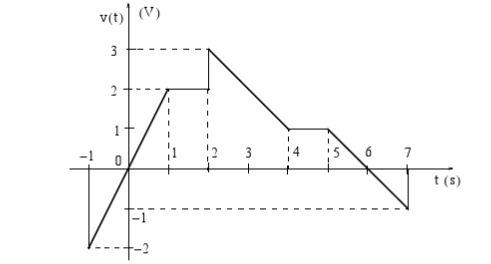

---
jupytext:
  formats: ipynb,md:myst
  text_representation:
    extension: .md
    format_name: myst
    format_version: 0.12
    jupytext_version: 1.9.1
kernelspec:
  display_name: MATLAB
  language: matlab
  name: imatlab
---

# Lab 01: Elementary Signals

+++

## Keeping Lab Records

The lab component will be assessed based on a portfolio of the MATLAB scripts, Simulink models and publishable MATLAB Live Scripts. You should therefore aim to keep all the files from each lab session in a suitable folder in your workspace on your OneDrive. I would suggest a structure like **eg-247-textbook\portfolio\lab01** which matches the layout of the files on this [GitHub repository](https://github.com/cpjobling/eg-247-textbook/tree/master/portfolio).

One elegant way to do this would be to fork this GitHub repository ([cpjobling/eg-247-textbook](https://github.com/cpjobling/eg-247-textbook)) and then build on from there, but that is not necessary.

If you do not use GitHub as the master repository of your portfolio, please ensure that you backup your work files regularly. You will be required to submit some or all of them for assessment.

+++

## Preamble to this Lab

### Associated Class Notes

This lab supports the materials covered in [Chapter 2 Elementary Signals](https://cpjobling.github.io/eg-247-textbook/elementary_signals/) of the course notes. You may wish to refer to the Worksheets [worksheet 2](https://cpjobling.github.io/eg-247-textbook/introduction/worksheet2) and [worksheet 3](https://cpjobling.github.io/eg-247-textbook/elementary_signals/worksheet3) for additional examples to try. 

### Other formats

This document is available in [HTML](https://cpjobling.github.io/eg-247-textbook/labs/lab01/index) format for online viewing and as [PDF](https://cpjobling.github.io/eg-247-textbook/labs/lab01/lab01.pdf) for printing.

### Acknowledgement

These examples have been adapted from [Chapter 1](https://ebookcentral.proquest.com/lib/swansea-ebooks/reader.action?docID=3384197#ppg=17) of Karris{cite}`karris`.

+++

## Aims

The purposes of this laboratory are to

1. Explore the properties of the unit step and Dirac delta functions using the analysis and plotting tools  provided by MATLAB in the *Symbolic Math Toolbox*.
1. Synthesise a generalised signal in Simulink and plot it and its derivative.
1. Experience **Peer Assessment** as a coursework moderation and feedback process.

This will introduce the symbolic toolbox and the `heaviside`, `delta` and `ezplot` functions provided by MATLAB  and the *signal design block*, *multiplexer*, *scope* and *derivative* blocks provided by Simulink for the simulation of continuous time signals and systems.

We will also demonstrate the Live Script feature provided by MATLAB that will be useful for recording lab results for this module.

+++

## Assessment criteria

Up to three marks can be claimed according to how many of parts 1-5 in the lab exercises have been completed. The mini project is worth an additional two marks. There are an additional 5 marks available for participating in the peer assessment. 

Detailed marking criteria for this and the other labs and the project are given in the linked [Assessment Criteria](https://docs.google.com/spreadsheets/d/1HsyBZp4h71DuIj2ris1nP52JdWaWiaT6UsOwQKGnwzI/edit?usp=sharing) [Google sheet].

+++

## Set up

### Before you start

Create a suitable folder structure on your file-store for your labs. 

I suggest:

```
OneDrive\workspace
  signals-and-systems-lab
	lab01
	lab02
	 :
```

Use folder `OneDrive\workspace\signals-and-systems-lab\lab01` for this lab.

+++

### Download starter script

Right click to save the file [elem_sigs.mlx](https://github.com/cpjobling/eg-247-textbook/blob/master/labs/lab01/elem_sigs.mlx) to your ``lab01`` folder. Open the file from the file browser in MATLAB.

+++

## Lab Exercises

### Lab Exercise 1.1

For Lab Exercise 1 you are required to complete parts 1 to 2 of the provided script (1 mark).

+++

### Lab Exercise 1.2

For Lab Exercise 2 you are required to complete parts 3 to 5 of the provided script (2 marks).

+++

### Mini Project 1

Work through the procedures given between [pages 1-18 and 1-19](https://ebookcentral.proquest.com/lib/swansea-ebooks/reader.action?ppg=34&docID=3384197&tm=1518436444996) of Karris{cite}`karris` to construct the piecewise signal generator first shown in [Figure 1.21](https://ebookcentral.proquest.com/lib/swansea-ebooks/reader.action?ppg=31&docID=3384197&tm=1518436492450) inside Simulink. 



*Signal to be synthesised (Reproduction of Fig 1.21 of Karris)*

Connect the signal up a derivative block and scope as shown in Figure 1.24 and simulate the system. Verify the result illustrated in Figures 1.23, 1.25 and 1.26. Store the Simulink model as ``signal.slx`` in your portfolio for later assessment. 

**Note**: you will need to adjust the Simulation parameters in Simulink in order to allow the simulation to run from $t = -1$ seconds. You should also adjust the y axes on the oscilloscope to the range $-3 \le v \le 4$ to avoid the plotbeing dominated by the large spikes due to the differentiating the discontinuities in the signal at $t = -1$, $t = 2$ and $t = 7$ seconds. 

(2 marks)

+++

## What to Hand In


### Claim

Up to three marks can be claimed according to how many of parts 1-5 in the lab exercises have been completed. The mini project is worth an additional 2 marks.

Make your claim by downloading and editing the labwork claim form and declaration: [lab01-claim.docx](https://cpjobling.github.io/eg-247-textbook/labs/lab01/lab01-claim.docx) [Word].

### Submission

You should submit the following to the **Lab 01: Elementary Signals** Assignment on Canvas.

1. The completed labwork claim form and declaration.
2. As evidence for completion of the lab exercises, your completed version of the Live Script file `elem_signals.mlx`.
3. As evidence of completion of the Miniproject, the Simulink model of the piecewise linear signal `signal.slx`.

### Deadline 

The Deadline for claims and submission is: 

**4:00 pm, 24th February 2021**.

### Important

To avoid errors in verification, particularly with Simulink, you should check that your script and simulations work on the version of MATLAB that is installed in the shared desktop (Version 2019a when I last checked). If you have installed a more recent version of MATLAB, or are using MATLAB online, you should note the version of MATLAB that you ahve used in the the submission comment. You can also save your Simulink model using the older version (use **File** > **Export Model to** > **Previous Version**).

+++

## Peer assessment procedure for this lab

On Monday 24th February, you should receive notification that the submissions of three of your colleagues are available for peer assessment. This notification will arrive by email (if you have your Canvas notifications turned on) or via the inbox on Canvas or the Canvas Student App. 

This is the procedure you should follow:

1. Carefully read the document on [Peer Assessment](../peer-assessment) ([PDF](https://cpjobling.github.io/eg-247-textbook/labs/peer-assessment.pdf)) before starting your assessment.

2. Check that the files are downloaded and named correctly as per the note on [Filenaming Conventions](../peer-assessment#Important-note-about-file-names) in the peer-assessment document.

3. Open the Live Script file `elem_signals.mlx` and execute **run all**. Check that the results are all present and that there are no errors. Review the formatting of the file and think about how readable and understandable the script is as a record of the experiment. 

4. Open and run the Simulink model `signal.slx` and confirm that the results match the figure given above.

+++

## Doing More

If you have time remaining, you may wish to confirm some of the results covered in class from [worksheet 2](https://cpjobling.github.io/eg-247-textbook/introduction/worksheet2) and [worksheet 3](https://cpjobling.github.io/eg-247-textbook/elementary_signals/worksheet3). You can also work through Appendix A of the textbook: that chapter introduces MATLAB in a way that matches the presentation in the rest of the book. There are also additional tutorial and video introductions to *MATLAB*, *Simulink* and the *Signal Processing Toolbox* in the **Getting Started with MATLAB** section of the **Useful Additional Resources** module of the Canvas site for Signals and Systems.

## Reference

See [Bibliography](/zbib).
