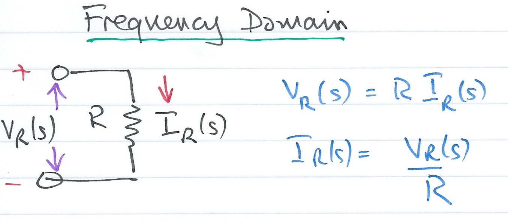
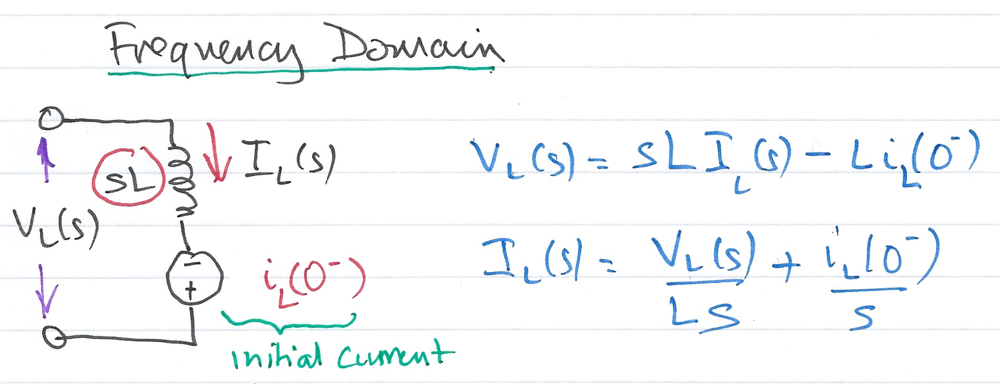
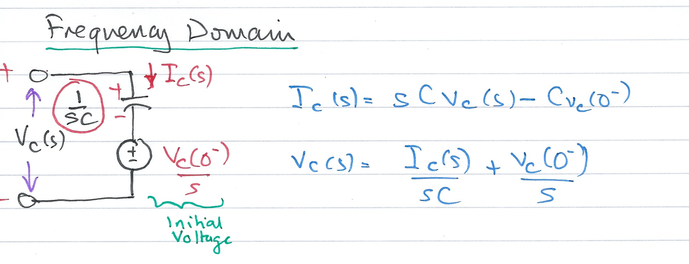
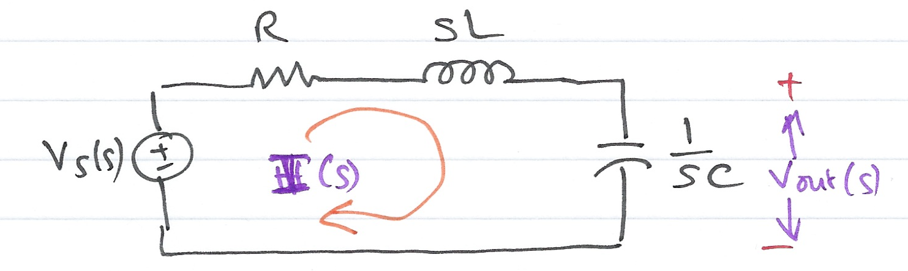

---
jupytext:
  formats: ipynb,md:myst
  text_representation:
    extension: .md
    format_name: myst
    format_version: 0.13
    jupytext_version: 1.11.5
kernelspec:
  display_name: MATLAB
  language: matlab
  name: imatlab
---

+++ {"slideshow": {"slide_type": "slide"}}

# Using Laplace Transforms for Circuit Analysis

+++ {"slideshow": {"slide_type": "notes"}}

The preparatory reading for this section is [Chapter 4](https://ebookcentral.proquest.com/lib/swansea-ebooks/reader.action?docID=3384197&ppg=101) {cite}`karris` which presents examples of the applications of the Laplace transform for electrical solving circuit problems.

+++ {"slideshow": {"slide_type": "notes"}}

## Colophon

An annotatable worksheet for this presentation is available as [**Worksheet 6**](https://cpjobling.github.io/eg-247-textbook/laplace_transform/3/worksheet6.html).

* The source code for this page is [laplace_transform/3/circuit_analysis.ipynb](https://github.com/cpjobling/eg-247-textbook/blob/master/laplace_transform/3/circuit_analysis.ipynb).

* You can view the notes for this presentation as a webpage ([HTML](https://cpjobling.github.io/eg-247-textbook/laplace_transform/3/circuit_analysis.html)). 

* This page is downloadable as a [PDF](https://cpjobling.github.io/eg-247-textbook/laplace_transform/3/circuit_analysis.pdf) file.

+++ {"slideshow": {"slide_type": "slide"}}

## Agenda

We look at applications of the Laplace Transform for

+++ {"slideshow": {"slide_type": "fragment"}}

* Circuit transformation from Time to Complex Frequency

+++ {"slideshow": {"slide_type": "fragment"}}

* Complex impedance

+++ {"slideshow": {"slide_type": "fragment"}}

* Complex admittance

+++ {"slideshow": {"slide_type": "slide"}}

## Circuit Transformation from Time to Complex Frequency

+++ {"slideshow": {"slide_type": "subslide"}}

### Time Domain Model of a Resistive Network

+++ {"slideshow": {"slide_type": "subslide"}}

###  Complex Frequency Domain Model of a Resistive Circuit

+++ {"slideshow": {"slide_type": "subslide"}}

###  Time Domain Model of an Inductive Network

+++ {"slideshow": {"slide_type": "subslide"}}

### Complex Frequency Domain Model of an Inductive Network 

+++ {"slideshow": {"slide_type": "subslide"}}

### Time Domain Model of a Capacitive Network

+++ {"slideshow": {"slide_type": "subslide"}}

### Complex Frequency Domain of a Capacitive Network

+++ {"slideshow": {"slide_type": "subslide"}}

### Examples

We will work through these in class. See [worksheet 6](worksheet6).

+++ {"slideshow": {"slide_type": "slide"}}

## Complex Impedance $Z(s)$

Consider the $s$-domain RLC series circuit, where the initial conditions are assumed to be zero.

+++ {"slideshow": {"slide_type": "subslide"}}

For this circuit, the sum

$$R + sL + \frac{1}{sC}$$ 

represents that total opposition to current flow. Then,

$$I(s) = \frac{V_s(s)}{R + sL + 1/(sC)}$$

+++ {"slideshow": {"slide_type": "subslide"}}

and defining the ratio $V_s(s)/I(s)$ as $Z(s)$, we obtain

$$Z(s) = \frac{V_s(s)}{I(s)} = R + sL + \frac{1}{sC}$$

+++ {"slideshow": {"slide_type": "subslide"}}

The $s$-domain current $I(s)$ can be found from 

$$I(s) = \frac{V_s(s)}{Z(s)}$$

where

$$Z(s) = R + sL + \frac{1}{sC}.$$

+++ {"slideshow": {"slide_type": "subslide"}}

Since $s = \sigma + j\omega$ is a complex number, $Z(s)$ is also complex and is known as the *complex input impedance* of this RLC series circuit.

+++ {"slideshow": {"slide_type": "slide"}}

## Complex Admittance $Y(s)$

Consider the $s$-domain GLC parallel circuit shown below where the initial conditions are zero.

+++ {"slideshow": {"slide_type": "subslide"}}

For this circuit

$$GV(s)+ \frac{1}{sL}V(s) + sCV(s) = I_s(s)$$

$$\left(G+ \frac{1}{sL} + sC\right)V(s) = I_s(s)$$

+++ {"slideshow": {"slide_type": "subslide"}}

Defining the ratio $I_s(s)/V(s)$ as $Y(s)$ we obtain

$$Y(s)=\frac{I_s(s)}{V(s)} = G+ \frac{1}{sL} + sC = \frac{1}{Z(s)}$$

+++ {"slideshow": {"slide_type": "subslide"}}

The $s$-domain voltage $V(s)$ can be found from 

$$V(s) = \frac{I_s(s)}{Y(s)}$$

where

$$Y(s) = G + \frac{1}{sL} + sC.$$

+++ {"slideshow": {"slide_type": "subslide"}}

$Y(s)$ is complex and is known as the *complex input admittance* of this GLC parallel circuit.

## Reference

See [Bibliography](/zbib).
